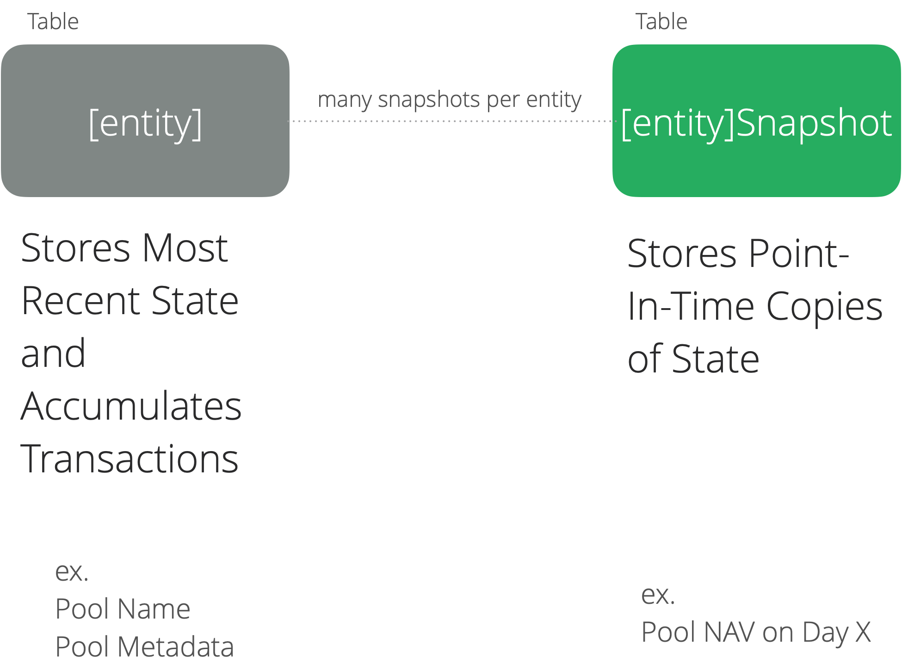
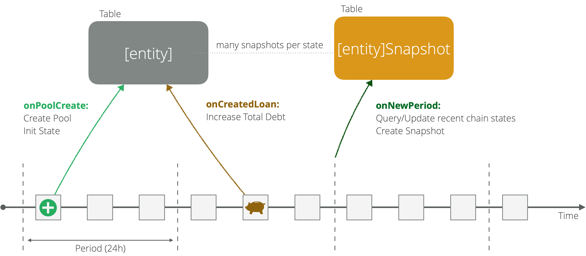

The indexing and querying of Centrifuge Chain data is based on the [SubQuery](https://subquery.network/) framework. SubQuery is an open source blockchain data indexer for developers that provides fast, flexible, reliable, and decentralised APIs to power multi-chain apps.

Chain data can be queried with a GraphQL api. To learn the basics of GraphQL, you can check out this [primer guide](https://medium.com/graphprotocol/graphql-will-power-the-decentralized-web-d7443a69c69a).

To learn how to query Centrifuge Pool's data using SubQuery, you can check [this guide](/build/guides/querying-data-subquery).

## Architecture and Data Model

The latest version of the GraphQL data model can be found on GitHub under the [centrifuge-subql](https://github.com/embrio-tech/centrifuge-subql/blob/main/schema.graphql) repository.

The indexer service fetches and stores current and historical data for the following entities:

- Pools
- Tranches
- Epochs
- Loans
- Investor Transactions
- Borrower Transactions
- Outstanding Orders
- Accounts (with related currencies and tranche-tokens balances)

Depending on the caracteristics of the underlying data (current or historical), properties of entities are stored in one or multiple tables, according to the principles defined in figure 1 below.

*Figure 1: entity / snapshot architecture for historical data*

Let’s see how the concept applies to the Pool entity and how the data is split across different tables.

### Pool / [entity]

Stores all the data about the underlying entity. This includes the name of the pool, references to metadata, creation timestamps, the underlying currency. It further serves as an accumulator to keep track of KPIs and values evolving over time. Stores only the most actual values available. In the specific case this includes: portfolio valuation, active loans, total number of loans, inflows, outflows. Such states are used at regular intervals to perform snapshots and provide historical data. Property names ending with an capital ‘R’ are reset to 0 right after a snapshot is created.

### PoolSnapshot / [entity]Snapshot

Provides historical data about the evolution of Pool over time. The dynamics of snapshottings are shown in Figure 2.

*Figure 2: entities snapshotting*

Relationsips can be used in GraphQL queries to access and group data. As an example it is possible to list all the Tranches related to a Pool in a single Pool query. All relationships between the entities are listed in Figure 3 below.

// TODO

### Querying data from SubQuery

To learn how to query Centrifuge Pool's data using SubQuery, you can check [this guide](/build/guides/querying-data-subquery).
