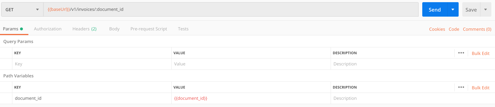
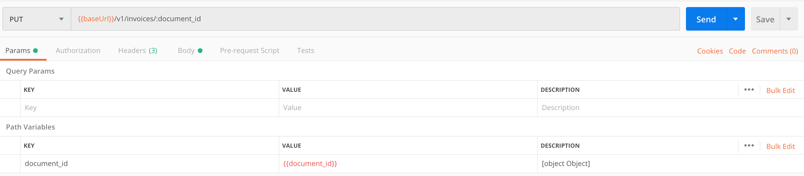
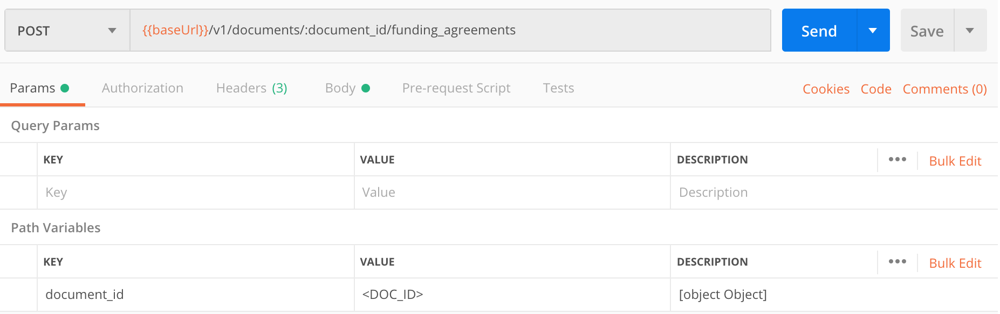
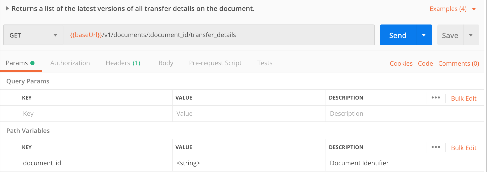

Once the Centrifuge node is up and running you are able to start submitting invoices and tokenize these documents via the Rest API. Please refer to the [Node API](https://centrifuge-os-node-api-4.api-docs.io/0.0.6/) documentation for a complete list of endpoints.

## Authentication Headers
The Centrifuge node is capable of maintaining multiple accounts. Accounts are used to track of the different users that might be using a single instance of a Centrifuge node. We use an http header for specifying which account to use for a given request.

| Header        | Value |
|---------------|-------|
| **authorization:** | hex encoded identity of the account, e.g. 0xafe241...) | 

## Usage Examples
In the section below we show how you can interact with the API through Postman (see [Recommended tools](/cent-node/getting-started/tools). If you use Postman, can import the [Centrifuge Postman Collection](https://www.getpostman.com/collections/828cc6af5bc56642ba42). Make sure you have imported the most recent version if you've used previous versions of the collection.

### Before you start 
Confirm that your Centrifuge Node is up und running, for example with a PING (See section [Post install verification](/cent-node/getting-started/ping)). If it is not running, run the Centrifuge Node using the `config.yaml` file you created:

  ```bash
  $ export CENT_ETHEREUM_ACCOUNTS_MAIN_KEY=$(cat $HOME/Library/Ethereum/keystore/UTC--2019-04-15T14-43-41.293727000Z--75aecbd0aa7f34207132d686d2a9e470fba2e6e4)
  $ export CENT_ETHEREUM_ACCOUNTS_MAIN_PASSWORD=<YOUR_PASSWORD>
  $ centrifuge run -c /<PATH-TO-CONFIG-DIR>/config.yaml
  ```

where `PATH-TO-CONFIG-DIR` is your location of the `config.yaml`.

Open the Postman Desktop App and select the calls you want to make. 

Please find examples for exchanging invoices, minting NFTs, and the creation of other document types below: 

### Create an invoice

To create an invoice use the POST call under the menu item _invoice_. Always make sure to add your Centrifuge ID under **Header** > **authorization**. Then go to **Body** and fill in the document template accordingly. Press send to create the invoice.

**Header:**


**Body:**


Creating an invoice automatically generates a document ID for the said invoice. This is required for the recipient to receive the invoice or if you want to update an invoice. 

### Receive an invoice

The recipient is able to look up the specific invoice by calling GET under the menu item _invoice_. The recipient will need the document ID and add it to the call, e.g: `http://localhost:8082/v1/invoices/<Add DocumentID>`. Then press send. The invoice details will be shown in the **Body** below.
  


### Update an invoice

Use the PUT command under the menu item _invoice_ to update an invoice. Add the document ID to the call as explained above. Then press send and update accordingly.




### Mint an NFTs
To mint a business NFT, use the POST command under the menu item _token_. First, add your Centrifuge ID under **Header** > **authorization**. Then, select **Body** and fill in the document template. Keep in mind that you want to use a deposit address where you are able to move the NFT later on.


### Verify Job Done
After each job, you receive an output that contains a job ID. You can use this job ID to check whether the job was successful. Go to the menu item _jobs_ in your Postman Centrifuge collection and call GET. Do not forget to add your Centrifuge ID as authorization value and state the job ID in the GET call. 


### Create a funding agreement 


You can create (POST) a funding agreement for an invoice document which specifies certain terms of the agreement. These terms can also be updated by calling the corresponding update funding agreement endpoint.
Please note that you must indicate in the path variables the document identifier of the invoice for which the funding agreement is applicable.

### Sign a funding agreement


You can also sign this funding agreement by using the POST command. Note that you need the agreement identifier as well as the document identifier. Calling this endpoint will add your signature to the signature array associated with each funding agreement.


This signature contains a number of values which can be useful.
 
- Identity indicates the Centrifuge identity of the signer.

- Signed version indicates the version of the document which has been signed.

- Outdated signature indicates whether or not this signature references a document which has been updated since the signing.

- Valid indicates the cryptographic validity of the signature itself.

### Retrieve a funding agreement


Either one of the parties on the funding agreement can look up the created funding agreement by submitting a GET request to the endpoint.
Please note that you will need the identifier of the funding agreement to fetch a specific agreement. 


Alternatively, you can submit a GET request to the `/v1/documents/{document_id}/funding_agreements` endpoint and this will fetch you a list of all funding agreements associated with the document.

### Create a transfer detail


You can create a transfer detail recording certain information about a transfer associated with an invoice document by submitting a POST request to the endpoint. This could potentially be associated with a funding agreement attached to the invoice.
Please note that to create a transfer detail, you will need also need the identifier of the document to which it is attached.

### Update a transfer detail


You can update a transfer detail to ie: change the status of a transfer from `open` to `settled` by submitting a PUT request.
Please note that you will need the identifier of the transfer detail in addition to the document identifier.

### Retrieve a transfer detail


You can look up the created transfer detail by submitting a GET request to the endpoint.
Please note that you will need the identifier of the transfer detail to fetch a specific one. 


Alternatively, you can submit a GET request to the `/v1/documents/{document_id}/transfer_details` endpoint and this will fetch you a list of all transfer details associated with the document.
