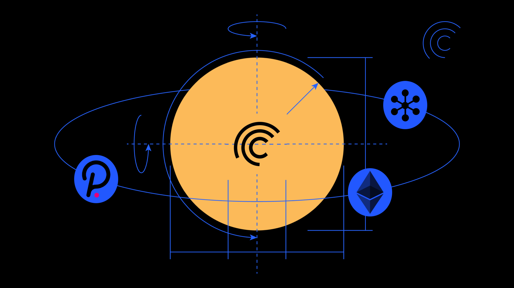

## Substrate/Polkadot Resources
* [Kusama Documentation](https://guide.kusama.network/en/latest/try/validate)
* [W3F Guide](https://github.com/w3f/polkadot-secure-validator) on Production Grade Setups for Validators on Substrate chains
* [Guides by Certus One](https://kb.certus.one/) (Cosmos Validator)
* [Architecture Deep Dive by Chorus](https://gdoc.pub/doc/e/2PACX-1vQXb1kd0zqYT8K4B4XYb-lrlfRIuPDXsgiTjj94gDOjw3ezEUAtjvxR8yfbKJypmioKeGRrhkLCtZog)
* [Polkadot Wiki](https://wiki.polkadot.network/docs/) (also covering Substrate relevant features)

## Get Help

* Centrifuge Chain on [Github](https://github.com/centrifuge/centrifuge-chain)
* Ask questions in our [Community Slack](https://centrifuge.io/slack)
* Join the conversation on [Discourse](https://discourse.centrifuge.io)
* Read our [Medium Blog](https://medium.com/centrifuge)

