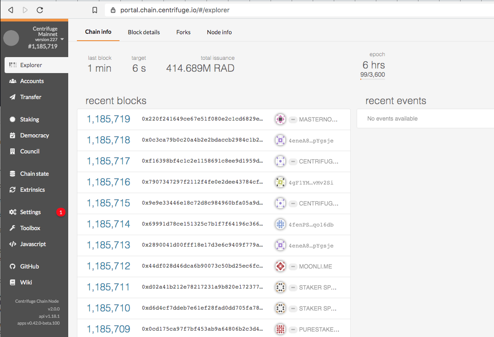
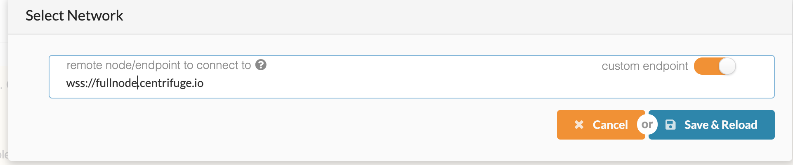
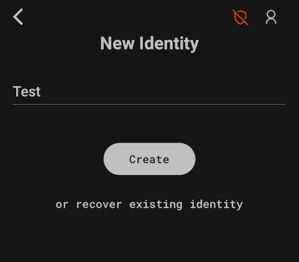
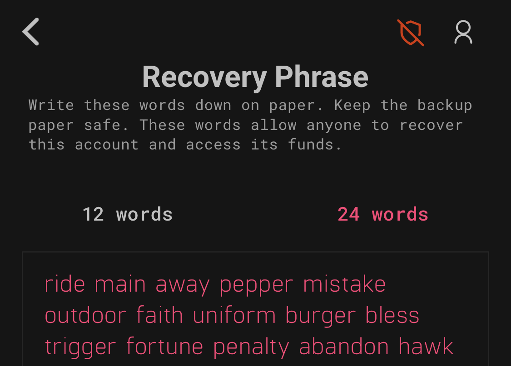
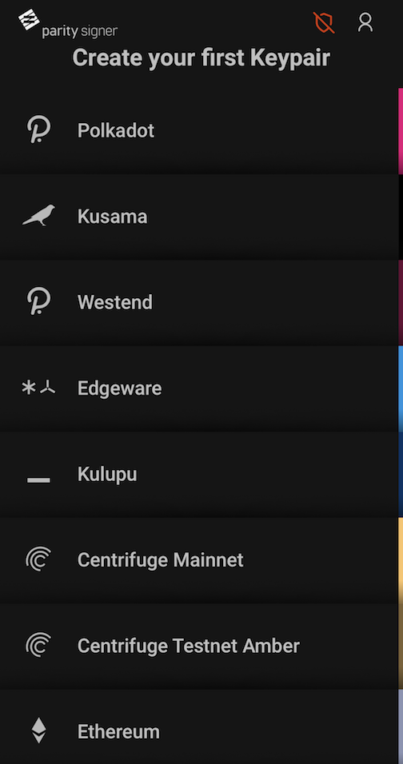
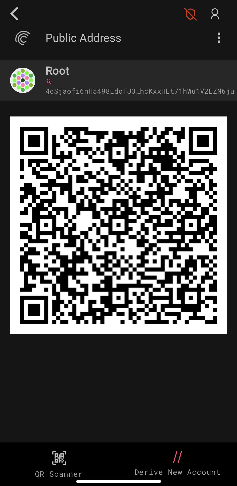
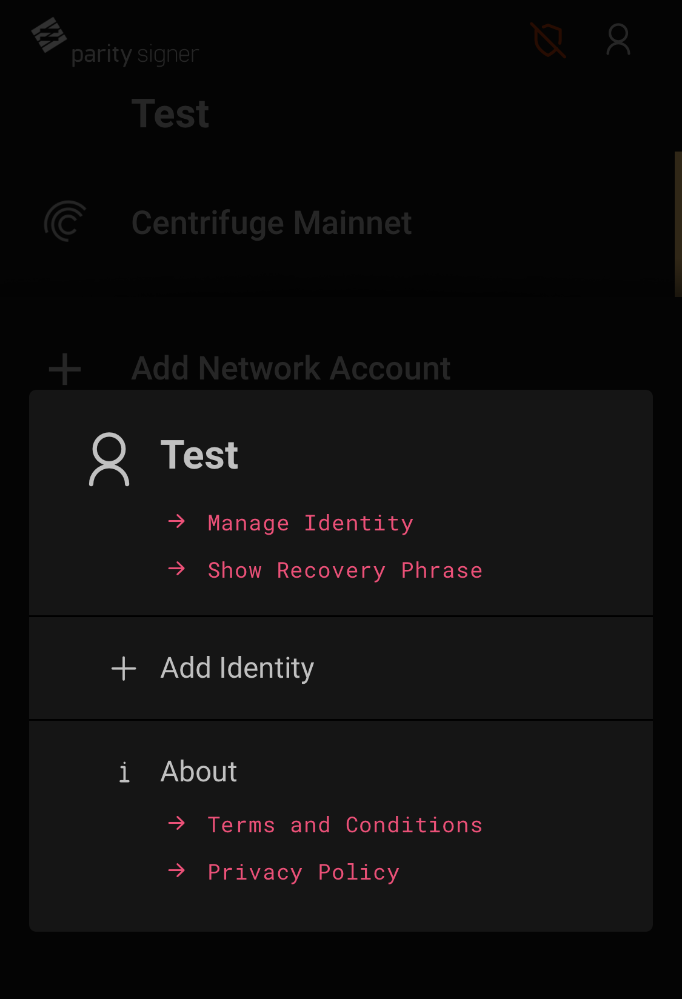

## Chain Portal
Centrifuge hosts an instance of the chain portal at [portal.chain.centrifuge.io](https://portal.chain.centrifuge.io). You can use it to interact with a full node provided by Centrifuge. The portal serves all three of our permanent networks.

**Mainnet:** https://portal.chain.centrifuge.io/#?rpc=wss://fullnode.centrifuge.io 
**Amber:** https://portal.chain.centrifuge.io/#?rpc=wss://fullnode.amber.centrifuge.io 
**Flint:** https://portal.chain.centrifuge.io/#?rpc=wss://fullnode.flint.centrifuge.io

## Create an account/key pair using the Portal UI
1. Open the Portal
1. Create a new account for your user by navigating to "Accounts" and clicking "Add account".

    Fill in the form, e. g. for Peter Parker: 

1. Click "Save" and then "Create and backup account". Make sure you save the downloaded JSON file in a safe place.

1. Done! You can now copy your address and send it to others to receive tokens. The address is the string starting with `5...` under the name of your account, e. g. `5HKk5u...wp29Zd` in the following. You can copy it by clicking on the icon to the left of your account name: 

## Create an account using the Parity Signer App

This is an unofficial guide on how to use the Parity Signer App to create an account on Centrifuge Chain. Please consult the official Parity Signer documentation [here](https://github.com/paritytech/parity-signer).

| DISCLAIMER: _Use of this guide is at your own risk. To the maximum extent permitted by applicable law, the services are provided without warranties of any kind, whether express, implied, statutory or otherwise, including, but not limited to, implied warranties of merchantability, fitness for a particular purpose, title, quiet enjoyment, accuracy, or non-infringement. Further, to the fullest extent allowed by applicable law, in no event shall the company or its affiliates, be liable to you or any third party for any damages of any kind._ |
| --- |

### How to connect to Centrifuge Chain Mainnet 

1. Open the Portal Website on your computer at: https://portal.chain.centrifuge.io/

2. In the top left, ensure that the Newtork is set to 'Centrifuge Mainnet'

3. To navigate to Mainnet, or to one of the Centrifuge testnets Amber or Flint, click on the top left corner and select custom endpoint to change the network.

4. For Mainnet, the endpoint should be set to `wss://fullnode.centrifuge.io`. Once a new endpoint is set, Save & Reload

### How to Generate an Address Using Parity Signer

1. Buy an old or new device (ex. ipod touch, android phone, etc.)
    - **Important** only charge it with a battery bank or wall charger, **don’t plug it into a computer!!!** Use a charge only cable, not a data cable.
1. Set up a passcode and set it to wipe the device upon entering the code incorrectly too many times.
1. Install the [Parity Signer App](https://www.parity.io/signer/) from below links:
    - [Link for apple device](https://itunes.apple.com/us/app/parity-signer/id1218174838)
    - [Link for android device](https://play.google.com/store/apps/details?id=io.parity.signer)
1. Never connect the the device to a computer, even to upgrade it.
1. Turn off wifi & bluetooth (**NEVER TURN IT ON AGAIN!**)
1. Create a key for Centrifuge Mainnet using the Parity Signer App
    - Create your identity to get started
    
    
    - Write down your 24 word Recovery Phrase (**THIS IS VERY IMPORTANT**)
    

    - Set your Identity PIN
        - **You will use this PIN to sign all of your transactions using this device.** 
    - Create your first Keypair - select the Centrifuge Mainnet Network
    

1. Get your address by scanning the QR code on the Portal Website. 
   - On your computer, navigate to https://portal.chain.centrifuge.io/
   - Make sure the endpoint is set to `wss://fullnode.centrifuge.io`
   - Click on Accounts
   - Click on 'Add via QR'

    - Scan the QR code on your device for your Centrifuge Mainnet Public Address
    

    - Your address for Centrifuge Mainnet should begin with a '4...'
1. To manually check the above process:
     - Delete the key from the app
     - Recover the key from your backed up phrase 
     - Verify the address matches what you obtained above
1. Send some test RAD to another address and use Parity Signer to sign this transaction
     - Use the public [Centrifuge Mainnet faucet](https://faucet.chain.centrifuge.io) to obtain some RAD for this test
     - Initiate a transfer on the Portal Website by selecting 'Transfer' in the left menu or on 'Send' from the Accounts page
     - Click 'Make Transfer'
     - Click 'Sign via QR'
     - Using the Parity Signer App, scan the QR code in your browser with the App's QR Scanner from this account screen:
     
     - In the app, confirm your signature of the transaction by entering your PIN
     - Click 'Scan Signature QR' in the browser 
     - Sign the transaction

1. Backup your Recovery Phrase and keep it somewhere safe. Please do research on secure methods for storage and recovery.

If you intend to stake your tokens towards validators on Centrifuge Chain, it is advised to generate another address (a "controller" address). You can generate that address by adding a new Identity and following steps 6 to 10 above, which gives you a new recovery phrase.

To add a new identity:
- Select the person icon on the top right
- Select 'Add Identity'

> **A note on app updates:** 
>If a new version of the app becomes available, please exercise the following caution.
>Ideally, replace the device or do not update the app.
>If an update is necessary:
>1. Hard reset the device and wipe everything
>2. Re-install the new parity signer app
>3. Turn off wifi & bluetooth (**NEVER TURN IT ON AGAIN**)
>4. Recover your key from seed phrase 

### Remember to write down your secret phrase & STORE IT SAFELY!

- Follow a secure protocol to save and store your private keys. Please do some research and choose a secure method that will work best for you.

## Getting Tokens
### Mainnet
A faucet is available giving out 0.1RAD per user per day at [faucet.chain.centrifuge.io](https://faucet.chain.centrifuge.io)

### Amber/Flint
You can get the testnet tokens _Amber Radial (ARAD)_ or _Flint Radial (FRAD)_ from BlockXLabs' faucet:

 [BlockXLabs Faucet](https://faucets.blockxlabs.com/centrifuge)

If you have a need for more ARAD or FRAD than what the faucet provides, we can send you more on a case by case basis. Please reach out to us at chain@centrifuge.io with a description of what you want to use the tokens for and your address so we can send you the appropriate amount.
