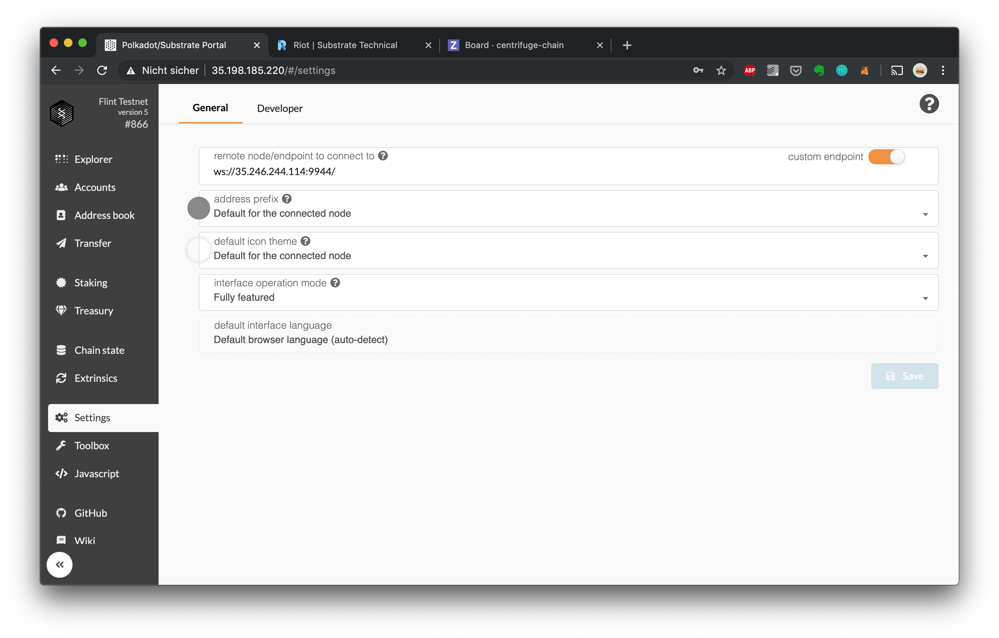

## Manually point the Portal to the Amber or Flint Testnet

To manually point the Portal user interface to Flint, navigate to the Settings page at http://35.198.185.220/#/settings and set

For **Amber**:
 `ws://35.246.192.167:9944`

For **Flint**:
 `ws://35.234.84.110:9944`

as the custom endpoint on the settings screen: 
