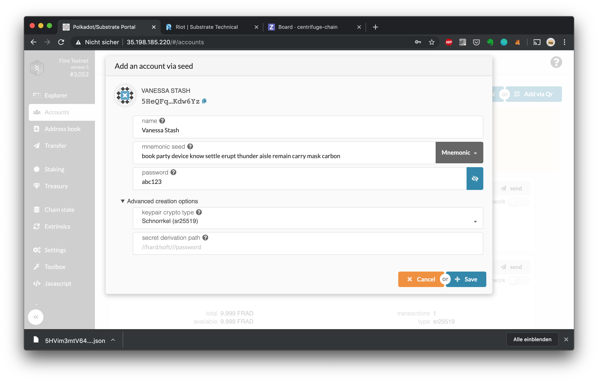
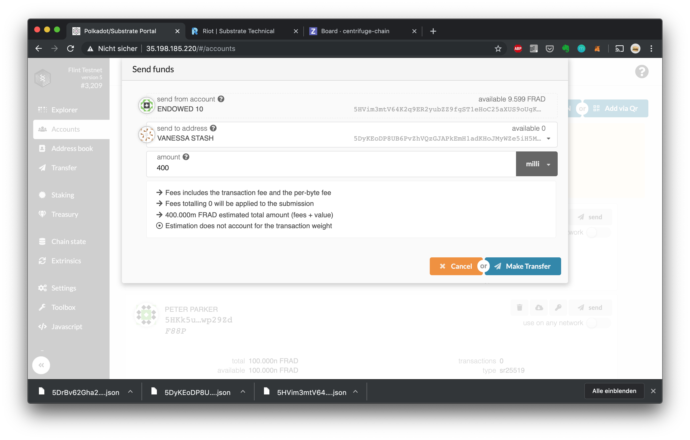
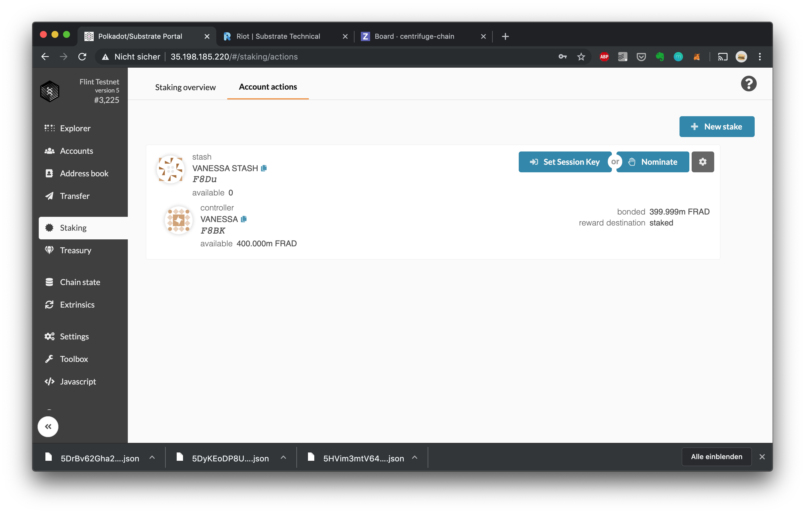
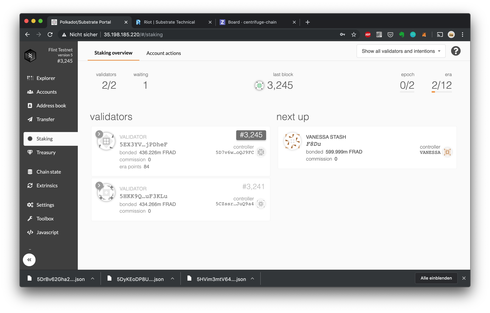
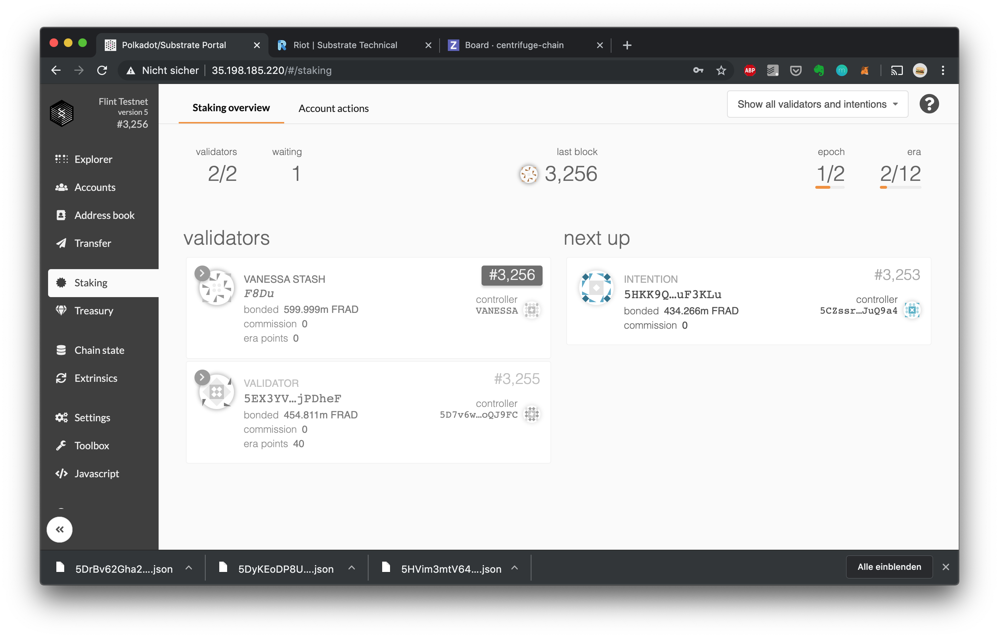
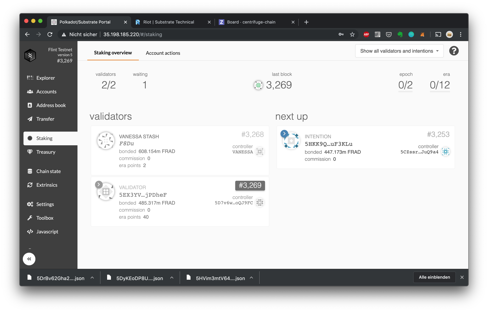

1. Open the Portal 

1. Create a new key pair for your validator – a stash account (`Vanessa Stash` in this example) that is holding the funds to be staked/bonded and can transfer them, and a separate controller account (`Vanessa` in this example) that will be able to switch between validating/nominating/chilling and can set session keys, which will be used for the validator tasks such as block proposals, finalization etc:  

1. Send tokens to your stash (for staking) and controller accounts (small amount to pay fees for actions) as described above. In order to become a validator, the stash account needs to own enough tokens to replace another validator in the next era. 

1. Head over to the staking screen and create a new stake  

1. Set the session keys you obtained in the [previous chapter](#Run-your-own-node-on-AmberFlint):  

1. You are ready to start validating! Change your status to validating by clicking "Validate":  

1. In the staking overview, you should now see your validator in the "Next Up" column:  If validator slots are empty or if your validator has a higher stake bonded then an active validator, it will enter the validator set at the next era change (at most in 24 hours on Amber/Flint): 

1. All done! If you want to stop validating, head back to "Account actions" and click "Stop Validating"  You should now see that your validator is no longer selected for the next era (at most in 24 hours on Amber/Flint):  After the next era change, your validator should go back to idling and no longer show up in the Staking overview: 

