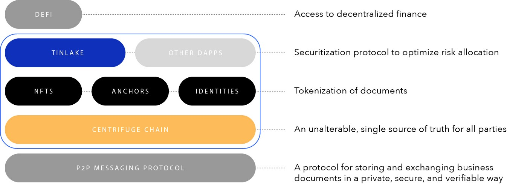

Ask questions in our [Community Slack](https://centrifuge.io/slack)

## The Centrifuge Stack

The Centrifuge Operating System is a decentralized platform to support a new generation of applications for the financial supply chain. It enables businesses to exchange financial documents such as invoices, and tokenize those assets to have greater access to financing — thereby unlocking value that has previously been inaccessible.

## Centrifuge Chain
[Centrifuge Chain](https://github.com/centrifuge/centrifuge-chain) is the gateway for real-world assets to the Blockchain Multiverse. It is being built on [Parity Substrate](https://substrate.dev) with an initial bridge to Ethereum.

Substrate will allow us to easily tap into the [Polkadot](https://polkadot.network) ecosystem at a future point in time as well as re-using [XCMP](https://wiki.polkadot.network/docs/en/learn-crosschain) modules to connect with other blockchains that support the standard.

We envision a larger ecosystem of many, connected blockchains—where Centrifuge Chain can [enable off-chain assets to access financing](https://medium.com/centrifuge/centrifuge-chain-the-gateway-for-real-world-assets-to-the-blockchain-multiverse-41dd5597ecf1) through DeFi.

## Chain Architecture

Centrifuge Chain will use its own native token - the Radial (RAD) token. It will also incentivize Validators and Nominators to participate through a block reward.

Centrifuge Chain is built on [Parity Substrate](https://substrate.dev), and relies on staked Validators to come to consensus over 3 components to commit blocks to the blockchain:
* BABE - block production/authorship
* GRANDPA - finality gadget
* NPoS - Validator selection algorithm

Any node can offer itself as a Validator candindate, but only a limited number will be selected. Only top Validators by stake are elected into the Validator Set. Validators can stake their own RAD and can be elected by staked Nominators.

Validators must run a full node and directly particiate in block authorship, finality, and validity checks. They are able to choose a reward commission that is taken up-front from the reward before splitting the remainder with Nominators.

Validators must stay online and available with very high up-time. They will be held responsible and incur slashing penalties for deliberate attacks, running modified software, severe bugs in the code, and unresponsiveness, to name just a few slashing conditions.

For a deeper dive into the architecture and economics of Centrifuge Chain, read our **[Token Design Specification](https://docs.google.com/document/d/1T4DF3XHs8l4gTzpnk6KASpD4JWjSoIWzxNX6DyVz__Q/edit?usp=sharing)**.
