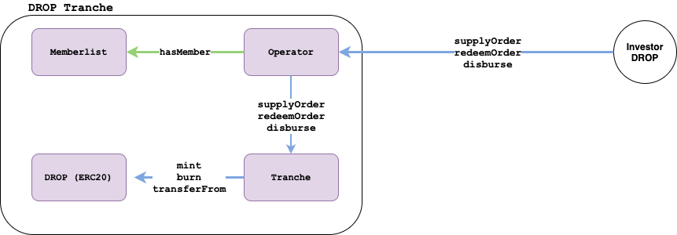
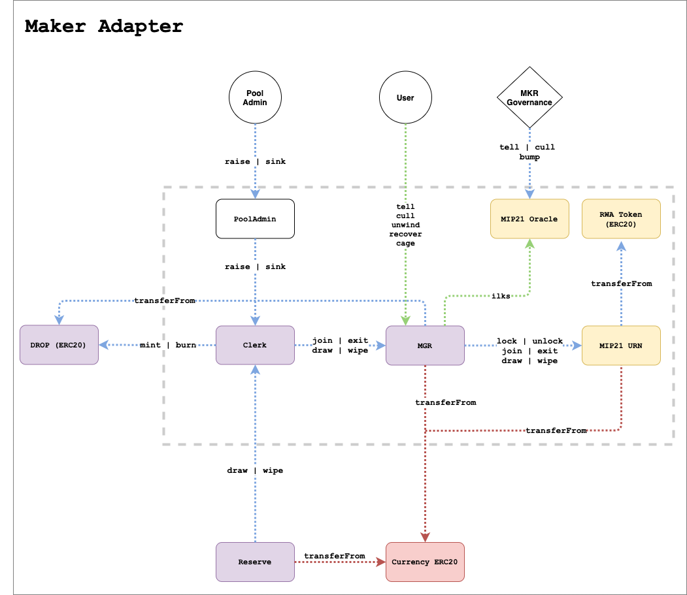

# Tinlake Smart Contracts (Legacy)

For a brief description of the Tinlake protocol go to [here](/getting-started/legacy/centrifuge-v1).

### Repositories

Tinlake is implemented in Solidity and deployed on Ethereum mainnet.
The source-code can be found on [Github](https://github.com/centrifuge/tinlake):

| Repository                                           | Desc                                                                                             |
| ---------------------------------------------------- | ------------------------------------------------------------------------------------------------ |
| https://github.com/centrifuge/tinlake                | Main Tinlake Repository                                                                          |
| https://github.com/centrifuge/tinlake-math           | Tinlake Math Libary. Adopted from ds-math.                                                       |
| https://github.com/centrifuge/tinlake-erc20          | Tinlake ERC20 implementation. Re-uses the ERC20 implementation from DAI.                         |
| https://github.com/centrifuge/tinlake-title          | ERC721 implementation used for Tinlake.                                                          |
| https://github.com/centrifuge/tinlake-deploy         | Tinlake deploy scripts build with bash and seth                                                  |
| https://github.com/centrifuge/tinlake-proxy          | Tinlake proxy contract used for the borrower interactions                                        |
| https://github.com/centrifuge/tinlake-actions        | Tinlake actions is a libary used via delegate call by the proxy                                  |
| https://github.com/centrifuge/tinlake-auth           | Tinlake authentification pattern libary                                                          |
| https://github.com/centrifuge/tinlake-maker-lib      | Tinlake Maker adapter. MIP22 implementation                                                      |
| https://github.com/centrifuge/tinlake-rpc-tests      | Tinlake RPC tests for the Maker integration. Tests run against live Mainnet or Kovan deployment. |
| https://github.com/centrifuge/tinlake-maker-tests    | Tinlake Maker integration system tests.                                                          |
| https://github.com/centrifuge/tinlake-spells-mainnet | Tinlake Mainnet spells (changes on Mainnet deployments)                                          |
| https://github.com/centrifuge/tinlake-spells-kovan   | Tinlake Kovan spells (changes on Mainnet deployments)                                            |
| https://github.com/centrifuge/tinlake-pools-cli      | Tinlake pool management                                                                          |
| https://github.com/centrifuge/tinlake-tranche-worker | Contract for cancelling all orders in a pool. (Required for contract upgrades)                   |

#### Audits

Centrifuge has performed multiple audits of its codebase:

- [Trail of Bits](https://www.trailofbits.com/) (1 audit)
  - Centrifuge Chain
- [Least Authority](https://leastauthority.com/) (3 audits)
  - Tinlake v0.2
  - Tinlake v0.3
  - Centrifuge Chain
- [DappHub](https://dapphub.com/) (1 audit)
  - Tinlake v0.3.5

All audit reports can be found [here](https://github.com/centrifuge/security/tree/master/audits).

### Security Vulnerability Disclosure

No technology is perfect or perfectly secure.
Centrifuge believes that working with skilled security researchers
across the globe is crucial in identifying weaknesses in any technology.
We welcome the contribution of external security researchers
and look forward to awarding them for their invaluable contribution to the security of all our users. [Read more about security here](https://centrifuge.io/security/).

### Deployments

Each Tinlake pool is an individual deployment of the set of smart contracts. A full list of all deployed pools, including metadata, can be found [here](https://github.com/centrifuge/tinlake-pools-mainnet).

## Overview of Smart Contracts

### Introduction

The design of Tinlake was inspired by the design of the MakerDAO contracts. Some design patterns and best practices like the `auth pattern` have been adopted in the Tinlake contracts.

The current version of Tinlake v0.3.5 has around 15 contracts.

It is important to notice that a deployment of Tinlake can only manage one pool. The current multiple pools on tinlake.centrifuge.io are re-deployments of the same source code.

The reasoning behind this is to keep the logic as simple as possible.

### Module overview

At its core, Tinlake has _two_ main modules:

- **Borrower Module**
- **Lender Module**

Each of the modules consists of multiple contracts written in Solidity.

The main purpose of the lender module is to handle the investor requests and maintain the pool constraints.

On the other hand, the borrow module keeps track of the individual loans from the asset originators.

### Contract Transaction Diagram


## Contract interactions

### Borrower Interactions

The Borrow module contract handles the individual loans of the issuers.

The main actions of an issuer are:

- **open**
  - Opens a new loan
- **lock**
  - Locks a NFT as collateral for loan
- **borrow**
  - Requests an amount of to borrow from the lender module
- **withdraw**
  - Withdraws a currency amount after the borrow requests
- **repay**
  - Repays a loan
- **close**
  - Close the loan after the debt has been repaid

### Lender Interactions

On the lender side of Tinlake, the there are three main interactions:

- Supply Order
- Redeem Order
- Disburse (Collect)

#### Supply Order

A user can create a supply order by locking DAI/stablecoin in Tinlake.


- During an _epoch_, the locked amount of DAI can be changed
- After the _epoch_ is closed, it is not possible to change the order
- If the _epoch_ is executed, the disburse method must be called to collect the DROP token
- If it is not possible to fulfill the entire supplyOrder, the rest is automatically resubmitted in the next epoch

```
Example:
- Alice wants to invest 100 DAI into the seniorTranche (DROP).
- She calls supplyOrder on the senior operator contract.
- Her DAI is transferred to the seniorTranche contract.
- The epoch is closed and the current DROP price of 1.5 DAI is calculated
- 60% of all supplyOrders can be fulfilled
- Alice calls the disburse method and she receives
    - (100 DAI* 0.6) / 1.5 = 40 DROP  tokens on her address
- The remaining 100-60 = 40 DAI are a new supplyOrder in the next epoch
- Alice calls supplyOrder and changes the order to zero DAI
    - Alice receives the 40 DAI back
```

- The tokenPrice which Alice gets for her investment is determined when the epoch is closed.

#### Redeem Order

#### Redeem Order

A user can redeem their DROP or TIN tokens in exchange for DAI/stablecoin with a redeem order.


#### Disburse Order

The disburse method can be called to collect tokens from an executed supply order or DAI/stablecoin from a successfully executed redeem order.


For creating a new redeem or supply order, the disburse method needs to be called before.

The token price of a supply or redeem order is defined by the `epoch` and not by the price.

## Lender Variables

From a high level perspective, the lender contracts need to track the investments, perform the interest rates calculations, and ensure that the junior tranche takes the losses first.

The following variables are needed to track the state of the these actions.

#### Reserve

The total currency (ERC20) locked in the reserve contract. In live Tinlake pools as of time of writing, the currency is the DAI stablecoin.

#### NAV

Net Asset Value of all outstanding loans.

#### PoolValue

The pool value is the total value in a Tinlake pool. It includes the currency in the reserve and net asset value of the outstanding loans.

$$
\text{poolValue} = \text{reserve} + \text{NAV}
$$

#### SeniorAsset

The seniorAsset is the amount which belongs to the senior investor (_DROP_) in a pool.

**Expected SeniorAsset**

$$
\text{expectedSeniorAsset} = \text{seniorDebt} + \text{seniorBalance}
$$

**SeniorDebt**

SeniorDebt is the amount which accrues interest for the senior tranche.

$$
\text{seniorDebt} = \text{seniorDebt} * \text{seniorInterestRate}
$$

**SeniorBalance**
SeniorBalance is the amount of the seniorTranche which is not used for interest accumulation.

**Example**

```
Tinlake Pool:
------------------------------------------
| NAV:     80 DAI  | juniorAsset: 10 DAI |
| Reserve: 20 DAI  | seniorAsset: 90 DAI |
------------------------------------------

In this pool, 80% of the pool value is used for loans.
Therefore, 80% of the seniorAsset should be used for interest accumulation.

seniorDebt:     90 DAI * 0.8 =    72 DAI
seniorBalance:  90 DAI - 72 DAI = 18 DAI

Let's say the interest rate is 10%.
The seniorDebt would increase in one time period.

seniorDebt:    72 DAI * 1.10 = 79.2 DAI
seniorBalance:               = 18.0 DAI
seniorAsset:                   97.2 DAI

```

The senior value represents the value of the senior/DROP tranche.

It is calculated as:

$$
\text{seniorAsset} = min(\text{expectedSeniorAsset},  \text{poolValue})
$$

If loans are defaulting, the juniorAsset would cover the losses. If the entire juniorAsset is lost, the poolValue could be lower than the expectedSeniorAsset.

The poolValue can be also expressed as:

$$
\text{poolValue} = \text{seniorAsset} + \text{juniorAsset}
$$

#### JuniorAsset

The juniorAsset is the amount of the poolValue which belongs to junior investors (`TIN`).

The difference between the seniorAsset value poolValue is the juniorAsset.

$$
\text{juniorAsset} = max(\text{poolValue} -  \text{seniorAsset}, 0)
$$

In case of losses, they are first covered by the junior investors.

**seniorSupply**
Is the total amount of minted ERC20 DROP tokens.

**juniorSupply**
Is the total amount of minted ERC20 TIN tokens.

#### SeniorRatio

The seniorAssetRatio is defined as:

$$
\text{seniorRatio} = \frac{\text{seniorAsset}}{\text{poolValue}}
$$

It describes the percentage of the poolValue which belongs to senior investors.

$$
\text{juniorRatio} = 1 - \text{seniorRatio} =
 \frac{\text{juniorAsset}}{\text{poolValue}}
$$

The juniorRatio is an important metric in the pool because it defines the protections of the junior investors.

The percentage of loan defaults in a pool has to be higher than the juniorRatio until the senior investors are affected.

In the contracts the seniorRatio is used.

#### JuniorRatio Increase

The following investor actions increase the juniorRatio:

- TIN supply
- DROP redeem

#### JuniorRatio Decrease

The following investor actions decrease the juniorRatio:

- TIN redeem
- DROP supply

#### Epoch Execute: State Variable Changes

The lender state variables in Tinlake are changing either because of:

- Interest Accumulation
- Borrow/Repay Loans
- Epoch Execute

In an epoch execution, the orders which can be fulfilled are changing the lender state

- $\text{TIN}_{invest}$
- $\text{DROP}_{invest}$
- $\text{TIN}_{redeem}$
- $\text{DROP}_{redeem}$

#### Reserve

Amount of DAI available in the reserve.

$$
\text{Reserve}_{e+1} = \text{Reserve}_{e}  + \text{TIN}_{invest} + \text{DROP}_{invest}  - \text{TIN}_{redeem} - \text{DROP}_{redeem}
$$

Notation: $\text{Reserve}_{e+1}$ new reserve in the next epoch after of the execution of the current. $\text{Reserve}_{e}$ describes the current.

#### NAV

Net asset value of all ongoing loans expressed in DAI. The NAV is not impacted by the orders but relevant for the constraint calculation.

#### SeniorAsset

$$
\text{SeniorAsset}_{e+1} = \text{SeniorAsset}_{e} + \text{DROP}_{invest} - \text{DROP}_{redeem}
$$

Note: This is a simplification of the seniorAsset formula and does not contain losses. (Not relevant for the solver).

#### JuniorAsset

$$
\text{JuniorAsset}_{e+1} = NAV + \text{Reserve}_{e+1} - \text{SeniorAsset}_{e+1}
$$

Note: This is a simplification of the juniorAsset formula.

## Lender Contracts

### Coordinator Contract

```
The coordinator contract manages the epochs for the investors.
```

#### Main purpose

- Closing and executing epochs
- Responsible for determining the fulfillments of supplyOrders and redeemOrders in an epoch
- Maintaining the pool constraints
- Allowing and handling submissions if not all orders can be fulfilled
- Validating and scoring submitted solutions

#### Contract Diagram


#### Coordinator State Diagram


#### Main Functions

**closeEpoch**

```javascript
 function closeEpoch() external minimumEpochTimePassed
```

- An epoch can be closed after a minimum epoch time has passed
- `closeEpoch` creates a snapshot of the current lender state
- If all orders can be fulfilled without violating any constraints, the epoch is executed
- Otherwise the submission period starts

**executeEpoch**

```javascript
 function executeEpoch() public
```

**executeEpoch**

```javascript
 function submitSolution() public
```

**submitSolution**

```javascript
function submitSolution(uint seniorRedeem, uint juniorRedeem,
        uint juniorSupply, uint seniorSupply) public returns(int)
```

### Tranche Contract

#### Tranche Module Contracts Overview

A Tinlake deployment has two tranche modules deployed:

- _DROP_ Tranche Module
- _TIN_ Tranche Module

#### Module Diagram



A tranche module has four contracts

- **Operator Contract**
  - Can be directly called by an investor
- **Memberlist Contracts**
  - Maintains a whitelisted list of investors for a specific Tinlake pool
- **Tranche Contract**
  - Main tranche contract
- **Token (ERC20) Contract**
  - ERC20 contract for the interest bearing token

```
The Tranche contracts maintains the orders of investors.
```

#### Main Purpose

- Managing supply and redeem orders
- Calculating the correct disburse amount over multiple epochs
- Minting of DROP or TIN tokens
- Holding DAI and tokens from locked orders and non-collected disburse amounts

#### Main Functions

**function supplyOrder**

```javascript
 function supplyOrder(address usr, uint newSupplyAmount) public auth orderAllowed(usr)
```

The `supplyOrder` function can be used to place or revoke an order. The method is called by the operator contract. The initial call is initiated by an investor.

**function redeemOrder**

```javascript
function redeemOrder(address usr, uint newRedeemAmount) public auth orderAllowed(usr) {
```

The `redeemOrder` function can be used to place or revoke a redeem.

**function disburse**

```javascript
function disburse(address usr,  uint endEpoch) public auth returns (uint payoutCurrencyAmount, uint payoutTokenAmount, uint remainingSupplyCurrency, uint remainingRedeemToken)
```

The `disburse` function can be used after an epoch is over to receive currency and tokens. The collection can be used over multiple epochs.

**Example**

```
Alice:
supplyOrder: 100 DAI

Epochs:
epoch n: 40% of all orders can be fulfilled tokenPrice: 1.2
epoch n+1: 30% of all orders can be fulfilled tokenPrice: 1.5


Alice calls the disburse function  in epoch n+2:

epoch n: 100 DAI * 0.4 /1.2 = 33.33 DROP
epoch n: supplyOrder(amountLeft) = 60 DAI
epoch n+1: 60 DAI * 0.3/1.5 = 12 DROP

Disburse Amount: 33.33 DROP + 12 DROP = 45.33 DROP

```

The contract maintains the supply and redeem orders for epochs. One for DROP and one for TIN.

If an epoch gets executed, the tranche contract mints new token or transfers currency to reserve. At any point in time, the contract can hold tokens or the stablecoin-currency. The balances are not considered as part of the Tinlake reserve.

The contract maintains the supply and redeem orders for epochs. One for DROP and one for TIN.

If an epoch gets executed, the tranche contract mints new token or transfers currency to reserve. At any point in time, the contract can hold tokens or the stablecoin-currency. The balances are not considered as part of the Tinlake reserve.

A locked amount for a supply or redeem order can be changed as long as the epoch is still ongoing. On the other side, users might have successfully supplied or redeemed their tokens or currency but didn't collect them.

### Assessor Contract

```
The assessor contract keeps track of the state
and the constraints of lender module
.
```

**changeSeniorAsset**

```javascript
function changeSeniorAsset(uint seniorSupply, uint seniorRedeem) external auth
```

- Method is called by the coordinator in epoch execute
- Updates the senior asset and performs the rebalancing

**calcJuniorTokenPrice**

```javascript
  function calcJuniorTokenPrice(uint nav_, uint reserve_) public view returns (uint)
```

- Returns the current junior token price

**calcSeniorTokenPrice**

```javascript
    function calcSeniorTokenPrice(uint nav_, uint reserve_) public view returns(uint)
```

- Returns the current senior token price

### Reserve Contract

```
The reserve contracts holds the currency and offers methods for deposit and payout.
```

**deposit**

```javascript=
 function deposit(uint currencyAmount) public auth
```

- Deposits currency into the reserve
- Currency is transferred from `msg.sender`

### Operator Contract

```
The operator contract manages the allowances for investors.
```

## Borrower Contracts

### Contract diagram


### IDs

The loanID itself is an ERC721 NFT contract called `Title`.

### NFT's

We need to distinguish between three different NFTs used in the Tinlake contracts.

- Collateral NFT

  - A collateral NFT is used as collateral in Tinlake to borrow a loan

- Title NFT
  - Tracks the ownership of a Tinlake loan.
  - Only the owner of the title NFT can repay a Tinlake loan and unlock the collateral NFT

* Access NFT
  - The borrowers in Tinlake interact via a proxy contract with the shelf contract
  - The authentication in the proxy contract happens with an Access NFT
  - The owner of the NFT can call execute on the proxy contract

### Shelf contract

```
The Shelf contract handles all loan related actions.
```

The collateral NFTs are locked in the Shelf contract.

#### Main Functions

**issue**

```javascript
  function issue(address registry_, uint token_) external note returns (uint)
```

This is the first step in the loan process. It issues (or creates) a new loan in Tinlake. Issuing a new loan requires the ownership of a collateral NFT that will be locked in the next step of the loan creation process. It combines a collateral NFT with a loan ID.

**lock**

```javascript
    function lock(uint loan) external owner(loan) note
```

Locks the collateral NFT in the shelf. This requires the ID of an issued loan, and the ownership of both the corresponding loan NFT and the collateral NFT.

**borrow**

```javascript
  function borrow(uint loan, uint currencyAmount) external owner(loan)
```

This starts the borrow process of a loan. The method can only be called if the collateral NFT is locked.

Calling borrow informs the system of the requested currencyAmount. This requires a `max ceiling` (~max borrow amount) for the collateral NFT to be defined by an oracle in the NAV feed.

If no max ceiling has been provided in the NAV feed contract, the maximum borrow amount would be zero.

**withdraw**

```javascript
  function withdraw(uint loan, uint currencyAmount, address usr) external owner(loan) note
```

- Transfers the requested currencyAmount to the address of the loan owner
- The method triggers the reserve to ensure the shelf has enough currency

**repay**

```javascript
   function repay(uint loan, uint currencyAmount) external owner(loan) note

```

- Repays the debt of a loan
- Partial repayment is supported

**unlock**

```javascript
function unlock(uint loan) external owner(loan) not
```

- Unlocks the NFT and transfers it back to the msg.sender
- msg.sender is the proxy contract in most cases
- Rquires a debt of zero

**close**

```javascript
function close(uint loan) external note
```

- Closes a loan after the entire debt has been repaid.

### Pile contract

```
The pile contract manages the interest rate accumulations for loans.
```

The default implementation of the Pile allows creating of different interest rate groups and assigning each loan a rate group. Each interest rate group has an interest rate that is calculated on a per second compounding basis.

Its task is to report the outstanding debt for each loan with the method `debt(uint loan) returns (uint)`.

The method `accrue(uint loan)` needs to be called by the Shelf before any modification of the debt is made to update the current debt. This is to ensure that any other methods relying on that data (such as the Ceiling contract) get the most up to date debt().

Whenever `decDebt` and `incDebt` are called, first the debt is updated with the compounded interest and then the debt is increased or decreased by the specified amount.

#### Main Functions

**incDebt**

```javascript
function incDebt(uint loan, uint currencyAmount) external auth note
```

Increases the debt of a loan by a currencyAmount.

**decDebt**

```javascript
 function decDebt(uint loan, uint currencyAmount) external auth note
```

- Increases the debt of a loan by a currencyAmount. Decrease the loan's debt by a currencyAmount.

**debt**

```javascript
function debt(uint loan) external view returns (uint)
```

- Returns the current debt based on actual block.timestamp.

**claim**

```javascript
function claim(uint loan, address usr) public auth note
```

- Auth function to seize a loan with the collector contract
- Ownership of the collateral NFT is transferred to the msg.sender

### Collector contract

```
The collector contract can seize defaulted loans.
```

#### Main Functions

**seize**

```javascript
function seize(uint loan) external
```

- If the loan debt is above the loan threshold, the NFT should be seized
- The ownership of the nft is transferred to the collector

**file price**

```javascript
function file(bytes32 what, uint loan, address buyer, uint nftPrice) external auth
```

- For a seized loan, a price can be set with an auth call
- If the buyer is equal to address(0), everyone can buy the default loan

**collect**

```javascript
function collect(uint loan, address buyer) external auth
```

- After a price has been set, a buyer can buy the loan
- The collateral nft is transferred to the buyer

The collector functionality is part of Tinlake, but it is not in active usage.

### NAV Feed contract

The main purpose of the NAV feed is to maintain the priced values of collateral NFTs and to calculate the NAV.

##### Risk Groups

The NAV feed maintains risk groups for individual collateral NFTs.

A risk group has the following **properties**:

- **risk group ID**
  - uint256
- **thresholdRatio**

  - uint256
  - Percentage value in Fixed27 (10^27 = ONE)
  - If the loan debt reaches thresholdRatio \* nftValue, the loan can be seized (See collector contract)

- **ceilingRatio**
  - uint256
  - Percentage value in Fixed27 (10^27 = ONE)
  - Defines the maximum amount that can be borrowed
  - Maximum borrow: ceilingRatio \* nftValue
- **interestRate**
  - uint256
  - Interest rate per second for risk group
- **recoveryRatePD**
  - uint256
  - Percentage value in Fixed27 (10^27 = ONE)
  - Defines the expected return considering a default rate and loss given default

## NAV

### Introduction to Tinlake NAV

For a high level introduction to the NAV in Tinlake, please visit the [Pool Valuation (NAV) documentation](https://docs.centrifuge.io/learn/pool-valuation/).
In this document, the NAV formulas as seen as given.

The focus of this section is how to efficiently implement the NAV calculation on-chain in Solidity.

The reader should be familiar with the following financial concepts:

- **NAV** (Net Asset Value)
- **FV** (Future Value)
- **P** (Present Value)
- **D** (Discount Rate)
- **PD** (Probability of Default)
- **LGD** (Loss Given Default)
- **EL** (Expected Loss)

From a finance perspective, the current NAV implemented in Tinlake is a simple one-cash flow DCF (Discounted Cash Flow) valuation approach.

The idea is to have it on-chain for full transparency on how token prices are calculated in Tinlake.

The NAV contract serves two purposes in the Tinlake system.

- Calculating the current NAV
- Storing information about the individual collateral NFTs

### NAV Formulas/Calculation

#### Future Value (FV)

The future value is the expected amount of a loan repayment. In the most cases all the loans will be fully repaid. However, a certain percentage may default. The underlying collateral will be sold and a certain amount should be recoverable.

In Tinlake this is expressed in the expected return factor.

#### Expected Return Factor

It includes a given probability of default (PD) and loss given default (LGD) per each loan risk group.

This can be expressed as one variable.

```
Expected Loss = PD * LGD
```

```
Expected Return = 1 - ExpectedLoss
```

Note, `Expected Return` is also denoted Recovery Rate in finance. In the Solidity contract, the variable is called **recoveryRatePD**.

#### Future Value

Calculation for the future value of a loan.

```
P.....principal (loan borrow amount)
i.....interest rate per second
m.....maturityDate (unixTimestamp)
now...unix timestamp now
ER....expected return factor (0-1)
FV.... future value of a loan
```

$$
FV = P*i^{m-now}*ER
$$

**Example**:

Alice wants to borrow 100 DAI for 2 years with 5% interest per year. The probability of default **over two years** is 1% and loss given default is 20%.

ExpectedLoss: 0.01 _ 0.2 = 0.002
ExpectedReturnFactor: 1 - 0.002 = 0.998
FV = 100 DAI _ 1.05^(2023-2021) _ 0.998 = 100 _ 1.05^2 \* 0.998 = 110.0295 DAI

Note: For illustration, time and interest is in years instead of seconds.

#### Present Value of a Loan

```
FV...future value of a loan
d....discount rate of a loan
m.....maturityDate (unixTimestamp)
now...unix timestamp now
PV.....present value of a loan
```

#### PV before Maturity date (Discounting)

$$
PV = \frac{FV}{d^{m-now}}
$$

It is important to note that the present value of the loans is depending on the block.timestamp in Solidity.

**Example**:

Alice loan has a future value of 110.0295 DAI.

Let's assume a discount rate of 3.00%.

In the year 2022 the present value would be:

p = 110.0295\/(1.03^(2023-2022)) = 106.82 DAI

Note: For illustration time and interest is in year instead of seconds.

#### Total Discounting

The total discounting is the sum over all present values of the loans before the **maturity date**.

```
td....total Discounting
pv.....present value of a loan
```

$$
\text{totalDiscount} = \sum_{i=1}^{loans}  PV_{i}
$$

$$
\text{ For all loans where  (maturityDate >= now) }
$$

### Overdue loans

An overdue loan in Tinlake is defined as a loan with `now > maturityDate` and `isWrittenOff(loan) == false`.

Each individual loan can be immediately written off if `maturityDate > now`. The standard write-off function is a `public` method which can be called by everyone.

However, if a loan is not writtenOff, it is considered as **overdue**.

In that case the presentValue should be equal to future value until the loan is written-off.

$$
PV = FV
$$

#### Total Overdue Loans

$$
\text{overdueLoans} = \sum_{i=1}^{loans}  FV_{i}
$$

For all loans where `(maturityDate < now && isWrittenOff(i) == false)`

### Write-offs

If loan is not repaid after the maturity date, it will be moved into a write-group.

A write-off group has three attributes

- Write-off interestRate
- Write-off factor
  - between 0 and 1
- Overdue days
  - required overdue days to move a loan into the group

The write-group has a different interest rate for the loan debt and a writeOff factor. Most Tinlake pools have around 3-4 different write off groups with different factors (0% - 100%.

```
wf....write off factor
debt... debt of the loan
```

$$
\text{totalWriteOffs} = \sum_{i=1}^{loans}  \text{debt}_{i} * \text{wf}_{i}
$$

For all loans where `(maturityDate < now && isWrittenOff(i) == true)`

The debt will still continue to accrue interest.

### Current NAV

For calculating the current token prices, the current NAV is an important variable in the Tinlake contracts.

```
TD... totalDiscounting
TW... totalWriteOffs
```

$$
NAV = \text{totalDiscount} + \text{overdueLoans} + \text{totalWriteOffs}
$$

All loans with a maturity date in the future and an open debt are part of the `totalDiscounting`. An overdue loan after the maturity date is part of the `totalWriteOffs`

### Prev-Implementations

From a complexity perspective, the `totalDiscount` calculation is gas-consuming operation.

#### TotalDiscount: Naive Implementation O(n)

A naive implementation would be a iteration over all loans check if the maturity date is in the future. Calculate the present value of each loan and add them together to get the `totalDiscount`.

This would have a total runtime of O(n) and would be very expensive from the gas perspective.

The loans with the same write-off group can be grouped together in the pile contract and can be ignored from a runtime perspective.

This implementation is just done theoretically to introduce a simple solution.

#### NAV_v1: Grouping by maturity date

In the first implementation of NAV, we grouped the different loans together by maturity date in a linked-list. Instead of iterating over all loans, we only needed to iterate over all different maturity dates in the future.

**Bucket**
A bucket includes the future value of all loans with the same maturity date.

## NAV v2

The following sections describes how the NAV is implemented in Tinlake.

### Summary: Optimized Total Discount

- Instead of calculating the totalDiscount by iterating through all the buckets, the totalDiscount is calculated based on the previous totalDiscount.
- This changes the previous runtime from O(n) where `n` are all buckets between now and the future.
- To all buckets between lastNAVUpdate and now, which is one in the most cases. (depending on minimum epoch)
- This speeds up the discounting calculation to one iteration in most cases
  - assuming a NAV update is called every day
- The stored NAV needs to be updated in a borrow or repay event

### Calculate Total Discounting based on Previous Total Discounting

Le't's assume `total discounting` td is already given from yesterday. It is possible to calculate the current `total discounting` based on it.

Note: Assuming no new borrow or repay events and no overdue loans

```
t....time
```

$$
\text{totalDiscount}_t = \sum_{i=1}^{loans}  \frac{FV_i}{d^{m-now}}
$$

$$
\text{totalDiscount}_{t+1} = \sum_{i=1}^{loans}  \frac{FV_i}{d^{m-(now+1)}}
$$

$$
\quad \quad \quad \quad  \quad \quad \quad = \sum_{i=1}^{loans}  \frac{FV_i}{d^{m-now-1}}
$$

$$
\quad \quad \quad \quad  \quad \quad \quad \quad \quad  = \sum_{i=1}^{loans}  \frac{FV_i}{d^{m-now}} * \frac{1}{d^{-1}}
$$

$$
\quad \quad \quad \quad  \quad \quad \quad \quad = \frac{1}{d^{-1}} \sum_{i=1}^{loans}  \frac{FV_i}{d^{m-now}}
$$

$$
\quad \quad \quad \quad  \quad \quad \quad \quad =  \text{totalDiscount}_t * d
$$

### Simple: Total Discounting Formula

```
t...time passed since last update
```

$$
\text{totalDiscount}_{\text{lastUpdate}+t} = \text{totalDiscount}_\text{lastUpdate} * d^t
$$

The formula is correct if, between `lastUpdate` and `lastUpdate+t`, no new loan is overdue or no new loan has been borrowed or repaid.

If loans are overdue between `t` and `t+n`, they would exist incorrectly in the `totalDiscount`.

Therefore a `errTotalDiscount` is calculated which needs to be removed from `totalDiscount` for it to be correct, in case of new overdue loans.

**errTotalDiscount**
The `errTotalDiscount` is defined as the sum of all new loans which are overdue since the last update applying the total Discount formula.

Note the following, which is mathematically the same

$$
  \frac{FV}{d^{m-now}} = FV * d^{now-m}
$$

Given $now > m$ it is a way to avoid a negative pow operation in Solidity.

We can define `errTotalDiscount` as the following

$$
\text{errTotalDiscount} = \sum_{i=1}^{loans} FV * d^{now-m}
$$

For all loans where `maturityDate < now and maturityDate > lastUpdate`.

### Total Discounting Formula

$$
\text{totalDiscount}_{t+n} = \text{totalDiscount}_t * d^n - \text{errTotalDiscount}
$$

### Solidity Implementation: Total Discount

In the final Solidity implementation, we don't iterate over all loans to calculate the `errTotalDiscount`. The loan are grouped in `buckets`. All loans with the same maturity date are grouped into one bucket.

```solidity=
    // Solidity pseudo code
  uint errTotalDiscount = 0;
  uint nnow = uniqueDayTimestamp(block.timestamp);
        // find all new overdue loans since the last update
        // calculate the discount of the overdue loans which is needed
        // for the total discount calculation
        for(uint i = lastNAVUpdate; i < nnow; i = i + 1 days) {
            uint b = buckets[i];
            if (b != 0) {
                errTotalDiscount = safeAdd(errPV, rmul(b, rpow(discountRate.value, safeSub(nnow, i), ONE)));
            }
        }

        uint totalDiscount = safeSub(rmul(latestDiscount, rpow(discountRate.value, safeSub(nnow, lastNAVUpdate), ONE)), errTotalDiscount),
```

### Borrow and Repay

If a new loan is borrowed or repaid, first the latest NAV is calculated as described in the section above.

If a new loan is borrowed as a first step the NAV is updated to the latest`block.timestamp`.
Afterwards the new loan needs to be added to the `totalDiscount` and `latestNAV`.

## Epochs

### Introduction to epochs

If the demand of investments or redemptions is higher than the available capital, new investments or redemption would result in a first come, first serve situation. Especially if multiple parties want to redeem their tokens after loans from borrowers are repaid. On Ethereum this would result in transaction front-running and very high gas fees for all participants.

To avoid such a situation, the supply and redemption orders happen in epochs.

During an _epoch_, every whitelisted investor can create supply or a redeem order for DROP or TIN.

After the _minimum epoch time_ has passed, anyone can execute the epoch.


An epoch can be executed after it is closed to calculate how many supply and redeem orders can be fulfilled.

The goal is to fulfill as many orders as possible without violating any pool constraints.

Pool constraints define restrictions in a pool like a max amount of currency in a reserve or maintain a healthy ratio between DROP and TIN.

**Order Types**
In Tinlake, there exists four different order types:

| OrderType         | Priority   | Description                                                                                                             |
| ----------------- | ---------- | ----------------------------------------------------------------------------------------------------------------------- |
| seniorRedeemOrder | Priority 1 | Sum of all senior redeem orders in an epoch has the highest priority. First, the seniorRedeemOrder should be maximized. |
| juniorRedeemOrder | Priority 2 | Sum of all junior redeem orders in an epoch has the second highest priority.                                            |
| juniorSupplyOrder | Priority 3 | Sum of all junior supply orders in an epoch.                                                                            |
| seniorSupplyOrder | Priority 4 | Sum of all senior supply orders in an epoch.                                                                            |

- Order types have different priorities
- All orders within one order type are valued equally.
- There is no first come first serve principle.

SeniorRedeemOrders have the highest priority. The goal is to maximize the seniorRedeemOrders and afterwards consider the other order types. The supplyOrders can help to increase the seniorRedeem fulfillment rate.

The idea is to fulfill the maximum amount of orders. If it is not possible to fulfill 100% of all invest orders, the fulfillment rate is calculated and applied to all orders equally. This means all investors from the same order type can supply or redeem the same percentage of their original investment.

For each order type the fulfillment rate is calculated depending on the pool constraints.

The amount left is automatically re-ordered in the next `epoch`.

After an `epoch` is closed, the current token prices are calculated. The tokenPrice reflects a current valuation of the portfolio expressed in the NAV.

### Advantages of Epochs

- The Tinlake reserve shouldn't hold a high amount of DAI because of capital efficiency, as DAI in the reserve is unused capital for loans (a.k.a. cash drag)
- Without epochs, a first come, first serve principle would result in frontrunning
- Epochs allow to priorities all four investment types

An epoch can have an arbitrary length. It only requires a _minimum epoch time_ defined by the issuer. After the minimum epoch time has passed, any user can close the epoch.

### Epoch Pool Constraints

The fulfillment of _order types_ is constricted by the so-called pool constraints. Some constraints arise naturally, like the maximum number of redeems restricted by the amount of DAI available in the reserve. Others are defined by the issuer to maintain a healthy pool state.

The following constraints are defined by the asset originator

| Constraints                | Desc                                                                                                                                                                                     |
| -------------------------- | ---------------------------------------------------------------------------------------------------------------------------------------------------------------------------------------- |
| C1: Currency Constraint    | It is not possible to allow more redeems than there is currency in the reserve. (after considering the new investments)                                                                  |
| C2: Max Reserve Constraint | The total amount of DAI in the reserve is restricted by the maxReserve parameter. The maxReserve can be updated by the issuer.                                                           |
| C3: MaxSeniorRatio         | New supplies and new redemptions are not allowed to violate maxSeniorRatio. A maxSeniorRatio implicitly guarantees a minimum juniorRatio. The juniorRatio protects the senior investors. |

## The Solver

### Why a Solver?

If all (maximum) invest and redeem orders can be fulfilled without violating any constraints all orders will be executed upon epoch close.

If all (maximum) invest and redeem orders can be fulfilled without violating any constraints all orders will be executed upon epoch close.

Instead of finding the optimal solution on-chain through smart contract calculations, optimal solutions can be calculated off-chain and submitted to the pool. In this approach, the smart contracts only validate and score submitted solutions. The smart contracts allow anyone to submit a solution in the epoch execution state. They then verify that the solution is valid and accept the best submitted solution according to the execution priorities.

This approach reduces the complexity and costs of the contracts and allows to easily add new constraints like a `minimumReserve` for example.

### Decision Function

The decision function should maximize the orders in Tinlake without violating any of the constraints.

The priority of the different order types can be encoded into a decision function where weights enforce the priority.

In literature, this approach is called [goal programming](https://en.wikipedia.org/wiki/Goal_programming).

The problem of how many orders a Tinlake pool can fulfill without violating any constraints can be seen as a linear programming problem (LP).


`Source: Wikipedia`

In Tinlake's case, the _feasible region_ of the LP problem is restricted by the maximum orders and by the pool constraints.

### Submission Period

If in an epoch execution it is not possible to fulfill all orders. the pool opens a submission period.

- Anyone can submit a solution during a submission period
- The solution is fully valid if all constraint are satisfied
- A valid solution is scored and can be compared with others
- The solution with the best score is stored on-chain
- A minimum challenge period starts after the first valid solution is submitted
- After the minimum challenge period the epoch can be executed with the best solution

### Challenge Period

If the pool is in a submission period, it is open to everyone to submit solution.

A restricted list of allowed solution submitters would centralize the epoch execution process and is therefore avoided.

However, it is important to notice that an attacker could potentially submit a non-optimal solution.

For preventing the execution of a non-optimal solution a challenge period has been added.

The challenge period needs to pass before the epoch can execute the first valid submitted solution.

From a risk perspective it only requires one honest submitter for having the optimal solution.

**Off-chain Solver**

We included a solver library (based on wasm) in the Tinlake UI so everyone can submit the optimal solution as easy as possible.

It is easy to detect off-chain if a non-optimal solution has been submitted to the contracts.

### LP-Constraints

#### Core Constraints

**1. Max Reserve Constraint**
After the epoch is executed

$$
\text{Reserve}_{e+1} <= \text{Reserve}_{max}
$$

#### Max DROP Ratio Constraint

$$
\frac{\text{SeniorAsset}_{e+1}}{NAV_{e+1} + Reserve_{e+1}} <= \text{DROP Ratio}_{max}
$$

#### Min DROP Ratio Constraint

$$
\frac{\text{SeniorAsset}_{e+1}}{NAV_{e+1} + Reserve_{e+1}} >= \text{DROP Ratio}_{min}
$$

#### Currency Available Constraint

The orders are restricted by the currency available in the pool after an epoch execution. This constraint considers new investments through supply orders.

$$
\text{Reserve}_{e+1} > 0
$$

```
Example:
Reserve: 5 DAI
DROP supplyOrder: 10 DAI
DROP redeemOrder: 15 DAI

Solution:
DROP supplyOrder: 10 DAI
DROP redeemOrder: 15 DAI

```

#### Max Order Constraint

This is a helper constraint. A submitted solution is not allowed to be higher than the total orders.

$$
\text{DROP}_{invest} <= \text{DROP Order}_{invest}
$$

$$
\text{TIN}_{invest} <= \text{TIN Order}_{invest}
$$

$$
\text{TIN}_{redeem} <= \text{TIN Order}_{redeem}
$$

$$
\text{DROP}_{redeem} <= \text{DROP Order}_{redeem}
$$

#### Positive Constraint

This is a helper constraint. Negative values are not possible.

$$
\text{DROP}_{invest} >= 0
$$

$$
\text{TIN}_{invest} >= 0
$$

$$
\text{TIN}_{redeem}>= 0
$$

$$
\text{DROP}_{redeem} >= 0
$$

### Decision Function

The decision function in the Tinlake contracts uses different weights to achieve the following order:

- 1. DROP Redeem
- 2. TIN Redeem
- 3. TIN Invest
- 4. DROP Invest

**Weights**

$$
\text{DROP}_{redeem} = 1.000.000
$$

$$
\text{TIN}_{redeem} = 100.000
$$

$$
\text{TIN}_{supply} = 10.000
$$

$$
\text{DROP}_{supply} = 1.000
$$

**Max Function**

$$
\max  \text{DROP}_{redeem} *  \text{DROP}_{redeem} + \text{TIN}_{redeem} * \text{TIN}_{redeem} +  \text{TIN}_{supply} * \text{TIN}_{supply} + \text{DROP}_{supply} * \text{DROP}_{supply}
$$

See More: [Centrifuge Design Doc: Solver - Decision Function](https://centrifuge.hackmd.io/qor69CIXSl6pw-hAq2ocAQ)

### State Improvements Submissions

In a Tinlake pool, two different types of constraints exist

- Core Constraints
- Pool Constraints

A submitted solution always needs to satisfy the core constraints.

It is possible that a current pool state violates the pool constraints.

The seniorRatio can be higher or lower than the min and max ratio. This can happen by a NAV decrease or increase.

The reserve can violate the maxReserve if a high repayment happened or the asset originator changed the maxReserve.

If the ratio or maxReserve violates a constraint, we define a pool as unhealthy.

**Unhealthy State**
In the case of a pool being in a unhealthy state, there a two possibilities in an epoch execution:

- Change of the pool state from unhealthy to healthy with the orders
- The pool stays unhealthy; only a potential improvement is possible

It is not possible to detect on-chain in which of the two cases a pool is.

```
Example:
reserve: 100k DAI
maxReserve: 110 DAI

seniorRedeemOrder: 20k
The 20k seniorRedeem orders could fix the unhealthy state.

Instead, if we only would have 5k redeemOrders, we could only improve the reserve constraint.

(We are assuming here the redeemOrders would not violate any other constraints)
```

### Improvement Score

In case of an unhealthy state, the pool accepts improvements of the current situation as a solution until it sees a solution which satisfies all constraints.

The highest priority is to fix the seniorRatio if it is broken.

```
Example Broken Senior Ratio:
current seniorRatio: 0.95

maxSeniorRatio: 0.8
minSeniorRatio: 0.7
```

The second priority is to fix the maxReserve constraint if it is broken too.

**Ratio Improvement Score**
If a submitted solution is outside of the senior Ratio range.

$$
\text{minSeniorRatio} <= \text{seniorRatio} <= \text{maxSeniorRatio}
$$

The score of the ratio is calculated in the following way:

$$
d = |\text{seniorRatio} -\frac{\text{minSeniorRatio}+\text{maxSeniorRatio}}{2}|
$$

$$
\text{ratioScore} = \text{weight} * \frac{1}{d}
$$

This results in the following scoring behavior. The closer the ratio is to the minRatio or maxRatio, the higher the score.

Note: The scoring function only applies if the current ratio is not within the range.

**Reserve Improvement Score**
If the current reserve is higher than the maxReserve, the improvement score is:

$$
\text{reserveScore} = \text{weight} * \frac{1}{\text{maxReserve} - \text{reserve}}
$$

**If a first improvement is submitted the score of the current state are used as a baseline**
The submitted solution needs to have a higher score than the current state.
If the current orders would not improve the state, no new orders are accepted.

```
Example:
reserve Constraint is violated but only new supplyOrders exist
```

### Interest Rebalancing

The senior investors are getting a fixed interest rate on their investment for the currency of ongoing loans. Currency which is in the reserve does not accrue interest. Only DAI which is used for loans can accrue interest.

The current NAV multiplied with the current seniorRatio is the interest bearing amount for the seniorAsset.

**Rebalancing**
In rebalancing, the total seniorAsset value stays the same. Only the relation between seniorDebt and seniorBalance changes.

$$
\text{seniorDebt} = \text{NAV} * \text{seniorRatio}
$$

$$
\text{seniorBalance} = max(\text{seniorAsset} - \text{seniorBalance}, 0);
$$

With every epoch that has executed supply\/redeem transactions, the relation between senior und junior tranches changes.

The rebalancing is happening as part of the epochExecute.

**Loan Borrow/Repay**
If a loan is repaid or borrowed, it changes the NAV and reserve. The borrow and repayment amounts are updates to the balance between `seniorDebt` and `seniorBalance`.

**JuniorAsset increase**
The juniorAsset is defined as the difference between the poolValue and the seniorAsset. Since the NAV is continuously increasing, it results in a juniorAsset increase. This increase of the juniorAsset is only considered in the rebalancing at the end of an epoch.

### Off-chain - LP Solver Library

The solver is currently run from our Tinlake Bot, as well as manually callable from the Tinlake UI.

These are both Javascript environments. However, no linear solver exists in vanilla Javascript which fits our requirements.

Therefore, a while back we ported CLP, a well tested C++ based linear solver, using WebAssembly:

- https://github.com/centrifuge/clp-wasm

The clp-wasm library contains a C++ wrapper which makes sure the precision we need (with the usage of the fixed point arithmetic) is achieved.

The actual input and constraints are then defined in tinlake.js, our JS client library for Tinlake.

The code for this can be found [here](https://github.com/centrifuge/tinlake.js).

## Maker integration

Some DROP tokens of specific Tinlake pools are accepted as collateral in Maker. In this case, a `Debt ceiling` is defined my Maker governance. In exchange for providing liquidity, DROP tokens are locked in a Maker vault as collateral. Some pools also include an additional over-collateralization as an additional protection. In a liquidation scenario, the overcollateralization would be paid by TIN token holders.



### DROP Token as collateral

Important metrics to use DROP as a collateral in Maker are:

- DROP token price
  - current price of DROP if redeemed for DAI
- tinRatio
  - the juniorAsset value protects drop investors in case of losses

### Maker Creditline

If the DROP token of a specific Tinlake pool is accepted as collateral in Maker, a `debt ceiling` is defined my Maker governance.

Tinlake itself maintains a variable called `creditline`.

The asset originator can change the creditline by calling

- raise
  - raises the creditline
- sink
  - sink the creditline

The creditline needs to be `<=` debt ceiling.

The creditline defines how much an asset originator wants to borrow at maximum from the Maker vault.

**Raise/Sink**
A raise or sink of the creditline is not triggering a borrowing or repayment of DAI.

It only indicates that it will happen soon and ensures that the pool is ready for it.

The pool check if a borrow from Maker would violate any of the constraints.

A borrow from Maker results in a seniorRatio increase.

From the constraint perspective, the Maker DROP is already considered as part after the raise.

It is not possible to redeem the required TIN for the Maker creditline.

```
Example: Raise creditline 10k DAI
seniorRatioRange: 0,10 - 0,9

seniorAsset:  10k
juniorAsset:  200k
seniorRatio: 0,11

It is possible for nearly all TIN investors to leave the pool.

raise creditline: 890k (no overcollateralization)
validate constraint perspective:
seniorAsset: 900k
juniorAsset: 200k
seniorRatio: 0,9

It would be not possible for TIN investors to redeem after the raise.
```

From the constraint perspective in the epoch, it doesn't matter if the amount is already borrowed or not.

**Draw**
Borrows DAI from Maker and uses DROP as collateral.

### Over-Collateralization

The Maker community can define a over-collateralizaton for DROP to be accept as collateral in Maker.

```
Example:
Overcollateralization of 110%

dropPrice: 1.5
draw Amount: 100 DAI
collateralValue: 100 DAI 1.10 = 110 DAI
collateral in DROP: 110 DAI/1.5 = 73.33 DROP
```

The required over-collateralization of DROP for Maker is paid by TIN investors in case of liquidation scenario.

```
Example:

State:
seniorAsset:  80 DAI |  80 DROP | dropPrice: 1.0
juniorAsset:  20 DAI |  20 TIN  | tinPrice:  1.0
Reserve:     100 DAI
dropPrice:   1.0
seniorRatio: 0.8
--
Maker draw:
draw: 10 DAI from Maker
Overcollateralization: 110%
Assumption: draw is not violating constraints
---
drawAmount: 10 DAI
mint: 11 DROP (10 * 1.1/1 = 11 DROP)
transfer DROP to MKR
deposit: 10 DAI into the reserve
increase seniorAsset: 11 DAI

State:
seniorAsset:  91 DAI | 91 DROP | dropPrice: 1.0
juniorAsset:  19 DAI | 20 TIN | tinPrice: 19/20 = 0.95
Reserve:     110 DAI
seniorRatio:  91/110: 0.82

```

In case of a liquidation the TIN investors would have to pay for the additional DROP.

```
In the example above the TIN price would
drop to 0.95 in case of a liquidation.


```
