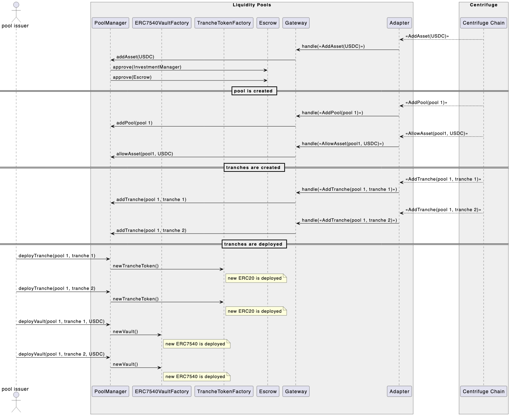
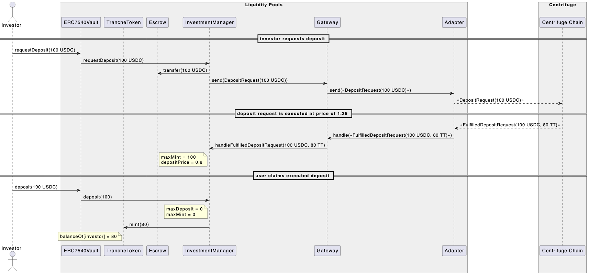
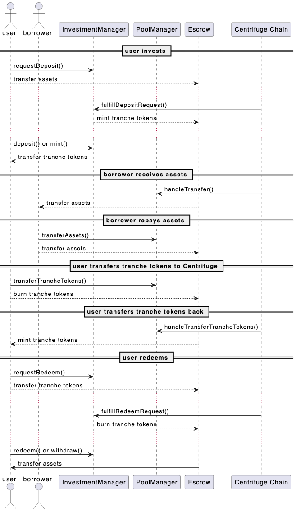

# Overview

## High level contract overview

Investors can invest in multiple tranches for each RWA pool. Each of these tranches is a separate deployment of an [ERC-7540](https://eips.ethereum.org/EIPS/eip-7540) Vault and a Tranche Token.

- [**Liquidity Pool)**](https://github.com/centrifuge/liquidity-pools/blob/main/src/ERC7540Vault.sol): An [ERC-7540](https://eips.ethereum.org/EIPS/eip-7540) (extension of [ERC-4626](https://ethereum.org/en/developers/docs/standards/tokens/erc-4626/)) compatible contract that enables investors to deposit and withdraw stablecoins to invest in tranches of pools.
- [**Tranche Token**](https://github.com/centrifuge/liquidity-pools/blob/main/src/token/Tranche.sol): An [ERC-20](https://ethereum.org/en/developers/docs/standards/tokens/erc-20/) token for the tranche, linked to a [`RestrictionManager`](https://github.com/centrifuge/liquidity-pools/blob/main/src/token/RestrictionManager.sol) that manages transfer restrictions. Prices for tranche tokens are computed on Centrifuge.

The deployment of these tranches and the management of investments is controlled by the underlying InvestmentManager, TokenManager, Gateway, and Adapters.

- [**Investment Manager**](https://github.com/centrifuge/liquidity-pools/blob/main/src/InvestmentManager.sol): The core business logic contract that handles pool creation, tranche deployment, managing investments and sending tokens to the [`Escrow`](https://github.com/centrifuge/liquidity-pools/blob/main/src/Escrow.sol), and more.
- [**Pool Manager**](https://github.com/centrifuge/liquidity-pools/blob/main/src/PoolManager.sol): The second business logic contract that handles asset bookkeeping, and transferring tranche tokens as well as assets.
- [**Gateway**](https://github.com/centrifuge/liquidity-pools/blob/main/src/gateway/Gateway.sol): Multi-Message Aggregation (MMA) implementation, receiving messages from managers, sending these messages as full payload to 1 adapter and a proof to n-1 adapters, and verifying incoming payloads and proofs and sending back to managers.
- [**Adapters**](https://github.com/centrifuge/liquidity-pools/tree/main/src/gateway/adapters): Adapter implementations for messaging layers.

## How it works
Using the Centrifuge protocol, issuers can launch pools of real-world assets. Each pool can have 1 or more tranches that investors can buy. The purpose of these tranches is to give investors different kinds of risk exposure and yield on the same asset class. Each pool has 1 pool asset. The decimals of this pool asset define the decimals of the tranche tokens that are issued per tranche. Both deposit (also known as investments) and redemptions in tranches of Centrifuge pool happen asynchronously, through an epoch mechanism. Prices for tranches are calculated on Centrifuge Chain based on the Net Asset Value of the real world assets in the pool. More information on this can be found in the [documentation](https://docs.centrifuge.io/getting-started/securitization/).

Because of the epoch mechanism, as well as the fact that Liquidity Pools communicate with Centrifuge Chain through messaging layers, deposits and redemptions cannot be executed automatically, and rather are executed asynchronously. A key goal of Liquidity Pools is to increase composability of Centrifuge assets. This is accomplished through the ERC7540 token standard for asynchronous deposits and redemptions. There is also support for permits when requesting deposits/redemptions. More details on this in `User flows` below.

The communication between Liquidity Pools and Centrifuge Chain uses external general message passing protocols. Messages are encoded using a compacted ABI encoding scheme.

### Multiple asset support
While there is 1 native pool asset, ERC-7540 vaults, using the ERC7575 extension, are built to support deposits in multiple assets. Each vault is linked to 1 asset (asset) and 1 tranche token (share), but multiple vaults can be deployed linked to the same tranche token (share). The vault contract therefore passes through the ERC20 methods to the underlying share implementation.

The challenge with supporting multiple assets is that the decimals between the tranche token (which is based on the native pool asset decimals) and the investment asset (or asset) can differ. Therefore, all price calculations and conversions between shares and assets (or tranche tokens and assets) need to account for these differences. This is accomplished by normalizing all balances and prices to 18 decimal fixed point integers, doing the calculations using these normalized values, and then unnormalizing back to the intended decimals. Currencies with more than 18 decimals are not supported and blocked in the contracts.

## User flows
`TT` = Tranche Tokens
`<<Message>>` = an encoded message
### Pool creation flow

### How users can invest

### Flow of funds

## Changes from V1

### Multi-message aggregation
To support multiple messaging adapters, multi-message aggregation (MMA) is implemented in the Gateway contract. Each message is sent to/from Centrifuge Chain with 1 full message payload, and `n-1` proofs, where `n` is the number of adapters used, and the proofs are `keccak` hashes of the messages.

There is no nonces used to support unordered messaging + keep the system complexity simple. Therefore the Gateway contract stores votes (counts of received messages and proofs) as uints, and there can be multiple parallel duplicate messages being processed at once.

In case an adapter stops processing messages, there is a recovery message that can be initiated on Centrifuge Chain, with a CFG token holder vote. This can trigger the initiation of the recovery process, which will start a 7 day period. Within that 7 day period, any other adapter (again through CFG governance) or the Guardian can block the recovery. This is to ensure no single adapter can use the recovery process to bypass the other adapters.

### Tranche token hooks
On Centrifuge Chain, all pool related values are stored as uint128s. In Liquidity Pools, the decimals of assets is also limited to 18. Therefore we can safely store all user balances in a uint128.

We also need to store per user restrictions. Therefore, the tranche token actually combines these data items. The least significant 128 bits of the balances is the actual token balance, while the most significant 128 bits is used for storing user data.

To make this flexible for future tranche token customizations, there is a hook model used, that includes callbacks on ERC20 transfers. RestrictionManager is the first and only hook implementation today.

### Operator mechanism in vault
To enable integrations that act on behalf of other users, the ERC-7540 vaults support an operator mechanism, very similar to ERC-6909. This allows smart coontracts to call any method on behalf of the user, including deciding where to send their shares or assets.

It also supports a signed message for setting an operator (`authorizeOperator`). This can be used by cross chain integrations (Superform being the first target user).

### Router contract
There is the `CentrifugeRouter` contract, similar in design to `UniswapRouter` and the Morpho bundler contracts. It has a few features:
* **Multicall**, to enable flows like [claimDeposit, requestRedeem] in 1 tx.
* **Locking requests**. This enables users to send assets to lock for a deposit request to the contract before they are added as a member to a tranche. And then anyone (a bot) can permissionlessly execute the locked request.
* **Permissionless claiming**: Any request sent through the router can be permissionlessly claimed. The intended user of the router is EOAs rather than smart contracts.
* **ERC20 wrapper support**: To allow us to extend functionality of assets in pools without modifying core logic, we want to use ERC20Wrapper like contracts in the future.

This can be considered the interface for EOAs, while the ERC-7540 vaults are the interface for smart contracts.

### Automated gas payments
To send messages to Centrifuge Chain, gas payments to the underlying adapters need to occur. The router implements methods to accept native gas token payments, which then passes this on to the gateway. The gateway estimates the gas per adapter, and pays each individual adapter accordingly.

The gas limit of each message on Centrifuge Chain is assumed to be 1 worst case value, except for a separate gas limit for proofs which is significantly lower. There is also an oracle for the current gas price on Centrifuge Chain as well as the current CFG/ETH price.

If a user interacts with an ERC-7540 vault, it is not possible to automatically pay gas fees since the specification of the methods does not include `payable`. THe gas service, through `shouldRefuel`, can decide whether to subsidize these transactions through any native gas tokens held by the gateway contract. Right now this is always allowed (and thus a known DoS vector for spamming with transactions and taking out all native gas tokensg). The will be a 2nd iteration of the gas service where there will be rules for deciding what to subsidize.

For now the assumption is that most vault interactions won't be subsidized, and will rather be paid after the transaction separately (based on an off-chain bot that has rules implemented).

If there is more gas paid by the user than used, this is stored in the gateway and used for the subsidies.
