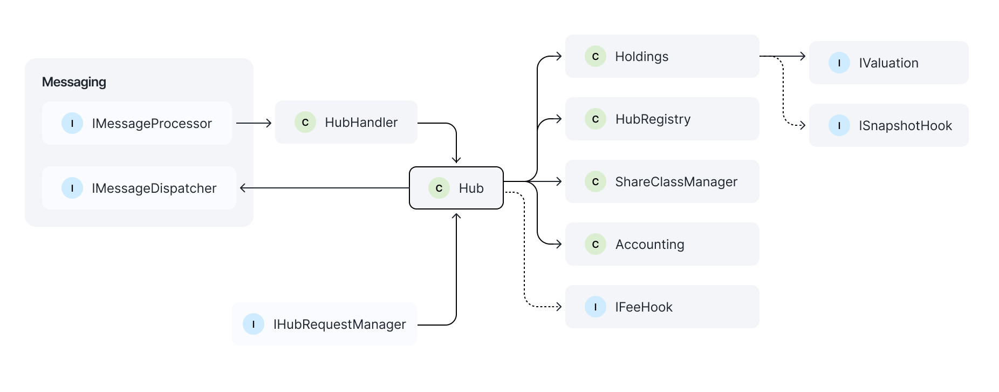

# Hub

The Hub module in the Centrifuge Protocol serves as the core orchestration layer for decentralized pool management. It acts as the central controller that connects various components of a pool’s lifecycle — from registration and accounting to share class configuration and metadata handling.



## Contracts

It contains five smart contracts:

### Hub

* **Description**: The central pool management contract.
* **Responsibilities**:

  * Aggregates and exposes all core pool functions in a single interface.
  * Allows pools to assign hub managers — trusted entities with full permissions over the pool lifecycle.
  * Coordinates pool creation, share class setup, metadata updates, and notification hooks.

### HubRegistry

* **Description**: A global registry of all pools, assets, and currencies used in the protocol.
* **Responsibilities**:

  * Stores `PoolId` objects mapped from external identifiers (e.g., Centrifuge IDs).
  * Enables canonical lookup of pools and related resources.
  * Ensures system-wide uniqueness and integrity of registered identifiers.

### Holdings

* **Description**: Ledger of holdings per pool, tied to accounting IDs.
* **Responsibilities**:

  * Tracks internal balances and positions for each pool.
  * Associates each holding with a unique accounting ID for traceability.

### Accounting

* **Description**: A robust double-entry bookkeeping system.
* **Responsibilities**:

  * Manages debits and credits across accounting IDs.
  * Ensures every operation maintains a balanced ledger.
  * Forms the financial backbone for audits and reporting.

### ShareClassManager

* **Description**: Manages share classes across pools and chains.
* **Responsibilities**:

  * Handles **epoch-based workflows**, including request submission, approval, and fulfillment.
  * Generates share class IDs and manages cross-chain state.

## Pool Setup Workflow

Below is an example of how to initialize and configure a pool using the Hub module:

```solidity
PoolId poolId = hubRegistry.poolId(centrifugeId, 1); // Derive a unique PoolId
hub.createPool(poolId, msg.sender, USD_ID);         // Create the pool with USD as the currency
hub.updateHubManager(poolId, admin, true);          // Grant admin rights to a manager

ShareClassId scId = shareClassManager.previewNextShareClassId(poolId); // Preview the next share class ID

hub.setPoolMetadata(poolId, bytes("Testing pool")); // Attach metadata
hub.addShareClass(poolId, "Tokenized MMF", "MMF", bytes32(bytes("1"))); // Add share class to the pool

hub.notifyPool(poolId, centrifugeId);               // Notify the pool of its registration
hub.notifyShareClass(poolId, scId, centrifugeId, bytes32(bytes20(redemptionRestrictionsHook))); // Set share class-level restrictions
```

### Step-by-Step Breakdown

1. **Generate a PoolId**:

   * Derived from a Centrifuge-specific identifier and a nonce.
   * Ensures uniqueness within the protocol.

2. **Create the Pool**:

   * Registers the pool in the Hub.
   * Specifies currency and the initiating address.

3. **Assign a Hub Manager**:

   * Grants full permissions to manage the pool (adding share classes, updating metadata, etc.).

4. **Configure Share Class**:

   * Create a new share class (e.g., MMF tokens).
   * Metadata and IDs are established for tracking and issuance.

5. **Notification Hooks**:

   * Hooks like `notifyPool` and `notifyShareClass` inform the Spoke network of the pool.
