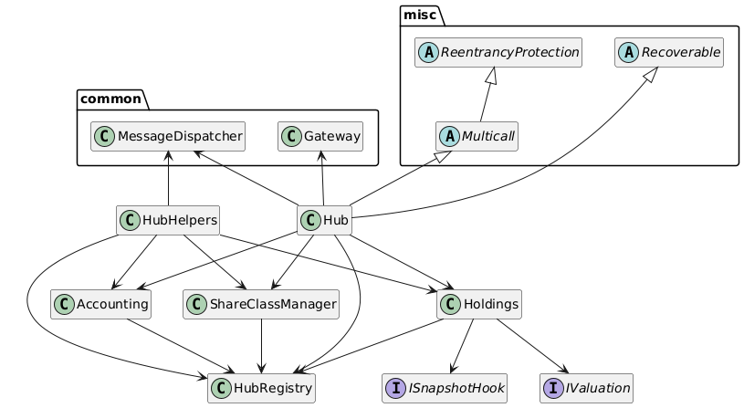

# Hub

The Hub module serves as the central orchestration layer for pool management in the Centrifuge Protocol. It coordinates all core pool operations including registration, accounting, holdings management, share class configuration, and cross-chain message handling.

### Hub

The central pool management contract that aggregates all core pool functions in a single interface. It handles pool administration including manager assignment, share class notifications, metadata updates, and asset price broadcasting across chains. Managers assigned to a pool have full rights over all pool actions, enabling them to configure holdings, update share classes, set price feeds, and coordinate cross-chain state synchronization.

The `Hub` coordinates with `ShareClassManager`, `Holdings`, `Accounting`, and `HubRegistry` to maintain consistent pool state. It supports batched multicall operations for efficient transaction execution and integrates with an optional fee hook for custom fee logic. All cross-chain communication flows through the `Hub`'s integration with the `Gateway`'s message sender, enabling pools to notify remote chains of share class updates, price changes, and other critical state transitions.

### HubHandler

Processes incoming cross-chain messages for the `Hub`, acting as the message receiver from the `Gateway`'s `MessageProcessor`. It handles asset registration from remote chains, vault request callbacks, holding amount updates, share issuance/revocation messages, and cross-chain share transfers. All handler methods are auth-protected and called exclusively by the `Gateway`.

The `HubHandler` coordinates state updates across `Hub`, `Holdings`, and `ShareClassManager` based on incoming messages. It validates and routes request callbacks to appropriate `HubRequestManager`s registered per pool and destination chain, ensuring that vault operations flow correctly through the system. It also maintains snapshot state for cross-chain consistency, tracking when assets and shares are synchronized across different networks.

### Holdings

The `Holdings` contract serves as the ledger for all pool holdings, tracking assets and their associated accounting IDs. Each holding is initialized with an `IValuation` contract that determines how to price the asset in the pool's currency, along with mappings to accounting IDs for integration with the double-entry bookkeeping system. Holdings can be designated as either assets or liabilities, affecting how they contribute to pool valuations.

The contract tracks holding amounts per pool, share class, and asset, providing methods to increase and decrease amounts with price validation. It maintains snapshot state per chain to ensure cross-chain data consistency, tracking when the holdings on a given chain are synchronized with share issuance. Optional `ISnapshotHook` integration allows for custom logic to execute when snapshot state changes, enabling advanced pool behaviors.

### HubRegistry

The global registry serves as the canonical source of truth for all pools, assets, currencies, and pool-level dependencies. It handles pool registration with initial manager and currency assignment, asset registration with decimal precision tracking, and ongoing manager updates. The registry enforces uniqueness constraints, preventing duplicate pool or asset registrations and validating existence before state updates.

Beyond basic registration, `HubRegistry` manages pool metadata storage and tracks pool dependencies such as `HubRequestManager`s per destination chain. This enables pools to configure different request handling logic for different networks while maintaining centralized visibility into pool configuration. Multiple managers can be assigned to each pool, providing flexible access control for pool operations.

### Accounting

A double-entry bookkeeping system that maintains financial integrity for all pool operations. Accounts are created with either debit-normal or credit-normal balances, following traditional accounting conventions. It uses a lock/unlock mechanism where a specific pool must be unlocked before journal entries can be recorded, and must be locked to commit the transaction. During the locked period, the contract enforces that total debits equal total credits, ensuring balanced transactions. Transient storage tracks the in-flight journal state, including debited and credited amounts for the current transaction.

### ShareClassManager

Manages all share classes across pools and chains, handling creation, metadata, pricing, and issuance tracking. Share classes are created with unique deterministic IDs generated from the pool and an incrementing index, along with names, symbols, and salts. The contract prevents salt reuse to ensure share class uniqueness and tracks both total issuance and per-chain issuance to support cross-chain vault operations.

The manager maintains share prices (price per share in pool currency) with computed-at timestamps, validating that prices cannot be set in the future. It provides methods to update share class metadata, issue and revoke shares based on cross-chain activity, and preview the next share class ID for deterministic deployment planning. Share issuance is tracked separately per chain to enable accurate accounting when shares are minted or burned on different networks.
