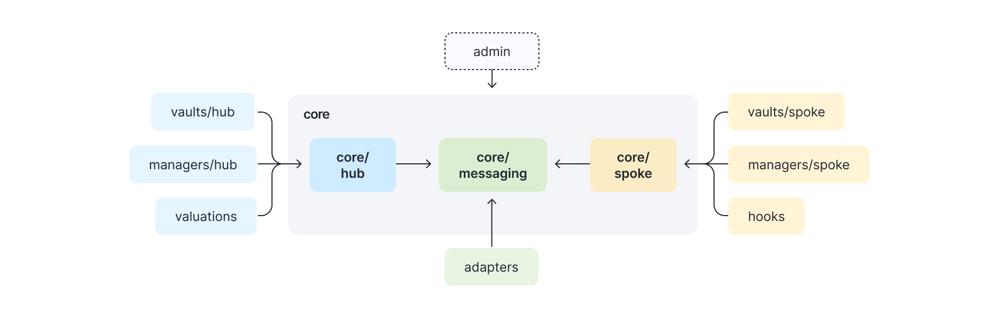

# Overview

The Centrifuge Protocol is built on an immutable core protocol architecture, with a modular design that enables customized products to be built on top of it.

## Immutable core

The immutable core includes:

* Hub: Central orchestration layer for pool management, accounting, and share class coordination
* Spoke: Local registry and integration point for cross-chain deployments

## Modular extensions

Built on top of the immutable core, the protocol supports various extension points that enable customization without modifying core contracts:
- Adapters: Cross-chain messaging adapters integrating with LayerZero, Wormhole, Axelar, and recovery mechanisms
- Hooks: Transfer hook implementations (FreezeOnly, RedemptionRestrictions, FullRestrictions, FreelyTransferable)
- Hub Managers: NAVManager for net asset value tracking and SimplePriceManager for single-share-class pool pricing
- Spoke Managers: OnOfframpManager for asset custody, MerkleProofManager for permissioned operations, QueueManager for batched syncing
- Valuations: Asset valuation implementations (IdentityValuation for 1:1 pricing, OracleValuation for oracle-based pricing)
- Vaults: ERC-4626/ERC-7540 vault implementations (AsyncVault, SyncDepositVault), request managers, and router
