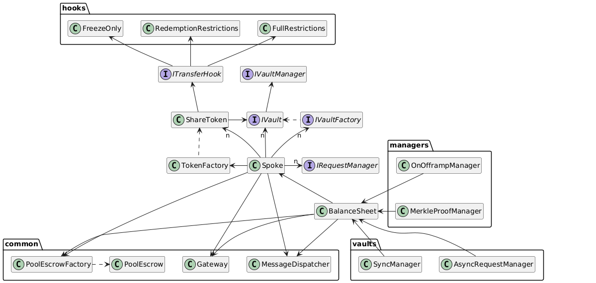

# Spoke

The Spoke module is a core component of the Centrifuge protocol's on-chain infrastructure, responsible for local management and orchestration of asset pools, share classes, vaults, and related operations. It acts as the local registry and integration hub for factory-based deployments and other pool contracts.

## Contracts

### Spoke

The `Spoke` contract serves as:

* A **local registry** for pools, share classes, and associated vaults.
* An **integration point** for factories like `TokenFactory`, `VaultFactory`, and `PoolEscrowFactory`.
* A **router** for inter-contract coordination, including dispatching messages via the `MessageDispatcher`.

Key integrations:

* `TokenFactory` – to deploy `ShareToken` instances.
* `VaultFactory` – to deploy pool vaults.
* `PoolEscrowFactory` – for creating pool-specific escrows.
* `BalanceSheet` – to enable financial tracking and share/token management.

### Escrow

There are two primary types of escrow contracts:

* **Global Escrow** (`Escrow`)
  Used to hold pending requests and ensure secure settlement across the system.

* **Pool Escrow** (`PoolEscrow`)
  Tied to individual pools, it holds the balance sheet for assets and liabilities associated with that pool.

Factories such as `PoolEscrowFactory` are responsible for deterministic escrow deployments.

### BalanceSheet

The `BalanceSheet` contract:

* Tracks **asset and share class balances**.
* Authorizes **manager contracts** to interact with share tokens and vaults.
* Coordinates with `MerkleProofManager` and `OnOfframpManager` to verify and execute off-chain proofs and liquidity bridges.

Vault managers like `SyncManager` and `AsyncRequestManager` interact with this module to perform vault-specific logic.

### ShareToken

`ShareToken` is a custom ERC20 implementation with additional features:

* **ERC1404 compatibility**: Allows restriction enforcement on transfers.
* **ERC20 callbacks**: Integrates with `ITransferHook` for transfer-related hooks.
* Optional **transfer restriction logic** provided by:

  * `FreezeOnly`
  * `RedemptionRestrictions`
  * `FullRestrictions`

These hook contracts implement the `ITransferHook` interface and can be dynamically attached to `ShareToken`.

Each `ShareToken` is instantiated by the `TokenFactory` and linked to a specific pool and share class.

## Factories

* **TokenFactory**: Creates ERC20-compliant `ShareToken` contracts.
* **VaultFactory**: Spawns vaults that conform to `IVault`.
* **PoolEscrowFactory**: Deploys dedicated `PoolEscrow` instances per pool.

## Vaults and Managers

Vaults manage capital allocation strategies. The Spoke coordinates with multiple vault interfaces:

* `SyncManager` (synchronous interactions)
* `AsyncRequestManager` (handles delayed execution flows)

Managers are special contracts allowed to interact with vaults and balance sheets:

* `OnOfframpManager`: Restricts on-offramp transactions.
* `MerkleProofManager`: Integrates with external DeFi protocols.
