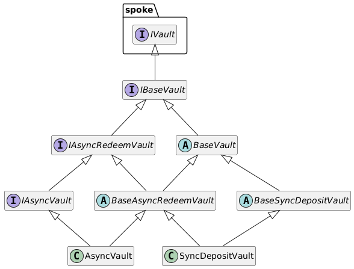

# Vaults

The Vaults module in the Centrifuge protocol enables flexible, secure, and standards-compliant tokenized asset management through both synchronous and asynchronous vault implementations. It leverages a combination of Ethereum token standards such as ERC-4626, ERC-7540, and ERC-7575 to provide support for token deposits and redemptions, including multicall entry points and support for multiple input/output assets.

It builds on:

* **ERC-4626**: Tokenized vaults for yield-bearing assets (synchronous behavior).
* **ERC-7540**: Standard for asynchronous deposits/redemptions.
* **ERC-7575**: Multitoken vaults - a single share token can be issued in exchange for multiple different underlying assets.

## Contract Structure

* **`IVault`**: Root interface for all vault functionality.
* **`IBaseVault`**: Common interface implemented by all vaults.
* **`IAsyncRedeemVault`**: Interface for vaults supporting asynchronous redemptions.
* **`IAsyncVault`**: Interface for vaults supporting full asynchronous behavior (deposits and redemptions).
* **`BaseVault`**: Abstract contract providing base implementation shared across vault types.
* **`BaseAsyncRedeemVault`**: Extends `BaseVault`, adds asynchronous redemption support.
* **`BaseSyncDepositVault`**: Extends `BaseVault`, adds ERC-4626 deposit logic.

### Vault implementations

* **`AsyncVault`**

  * Implements `IAsyncVault`
  * Fully asynchronous vault (ERC-7540 compliant)
  * Useful for real-world asset (RWA) use cases requiring delayed fulfillment of deposits/redemptions.

* **`SyncDepositVault`**

  * Combines synchronous deposits (ERC-4626) with asynchronous redemptions (ERC-7540)
  * Hybrid vault that caters to different liquidity needs for depositing vs. redeeming.

## Manager contracts

* **`AsyncRequestManager`**

  * Core engine for handling ERC-7540 asynchronous operations
  * Queues, executes, and manages state for async requests.

* **`SyncManager`**

  * Handles standard ERC-4626 operations
  * Ensures consistent accounting and exchange rate logic.

## Periphery

* **`VaultRouter`**

  * Multicall-enabled entry point for externally owned accounts (EOAs)
  * Routes deposit/redeem requests to appropriate vaults
  * Simplifies user interaction by abstracting vault-specific logic.

## ERC-7575 Support

Vaults in this module support **ERC-7575**, enabling:

* A single share token can be exchanged for multiple accepted collateral assets.
* Greater composability and flexibility in portfolio management.
* Enhanced user experience for diversified asset deposits.
