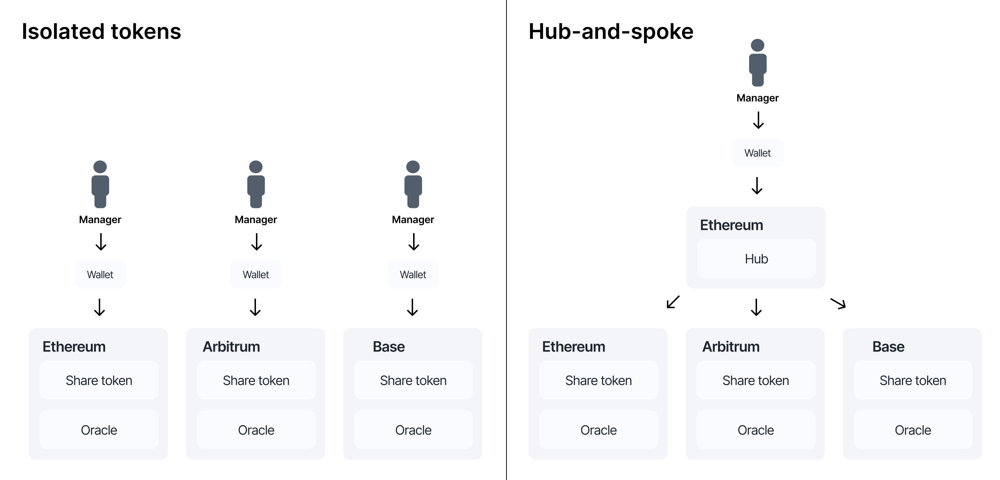

# Chain abstraction

The Centrifuge protocol is designed to scale tokenized assets across multiple blockchains using a hub-and-spoke architecture. This model solves a fundamental limitation of traditional tokenization protocols: the inability to efficiently operate across chains.

## The problem with traditional multi-chain tokenization

In legacy designs, each token is issued independently on each network. That means if a pool wants to make its asset available across Ethereum, Base, and Arbitrum, it must issue three separate tokens—one on each chain. Each version of the token has to be deployed, managed, and reconciled separately.

This model introduces operational overhead:

* Each chain requires its own custodian setup or self-custody wallet.
* Gas tokens must be managed on every chain.
* Blockchain endpoints must be monitored and maintained.
* Vault accounting becomes fragmented and complex.

This approach does not scale in a multi-chain world, where asset issuers increasingly seek access to liquidity across many L1s and L2s. Managing each chain as a silo creates complexity and risk, making cross-chain tokenization inefficient and brittle.

## Centrifuge’s hub-and-spoke solution

Centrifuge V3 solves this challenge with a hub-and-spoke architecture. Each pool selects a single hub chain—its source of truth and control—and issues assets and vaults across any number of spoke chains.

The hub chain serves as the control layer for the pool. It holds the authoritative state of the pool, its vaults, and the overall accounting.

The spoke chains are where tokens are deployed and liquidity is accessed. These include Ethereum, Base, Arbitrum, and other supported networks.

## Scalable interoperability

To make this possible, Centrifuge includes a robust messaging system between the hub and spoke chains. This system is designed to handle large-scale cross-chain activity with minimal overhead and maximum security.

### Multi-message aggregation

To increase the security of cross-chain communication, the protocol aggregates multiple messages into a single payload. This payload is then distributed along with multiple independent proofs, allowing verification through more than one interoperability provider. This reduces reliance on any single provider and improves resilience against downtime, censorship, or fraud. By aggregating messages, Centrifuge ensures that cross-chain actions remain atomic and consistent.

### Built-in retries and repayment

Cross-chain messaging can fail due to gas volatility, endpoint downtime, or validator issues. The Centrifuge protocol addresses this with:

* Automatic retry logic for failed messages
* Built-in repayment flows for messages that were underfunded with gas

This ensures that cross-chain actions are reliably completed without requiring manual intervention from the pool manager or end user.

### Automatic batching of messages

Centrifuge automatically groups multiple messages together whenever possible, whether they come from vault operations, redemptions, or token transfers. This reduces the total number of relayed messages and significantly lowers gas costs.

Batching is handled by the protocol itself, requiring no configuration from pool deployers. It is especially valuable for high-frequency use cases like redemptions, subscriptions, and rewards.

### User subsidy and automatic gas token relaying

The protocol also includes economic support features for pool users:****

* Pool users do not need to hold native gas tokens on each spoke chain
* Centrifuge relays gas tokens automatically between chains to fund transactions
* Gas payments can be subsidized or reimbursed by the protocol for specific actions

These features remove the burden of managing gas on multiple chains and create a seamless user experience—even when interacting with vaults across different networks.