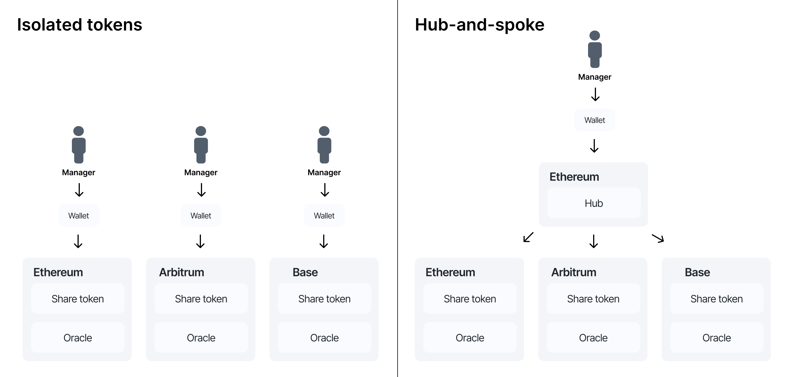

# Multi-chain asset management

The Centrifuge protocol is designed to scale tokenized assets across multiple blockchains using a hub-and-spoke architecture. Distribution to any chain is not a feature. It's a requirement. Institutional allocators operate across chains. DeFi protocols launch where liquidity concentrates. A fund that can't follow capital where it moves will always be constrained by deployment decisions made on day one.

## The problem with isolated multi-chain tokenization

In legacy designs, each token is issued on each chain, fully isolated. That means if a pool wants to make its asset available across Ethereum, Base, and Arbitrum, it must issue three separate tokens, one on each chain. Each version of the token has to be deployed, managed, and reconciled separately.

This model introduces operational overhead:

* Each chain requires its own custodian setup or self-custody wallet.
* Gas tokens must be managed on every chain.
* Blockchain endpoints must be monitored and maintained.
* Token accounting becomes fragmented and complex.

This approach does not scale. Managing each chain as a silo creates complexity and risk, making cross-chain tokenization inefficient and brittle. The real cost is *not* being multichain: fragmented liquidity, missed integrations, and manual reconciliation across isolated deployments.

## Centrifuge's hub-and-spoke solution

Centrifuge solves this with a hub-and-spoke architecture. Each pool selects a single hub chain as its source of truth, and issues assets and vaults across any number of spoke chains.



The hub chain serves as the control layer for the pool. It holds the authoritative state of the pool, its vaults, and the overall accounting. The spoke chains are where tokens are deployed and liquidity is accessed, including Ethereum, Base, Arbitrum, and other supported chains.

The architecture abstracts away the complexity of each individual chain. A builder or fund manager doesn't need to understand the gas model, finality characteristics, or bridging quirks of every chain. They interact with a single pool, and the protocol handles the translation. This is the core value proposition: multichain distribution without multichain operational overhead.

### One-click deployment to any number of chains

A tokenized asset can be deployed to any number of chains in a single action. Each new spoke is provisioned automatically with share tokens, escrows, and vault contracts. No bespoke engineering per chain. No separate deployment pipelines. One click, and the fund is accessible wherever investors and protocols need it.

## Scalable interoperability

To make this possible, Centrifuge includes a robust messaging system between the hub and spoke chains. This system is designed to handle large-scale cross-chain activity with minimal overhead and maximum security.

### Multi-adapter security

The protocol integrates multiple interoperability providers through adapters. Each cross-chain message can be verified by multiple independent proofs from different providers, reducing reliance on any single provider. This was designed in from the first deployment, not bolted on after a bridge exploit.

Adapters are modular. Pool deployers select which providers to use and can add new ones as the interoperability landscape evolves. If a new provider offers better cost or speed characteristics, it can be integrated without redeploying the vault infrastructure. The protocol ships adapters for Axelar, LayerZero, Wormhole, and Chainlink CCIP.

### Automatic batching of messages

Centrifuge automatically groups multiple messages together into a single payload and set of proofs. This reduces the total number of relayed messages and significantly lowers gas costs.

The `Gateway` contract exposes a `withBatch` function that makes this straightforward. You pass a callback containing all the operations you want to execute, and the gateway collects every outbound message generated during that callback into batched payloads, grouped by destination chain and pool. When the callback completes, all batches are sent in one go:

```solidity
// Wrap multiple operations in a single batch
gateway.withBatch(
    abi.encodeCall(myContract.executeOperations, ()),
    refundAddress
);

// Inside the callback, every send() call is automatically collected.
// Messages to the same destination chain are concatenated into
// a single payload. One set of proofs, one relay fee.
```

Batching is also nestable. A `withBatch` call inside another `withBatch` keeps accumulating messages into the outer batch. This means higher-level contracts can compose batch operations without worrying about whether a sub-call already started its own batch. The gateway tracks nesting depth and only flushes when the outermost batch completes.

Core contracts like `Hub` and `BalanceSheet` inherit from `BatchedMulticall`, which wraps the standard `multicall()` function in a `gateway.withBatch()` call. Any sequence of operations executed through `multicall()` on these contracts automatically batches all resulting cross-chain messages into a single payload. Builders composing multiple operations in one transaction get batching for free.

### Onchain cost estimates

Every adapter implements an `estimate` function that returns the expected cost of sending a cross-chain message before it's sent:

```solidity
// Query the cost of a cross-chain message before sending
uint256 cost = adapter.estimate(centrifugeId, payload, gasLimit);
```

Managers can budget gas subsidies accurately. Builders can surface cost estimates to users in their UI. No hardcoded gas buffers or guesswork on relay pricing. The estimate reflects current conditions and adapter fees.

### Gas subsidies

The protocol includes native gas subsidies so that investors never need to hold native gas tokens on spoke chains.

Each pool has a dedicated subsidy escrow (deployed deterministically via CREATE2) that pool managers or anyone else can fund with native tokens. When a cross-chain message is sent on behalf of the pool, the gas cost is drawn from the escrow. Investors interact with vaults using only their deposit asset.

If a message is sent without sufficient gas funding, it isn't lost. The Gateway queues it as an underpaid batch. Anyone can later call `repay()` with the required gas to send it, ensuring cross-chain operations are resilient to temporary gas funding gaps.

### Failed message retries and recovery

Cross-chain message execution can fail for various reasons. The protocol implements built-in resilience:

* **Failed message counter.** When a message fails to process on arrival, the Gateway increments a failed message counter and emits the failure reason. Anyone can call `retry()` to re-execute the message once the underlying condition is resolved. No manual message reconstruction or re-sending from the source chain is required.
* **Recovery adapter.** For severe incidents, a `RecoveryAdapter` allows authorized parties to inject messages directly into the protocol, bypassing cross-chain infrastructure entirely. This is the last-resort recovery mechanism for stuck or lost messages, ensuring no cross-chain state becomes permanently irrecoverable.
* **Per-pool circuit breaker.** The Gateway Manager can block outgoing messages per chain and per pool, acting as a circuit breaker for cross-chain message flow.

### Cross-chain observability

[Centrifugescan](https://centrifugescan.io/) is the first cross-chain explorer built specifically for tokenized assets. It tracks the full lifecycle of cross-chain messages, investment flows, and vault state across every spoke, providing a single view rather than switching between multiple block explorers.
