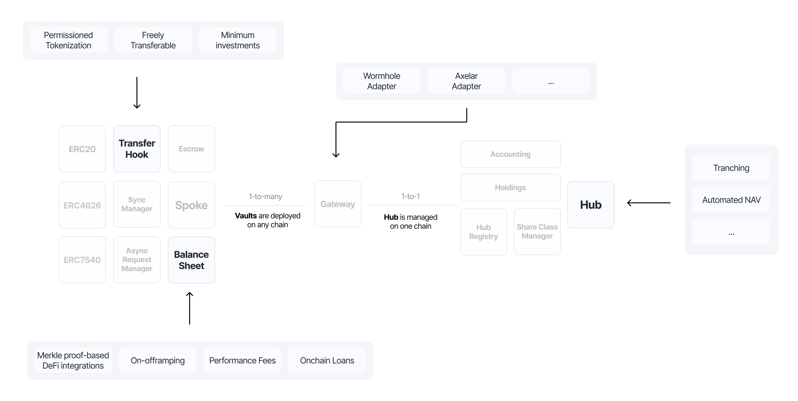
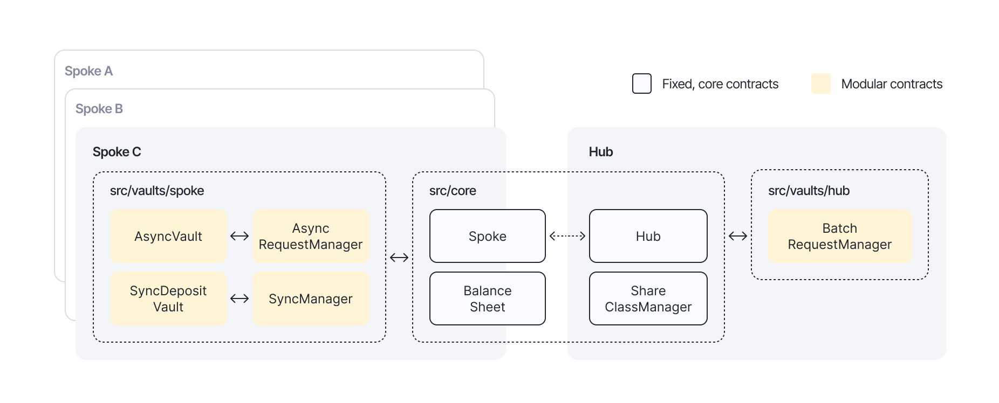

# Programmable vault stack

Building a single vault is straightforward. Building infrastructure that supports every type of vault the market will need is an abstraction problem.

A tokenized money market fund, a multi-strategy DeFi allocator, and a cross-chain distribution vehicle all need different rules around who can hold the token, how deposits and redemptions work, what fees apply, and how pricing is calculated. But they all share the same underlying mechanics: accounting, settlement, cross-chain messaging, and access controls.

Centrifuge's approach is to make the core immutable and audited, and make everything else pluggable. The result is a stack where builders configure behavior without writing security-critical code. The hard parts are solved once. Builders focus on the logic that differentiates their product.

Below is an overview of the smart contracts and where builders can plug in:

## Extension points

The vault stack is structured around extension points. Each point in the lifecycle where different products need different behavior is exposed as a swappable module. The core contracts handle the invariants (correct accounting, message integrity, settlement finality), and modules handle the policies (who can transfer, how requests are processed, how pricing works).

Here are the key extension points. The stack exposes more, but these illustrate the design philosophy.

### Transfer hooks

Every share token calls out to an `ITransferHook` implementation on every ERC-20 transfer. The hook decides whether the transfer is allowed based on the sender, receiver, and the type of operation (deposit, redemption, secondary transfer, cross-chain move).

The protocol ships multiple hook implementations covering the spectrum from fully restricted (memberlist required for all operations) to freely transferable (anyone can hold and transfer) to freeze-only (no memberlist, just a compliance kill switch). Builders select the model that fits their product, or write their own. The interface is a single function.

**Hooks are upgradeable without redeploying the token contract.** The share token references a hook contract that can be swapped by the pool manager. A fund can start with full restrictions and later switch to freely transferable once the token is ready for broader distribution, all without migrating tokens or breaking integrations.

### Sync vs async vaults

Not every asset needs asynchronous settlement. A stablecoin wrapper or a liquid onchain asset can handle instant deposits. An illiquid credit fund cannot.

The stack supports both through separate vault types. An **AsyncVault** implements the full ERC-7540 request/claim lifecycle for both deposits and redemptions. A **SyncDepositVault** offers instant ERC-4626 deposits at the current price while keeping redemptions asynchronous, because the underlying assets may not be instantly liquidatable. Each vault type delegates to its own request manager, so the settlement model is determined by configuration, not by forking the codebase.

### Batching on any cadence

Async vaults process requests in epochs. The `BatchRequestManager` on the hub accumulates deposit and redemption requests and fulfills them in batches, recording prices at fulfillment so investors receive their pro-rata allocation.

**The batching cadence is not hardcoded.** There is no "daily" or "weekly" setting in the contract. The fund manager controls when epochs close by calling the approval functions. A treasury fund might run epochs hourly. A credit fund might batch weekly. A fund with complex NAV calculations might process monthly. The contracts enforce sequential processing but leave the timing entirely to the manager.

This also means different share classes and different deposit assets within the same pool can run on independent epoch cycles. A pool's USDC deposits might batch daily while its USDT deposits batch weekly, all managed independently.

### Hub managers for pricing and NAV

Any contract that implements the `INAVHook` interface can be set as a pool's hub price manager. This is where NAV calculation, share pricing, and tranche allocation logic lives.

The protocol ships a `SimplePriceManager` for single-tranche pools that divides total NAV by total issuance. But the interface is open. A builder can deploy a custom hub manager that implements waterfall logic for senior/junior tranches, applies a fee accrual model, or prices shares based on any onchain or oracle-fed data. The `ShareClassManager` supports multiple share classes per pool, each with independent issuance tracking and pricing. The hub manager decides how to distribute value across them.

This means a senior/junior structure, a multi-currency fund, or an entirely novel pricing model all plug into the same core. The accounting and settlement are handled. The pricing logic is yours.

### Balance sheet managers

On the spoke side, **any contract can be set as a balance sheet manager.** This is the extension point for how a pool's assets are actually held, moved, and allocated.

A balance sheet manager handles deposits into the pool's reserves, withdrawals to fund redemptions, and any interaction with external protocols or custody arrangements. The default implementation covers standard reserve management. But a builder can deploy a custom balance sheet manager that:

* Routes deposits into a DeFi lending protocol
* Manages on/off-ramp flows to fiat
* Implements a multi-strategy allocation engine
* Integrates with external custody solutions

The core enforces correct accounting for whatever the manager does. The allocation logic is entirely pluggable.

### Cross-chain adapters

The same pattern applies to cross-chain messaging. The `Gateway` contract routes messages through adapters, and any contract that implements the `IAdapter` interface can be used. The protocol ships adapters for Axelar, LayerZero, Wormhole, and Chainlink CCIP. Pool deployers select which providers to use, and can add new ones as the interoperability landscape evolves. If a new messaging protocol launches with better economics or faster finality, it becomes available to every pool through a single adapter deployment.

### Hook managers

Hook Managers are smart contracts deployed on spoke chains that build on top of the transfer hooks system to provide automated account management capabilities:

* **Automated whitelisting**: Programmatically add or remove addresses from whitelists based on custom logic or external events
* **Freezing and unfreezing accounts**: Dynamically control which accounts can transfer tokens in response to compliance requirements or risk events
* **Custom access control logic**: Implement rules for managing who can hold and transfer share tokens

Hook Managers enable builders to create permissioning systems that respond to onchain or offchain events, integrate with KYC/AML providers, or implement time-based restrictions, all without requiring manual intervention or modifications to the core token contracts.

### Request managers

The image below shows the primary vaults implementation in the protocol, and how it leverages the immutable core as the base for cross-chain request handling logic. The orange contracts can be fully customized.

## Developer stack

Beyond the protocol, builders leverage:

* **Centrifuge SDK**:a typed TypeScript interface for querying pool data, submitting investment requests, and managing vault operations.
* **Centrifuge API**:a public GraphQL endpoint for server-side integration or analytics without running your own indexer.
* **Centrifuge Management App**:a purpose-built interface for vault management and capital allocation: pool configuration, epoch processing, NAV updates, role-based permissions, and cross-chain deployment. No CLI required.

A team that would otherwise spend a year building vault infrastructure, cross-chain messaging, accounting, and an operations dashboard can go to production in weeks by building on what already exists.
