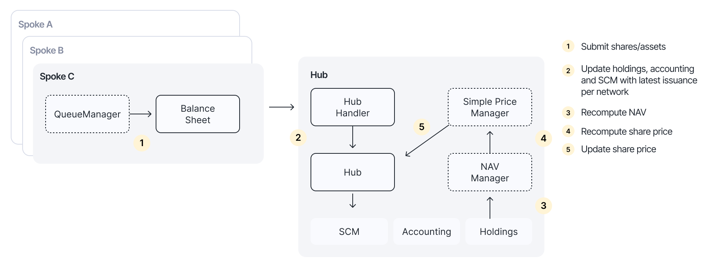

# Onchain accounting

The Centrifuge Protocol implements fully onchain and automated accounting of tokenized assets. The system provides automated Net Asset Value (NAV) calculations, share pricing, and oracle updates across all deployed networks, leveraging an onchain double-entry bookkeeping system.

Below is an overview of how the onchain accounting system works:



## Investment processing

Investments are submitted on each chain (Spokes), minting new shares and depositing ERC20 tokens into the balance sheet. The Queue Manager smart contract enables automatically submitting batches of investment updates cross-chain to the pool manager on the Hub chain.

This batch processing ensures efficient cross-chain communication while maintaining accurate state synchronization across all networks.

## Hub state management

The Hub chain serves as the source of truth for the protocol's accounting state. When it receives investment updates, it:

* Increases holdings for the invested assets
* Stores the updated token issuance for each Spoke network
* Increases the total issuance across all networks

This centralized state management ensures consistency while still supporting multi-chain deployments.

## Double-entry bookkeeping

The Hub maintains an onchain double-entry bookkeeping system that records all financial transactions. When investments are processed, the system:

* Debits the asset account (per invested asset per chain)
* Credits the equity account (per chain)

This traditional accounting approach, implemented onchain, provides transparency and auditability for all participants.

## NAV Manager

The NAV Manager smart contract recomputes the Net Asset Value based on the latest state in the bookkeeping system. It calculates:

```
NAV = equity + gain - loss - liability
```

This automated calculation ensures that the fund's value is always up-to-date and verifiable onchain, eliminating the need for manual NAV calculations or off-chain oracle inputs.

## Price Manager & oracle updates

The Simple Price Manager smart contract calculates the updated share price based on:

```
Share price = NAV / total issuance
```

Once calculated, it automatically submits oracle updates to all networks where the token is deployed, ensuring price consistency across chains.

## Benefits

Together, this onchain accounting system delivers:

* **Transparency**: Full visibility into pricing logic and accounting state
* **Automation**: Automated NAV and pricing calculations without manual intervention
* **True onchain accounting**: Complete double-entry bookkeeping maintained onchain
* **Cross-chain consistency**: Automated oracle updates ensure synchronized pricing across all networks
* **Builder-friendly**: Any builder on the Centrifuge Protocol can leverage this system in their products
