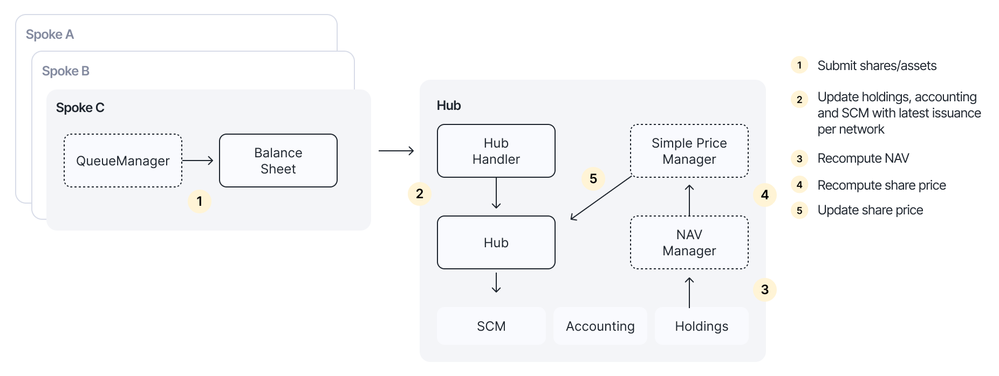

# Onchain accounting

The Centrifuge protocol implements fully onchain and automated accounting of tokenized assets. The system provides automated Net Asset Value (NAV) calculations, share pricing, and oracle updates across all deployed chains, built on an onchain double-entry bookkeeping system.

Below is an overview of how the onchain accounting system works:



## Double-entry bookkeeping

The hub chain runs a full double-entry bookkeeping engine (`Accounting.sol`). Every movement of value is recorded as a journal entry with matching debits and credits. The system enforces the fundamental accounting identity: within any transaction, total debits must equal total credits, or the transaction reverts.

### Account types

Six account types track the full financial picture for each pool:

| Account | Normal balance | Scope |
|---------|---------------|-------|
| **Asset** | Debit | Per asset across chains |
| **Equity** | Credit | Per chain |
| **Gain** | Credit | Per chain |
| **Loss** | Debit | Per chain |
| **Liability** | Credit | Per chain |
| **Expense** | Debit | Per chain |

### Journal entries

Journal entries are generated automatically for each state transition:

* **Deposit**: `DR Asset / CR Equity`
* **Withdrawal**: `DR Equity / CR Asset`
* **Mark-to-market gain**: `DR Asset / CR Gain`
* **Mark-to-market loss**: `DR Loss / CR Asset`
* **Liability increase**: `DR Expense / CR Liability`
* **Liability decrease**: `DR Liability / CR Expense`
* **Period-end close**: `DR Gain / CR Equity` and `DR Equity / CR Loss`

### Balance enforcement

The accounting engine uses a lock/unlock pattern with transient storage (EIP-1153) to enforce balanced entries. `unlock(poolId)` opens a journal transaction, `addDebit` and `addCredit` accumulate running totals in transient storage, and `lock()` reverts with `Unbalanced()` if debits do not equal credits at the end.

## Batched updates from spoke chains

In a multichain architecture, assets move on spoke chains while the ledger lives on the hub. Centrifuge's spoke chains queue balance changes locally rather than sending a cross-chain message per transaction.

When an investor deposits into a vault on Arbitrum, the `BalanceSheet` contract records the change in a local queue. Withdrawals, share issuances, and revocations are queued the same way.

The `QueueManager` flushes these queues in batches. It wraps all pending updates into a single `gateway.withBatch()` call, sending one cross-chain message per spoke that contains every asset and share delta since the last sync. On the hub, each update is unpacked into journal entries that update the accounting state.

### Complete vs partial sync

The system tracks whether a sync represents a complete snapshot. When both asset queues and share queues are fully flushed, the hub knows the spoke's state is consistent. This triggers a NAV recalculation. Partial syncs update the ledger but do not trigger repricing, preventing stale or incomplete data from affecting share prices.

## Hub-side valuations

Accounting entries record amounts. Valuations convert those amounts into the pool's base currency so the ledger reflects current market value.

Every holding on the hub is associated with a valuation contract implementing the `IValuation` interface:

```solidity
interface IValuation {
    function getPrice(PoolId, ShareClassId, AssetId)
        external view returns (D18);
    function getQuote(PoolId, ShareClassId, AssetId, uint128 baseAmount)
        external view returns (uint128);
}
```

Valuations are pluggable per holding. A pool can use different valuation contracts for different assets: one for stablecoin reserves, another for treasury positions, a third for a structured product. When any price updates, it immediately triggers a mark-to-market revaluation of the holding, and the resulting gain or loss flows into the accounting as a balanced journal entry.

### Any smart contract as a price source

The `OracleValuation` contract accepts prices from authorized feeders, and those feeders can be on any chain. A spoke-side contract can read an onchain price source (a Chainlink feed, a Uniswap TWAP, an ERC-4626 share price, a Morpho market rate) and relay it to the hub via the existing cross-chain messaging path. No separate oracle infrastructure is required.

## NAV Manager

The `NAVManager` implements `ISnapshotHook`, receiving callbacks when holdings reach a consistent state (i.e., when a complete sync is detected). It computes per-chain NAV from the accounting state:

```
NAV = equity + gain - loss - liability
```

The NAV is clamped at zero and passed to the pool's price manager.

## Price Manager and oracle updates

The price manager (e.g., `SimplePriceManager` for single-tranche pools) aggregates NAV and issuance across all chains and computes:

```
Share price = NAV / total issuance
```

Once calculated, it automatically submits oracle updates to all chains where the token is deployed, ensuring price consistency across the protocol.

Custom `INAVHook` implementations can distribute NAV across multiple share classes according to waterfall logic, fee accrual models, or any other pricing structure.

