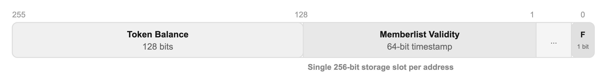

# Token compliance

Centrifuge share tokens are ERC-20 tokens extended with ERC-1404 (Simple Restricted Token) and a modular transfer hook system. Together, these provide the compliance capabilities that institutional investors require: identity management, transfer restrictions, freeze and clawback controls. The design keeps gas costs low enough for full DeFi composability.

## Architecture: share token + transfer hook

Every Centrifuge share token references an optional transfer hook contract. The hook is called on every token transfer, mint, and burn, and can enforce arbitrary compliance rules. The base hook provides built-in support for:

- Investor whitelisting - a memberlist with per-address validity timestamps, managed by pool managers or via multichain messages from the hub
- Account freezing - frozen addresses cannot send or receive tokens
- Action-aware rules - the hook distinguishes between deposits, redemptions, multichain transfers, and peer-to-peer transfers, enabling fine-grained policies per action type

## Compliance capabilities

| Capability | Implementation |
| --- | --- |
| Issue tokens | Restricted to balance sheet managers |
| Transfer tokens with compliance checks | Hook enforces rules on every `transfer` / `transferFrom` |
| Whitelist / blacklist addresses | Memberlist with per-address validity timestamps |
| Multiple trusted issuers | Multiple managers per token, each with independent authority |
| Freeze / unfreeze an address | Per-address freeze flag in token storage |
| Burn (revoke) tokens | Restricted to balance sheet managers |
| Recover tokens from a lost wallet | Forced transfer via balance sheet `transferSharesFrom()` |

The protocol ships with four pre-built hooks plus the option to set no hook at all. Each share class can use a different hook, and the hook can be changed without redeploying the token.

- **Full Restrictions** - users must be on the memberlist for deposits, redemptions, and transfers. Frozen users are blocked from all operations. The most restrictive configuration.
- **Freely Transferable** - users must be on the memberlist for deposits and redemptions, but tokens can be freely transferred to any non-frozen address. Suitable for tokens that should trade on secondary markets.
- **Redemption Restrictions** - users must be on the memberlist only for redemption requests. All other operations are unrestricted for non-frozen users.
- **Freeze Only** - no memberlist requirements. The only restriction is the ability to freeze individual addresses, blocking all their transfers.
- **No hook** - fully permissionless. The token behaves as a standard ERC-20 with no transfer restrictions.

Beyond these, custom hooks can enforce additional rules such as maximum holder counts, minimum investment sizes, lockup periods, and jurisdiction-based restrictions. The hook is upgradeable per share class, allowing compliance rules to evolve as requirements change.

## Multichain management

All compliance operations (whitelisting, freezing, unfreezing) can be managed centrally from the hub chain. A single transaction on the hub can whitelist a batch of investors across all spoke chains where a token is deployed. This eliminates the need to submit separate transactions on each chain and ensures consistent compliance state across the entire multichain deployment.

## Design advantages

**Gas-efficient.** Each address's token balance and compliance data are packed into a single 256-bit storage slot. A compliance check on transfer reads the same slot as the balance check, with no external contract calls or additional storage lookups. Other approaches such as ERC-3643 require multiple external contract calls (identity registry, compliance contract, post-transfer callbacks) on every transfer, adding significant gas overhead that limits DeFi composability.

**Flexible.** Issuers choose from pre-built restriction profiles or deploy custom hooks with arbitrary logic. The hook system is composable and not tied to any specific compliance vendor or module framework.

**DeFi-native.** The hook system is aware of vault interactions (ERC-7540) and can enforce different rules for deposits, redemptions, and peer transfers. For example, requiring KYC for vault interactions while allowing free secondary market transfers.

## Standards

Centrifuge share tokens implement ERC-20, ERC-1404 (transfer restriction detection), ERC-2612 (permit / gasless approvals), and ERC-7575 (share token for tokenized vaults). The protocol's vault contracts implement ERC-7540 (async deposits and redemptions) and are backward-compatible with ERC-4626.
