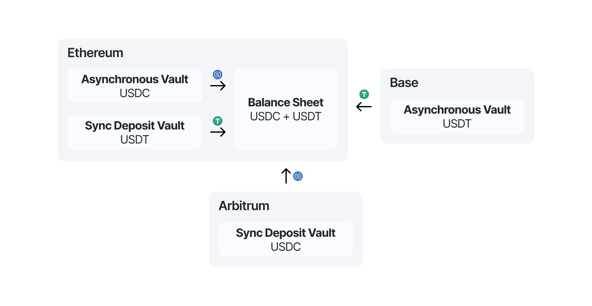

# Standards-based composability

The Centrifuge protocol leverages tokenized vault standard for investments and redemptions of share tokens.

## Vault types

The protocol supports asynchronous and synchronous vaults for investments.

### Asynchronous vaults

Asynchronous vaults are fully request-based and follow the ERC-7540 standard. They allow both deposit and redemption actions to be handled through an asynchronous workflow, using the Centrifuge Hub to manage requests.

### Synchronous deposit vaults

These vaults follow a hybrid model using both ERC-4626 and ERC-7540. Deposits are executed instantly using ERC-4626 behavior, allowing users to receive shares immediately. However, redemptions are handled asynchronously through ERC-7540, using the Hub to queue and manage the withdrawal requests.

## Pooled vaults

It is possible to support multiple investment assets per share token, using the ERC-7575 standard. Liquidity from all vaults is aggregated into a single balance sheet, to be allocated efficiently across all assets.

