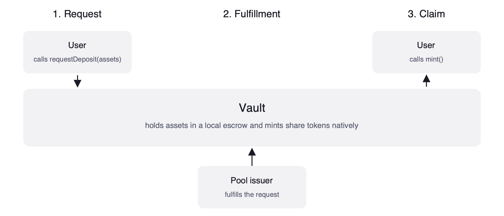

# Invest into a vault

This guide explains how to invest in and redeem from Centrifuge vaults, using both asynchronous and synchronous vault types.

## Asynchronous vaults

Asynchronous vaults batch and process deposits at set intervals. Deposits and redemptions are split into a request phase and a claim phase, with fulfillment by the pool issuer in between.



### Deposit

Approve the vault to spend your tokens, then submit a deposit request:

```solidity
asset.approve(address(vault), assets);
vault.requestDeposit(assets, user, user);
```

* `assets`: amount of underlying asset to request a deposit for.
* The second and third `user` values specify ownership and destination.

The request is queued and processed by the pool issuer. After fulfillment, claim the shares:

```solidity
vault.mint(vault.maxMint(user), user);
```

* `vault.maxMint(user)` returns the number of shares available to mint based on the fulfilled request.

### Redemption

Submit a redemption request for the shares you want to redeem:

```solidity
vault.requestRedeem(shares, user, user);
```

After fulfillment, withdraw the underlying asset:

```solidity
vault.withdraw(vault.maxWithdraw(user), receiver, user);
```

* `vault.maxWithdraw(user)` computes the maximum amount of assets that can now be withdrawn.
* `receiver`: address to receive the underlying asset (e.g., USDC).

## Synchronous deposit vaults

Synchronous vaults process deposits immediately within a single transaction, but redemptions still settle asynchronously.

### Deposit

Approve the vault, then deposit assets to receive vault shares in the same transaction:

```solidity
asset.approve(address(vault), assets);
vault.deposit(assets, receiver);
```

* `assets`: amount of underlying asset to deposit (e.g., 1000 \* 1e6 for 1000 USDC).
* `receiver`: address to receive the vault shares.

### Redemption

Synchronous vaults use the same redemption flow as [asynchronous vaults](#redemption): submit `requestRedeem`, wait for fulfillment, then call `withdraw`.

## Acting on behalf of another user

The ERC-7540 standard allows a user to submit deposit and redemption requests on behalf of another address. The `requestDeposit` and `requestRedeem` functions take separate `controller` and `owner` parameters:

```solidity
vault.requestDeposit(assets, controller, owner);
vault.requestRedeem(shares, controller, owner);
```

* `owner`: the source of the assets (for deposits) or shares (for redemptions). Must equal `msg.sender` unless the owner has approved `msg.sender` as an operator.
* `controller`: the address that controls the request. This address can later claim the resulting shares or assets, cancel the request, and manage the request lifecycle.

### Operator approvals

An owner can approve another address as an operator using `setOperator`:

```solidity
vault.setOperator(operator, true);
```

Once approved, the operator can call `requestDeposit` or `requestRedeem` with the owner's address as the `owner` parameter, cancel requests, and claim on behalf of the controller.

:::warning
Approving an operator grants it control over both the assets and shares associated with the vault. Only approve trusted addresses.
:::

### Smart contract integrations

If you are building a smart contract that wraps vault interactions (e.g., an aggregator or routing contract):

* Your contract is typically both `msg.sender` and `owner`: users transfer assets to your contract first, and your contract calls `requestDeposit` with itself as the `owner`. Alternatively, users can approve the vault directly and your contract passes the user's address as `owner` (if the user has approved your contract as an operator).
* Track which address is the `controller` for each request, since that address controls the claim and cancellation lifecycle.
* When claiming on behalf of users, ensure the `controller` parameter matches the address that submitted the original request.

:::info
For smart contract integrations, call `vault.isPermissioned(address(yourContract))` before submitting any requests. If your contract cannot hold shares, deposit and claim operations will revert.
:::

## FAQ

### How long does it take for requests to be processed?

Asynchronous requests are fulfilled by the pool issuer. The time to fulfillment depends on the specific product and its subscription or redemption settlement cycle.

### How do I get the current share price?

Use `vault.convertToAssets()` to convert a share amount to its current value in the investment asset:

```solidity
uint8 shareDecimals = vault.share().decimals();
uint256 oneShare = 10 ** shareDecimals;
uint256 assetValue = vault.convertToAssets(oneShare);
```

The result is denominated in the investment asset and uses the asset's decimals (e.g., 6 for USDC).

:::info
The price returned by `convertToAssets()` may not be the exact price at which a request is settled, since there can be a time lag between querying and fulfillment.
:::

### Who pays for cross-chain gas?

Investments are processed locally. The vault mints share tokens natively on the chain where it is deployed and holds the deposited assets in a local escrow on the same chain. You only pay gas for the local transaction.

Each vault interaction also emits a cross-chain message to the hub chain, so the pool issuer can keep bookkeeping consistent across every chain where the share token is deployed. The vault contracts estimate the cost of this message during the investment transaction, and the actual cost is drawn from the pool's subsidy balance held by the [Subsidy Manager](https://github.com/centrifuge/protocol/blob/main/src/utils/SubsidyManager.sol). The issuer tops this balance up per pool, so investors do not pay cross-chain fees.
