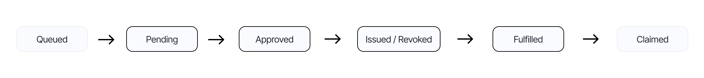

# Manage a pool

This guide outlines how to manage a pool on the Centrifuge protocol.

## Managing investment requests

Investment requests, whether deposits or redemptions, are submitted by users through vaults operating on various chains. Despite being initiated on different networks, these requests are managed centrally on the Hub chain. This ensures consistent processing and coordination across the entire protocol.

Each request is tracked in a central contract called the `BatchRequestManager`.

### Lifecycle of a request

Deposit and redeem requests move through six stages:

* **Queued**: An optional stage that requests go through if there was non-zero approved or issued/revoked but not yet fulfilled requests for this user.
* **Pending**: The initial state after submission by the user. The request has not yet been approved.
* **Approved**: The Hub manager approves the request. For deposits, this allows Balance Sheet Managers to withdraw the requested assets and allocate them as needed. At this stage, the request is not yet priced. The request can not be cancelled anymore once approved.
* **Issued/revoked**: A share price is assigned. For deposits, shares are issued to the user; for redemptions, shares are revoked in return for assets.
* **Fulfilled**: The corresponding vault is informed that the request has been processed. The user can now claim their shares (for deposits) or assets (for redemptions).
* **Claimed**: The user has successfully claimed their resulting assets or shares.



The separation of approval and issuance/revocation is to be used for cases where the price of the execution depends on buying or selling underlying assets, which can only happen after the request is fulfilled and the assets can be withdrawn and the request cannot be cancelled anymore.

:::info[ERC-4626 vaults]
For synchronous deposit vaults using ERC-4626, asset deposits skip all six stages, and shares are immediately minted into the user's wallet.
:::

### Request batching and partial fulfillment

The `BatchRequestManager` maintains First-In-First-Out (FIFO) batch-based logic for all pending requests. Batches are created when the fund manager triggers an approval, all requests that are pending at that moment become part of that batch. When a batch is approved with a specific total amount, the `BatchRequestManager` processes all requests in that batch. If the approved amount is insufficient to fulfill all requests in the batch, each request is fulfilled proportionally based on its share of the total requested amount.

As an example, consider three deposit requests submitted in this order:
1. User A requests 10 shares
2. User B requests 5 shares  
3. User A requests another 10 shares

**Case 1: Approving after each request**

If the fund manager approves 15 shares after the second request is submitted:
- **Batch 1** (requests 1-2, approved for 15 shares):
  - First request (User A, 10 shares): Fully approved ✓
  - Second request (User B, 5 shares): Fully approved ✓

Then if the fund manager approves 5 shares after the third request:
- **Batch 2** (request 3, approved for 5 shares):
  - Third request (User A, 10 shares): Partially approved for 5 shares

After both batches:
- User A has 10 shares fully approved from first request, and 5 shares partially approved from second request
- User B has 5 shares fully approved

**Case 2: Approving after all three requests**

If the fund manager waits and approves 20 shares only after all three requests are submitted:
- **Batch 1** (requests 1-3, approved for 20 shares total out of 25 requested):
  - First request (User A, 10 shares): Partially approved for 8 shares (10 / 25 × 20 = 8)
  - Second request (User B, 5 shares): Partially approved for 4 shares (5 / 25 × 20 = 4)
  - Third request (User A, 10 shares): Partially approved for 8 shares (10 / 25 × 20 = 8)

After this batch:
- User A has 8 shares approved from first request and 8 shares approved from second request (16 total)
- User B has 4 shares approved

This batch-based FIFO approach ensures fair and predictable processing across all investors, with the timing of approvals determining which requests are grouped together for processing.

### Approving a request

Once a request is pending, the Hub manager must approve it. This is done by calling the appropriate function on the `BatchRequestManager`:

```solidity
batchRequestManager.approveDeposits{value: gas}(poolId, scId, assetId, batchRequestManager.nowDepositEpoch(poolId, scId, assetId), approvedAssetAmount, pricePoolPerAsset, msg.sender);
batchRequestManager.approveRedeems{value: gas}(poolId, scId, assetId, batchRequestManager.nowRedeemEpoch(poolId, scId, assetId), approvedShareAmount, pricePoolPerAsset);
```

* `approvedAssetAmount` / `approvedShareAmount`: The total amount being approved for this batch
* `pricePoolPerAsset`: The price of the asset denominated in the pool currency (18 decimal fixed point integer)
* `gas`: The amount of native currency to cover cross-chain messaging costs (excess will be refunded)
* `msg.sender`: Address to receive any excess gas refund (deposits only)

Approving a deposit allows any authorized Balance Sheet Manager to withdraw the approved amount of assets. These assets can be invested before the share price is determined.

### Issuing or revoking shares

After approval, the next step is to finalize the share price and process the request. This is done by issuing shares (for deposits) or revoking shares (for redemptions):

```solidity
batchRequestManager.issueShares{value: gas}(poolId, scId, assetId, batchRequestManager.nowIssueEpoch(poolId, scId, assetId), pricePoolPerShare, extraGasLimit, msg.sender);
batchRequestManager.revokeShares{value: gas}(poolId, scId, assetId, batchRequestManager.nowRevokeEpoch(poolId, scId, assetId), pricePoolPerShare, extraGasLimit, msg.sender);
```

* `pricePoolPerShare`: The share price in pool currency (18 decimal fixed point integer)
* `extraGasLimit`: Additional gas limit for cross-chain message execution (uint128, can usually be set to 0)
* `gas`: The amount of native currency to cover cross-chain messaging costs (excess will be refunded)
* `msg.sender`: Address to receive any excess gas refund

This step locks in the value of the transaction by applying the calculated share price.

### Notifying vaults for fulfillment

Once shares are issued or revoked, each vault must be notified so that individual users can claim their resulting assets or shares. This is done per user using the following calls:

```solidity
uint32 maxClaims = batchRequestManager.maxDepositClaims(poolId, scId, bytes32(bytes20(user)), assetId);
hub.notifyDeposit(poolId, scId, assetId, bytes32(bytes20(user)), maxClaims);

uint32 maxClaims = batchRequestManager.maxRedeemClaims(poolId, scId, bytes32(bytes20(user)), assetId);
hub.notifyRedeem(poolId, scId, assetId, bytes32(bytes20(user)), maxClaims)
```

After this, the request is marked as fulfilled, and the user can proceed to claim.
