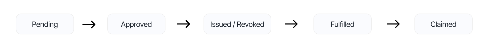

# Manage a pool

This guide outlines how to manage a pool on the Centrifuge protocol.

## Updating the share price

Each pool on the Centrifuge protocol can have multiple share classes. The price of each share token must be maintained and updated to reflect its current value. This price is managed at the protocol level through the Hub contract.

To update the token price for a specific share class in a pool, call the following function on the Hub:

```solidity
hub.updateSharePrice(poolId, scId, sharePrice);
```

* `poolId`: the unique identifier of the pool
* `scId`: the identifier of the share class within the pool
* `sharePrice`: the new price of the share token

The `sharePrice` must be denominated as an 18 decimal fixed point integer.

> **On-chain pricing**: Currently, the pricing mechanism is intended to be provided by an off-chain computation. In the future, on-chain price calculations will be implemented, using the holdings and double-entry bookkeeping accounting mechanism of the Hub.

### Pushing to price oracles

After updating the share token price, it must be pushed to the price oracle on each delpoyed network. This ensures that other contracts and off-chain components can retrieve the latest share price.

To notify the price oracle, call the following function:

```solidity
hub.notifySharePrice(poolId, scId, centrifugeId);
```

* `poolId`: the identifier of the pool whose share price was updated
* `scId`: the share class identifier for which the price was updated
* `centrifugeId`: the network identifier where the oracle should receive the updated price


## Managing investment requests

Investment requests, whether deposits or redemptions, are submitted by users through vaults operating on various chains. Despite being initiated on different networks, these requests are managed centrally on the Hub chain. This ensures consistent processing and coordination across the entire protocol.

Each request is tracked in a central contract called the `ShareClassManager`.

### Lifecycle of a request

All deposit and redeem requests move through five stages:

* **Pending**: The initial state after submission by the user. The request has not yet been approved.
* **Approved**: The Hub manager approves the request. For deposits, this allows Balance Sheet Managers to withdraw the requested assets and allocate them as needed. At this stage, the request is not yet priced. The request can not be cancelled anymore once approved.
* **Issued/revoked**: A share price is assigned. For deposits, shares are issued to the user; for redemptions, shares are revoked in return for assets.
* **Fulfilled**: The corresponding vault is informed that the request has been processed. The user can now claim their shares (for deposits) or assets (for redemptions).
* **Claimed**: The user has successfully claimed their resulting assets or shares.



The separation of approval and issuance/revocation is to be used for cases where the price of the execution depends on buying or selling underlying assets, which can only happen after the request is fulfilled and the assets can be withdrawn and the request cannot be cancelled anymore.

### Approving a request

Once a request is pending, the Hub manager must approve it. This is done by calling the appropriate function on the Hub:

```solidity
hub.approveDeposits(poolId, scId, assetId, shareClassManager.nowDepositEpoch(scId, assetId), amount)
hub.approveRedeems(poolId, scId, assetId, shareClassManager.nowRedeemEpoch(scId, assetId), amount)
```

Approving a deposit allows any authorized Balance Sheet Manager to withdraw the approved amount of assets. These assets can be invested before the share price is determined.

### Issuing or revoking shares

After approval, the next step is to finalize the share price and process the request. This is done by issuing shares (for deposits) or revoking shares (for redemptions):

```solidity
hub.issueShares(poolId, scId, assetId, shareClassManager.nowIssueEpoch(scId, assetId), sharePrice);
hub.revokeShares(poolId, scId, assetId, shareClassManager.nowRevokeEpoch(scId, assetId), sharePrice);
```

This step locks in the value of the transaction by applying the calculated share price.

### Notifying vaults for fulfillment

Once shares are issued or revoked, each vault must be notified so that individual users can claim their resulting assets or shares. This is done per user using the following calls:

```solidity
uint32 maxClaims = shareClassManager.maxDepositClaims(scId, bytes32(bytes20(user)), assetId);
hub.notifyDeposit(poolId, scId, assetId, bytes32(bytes20(user)), maxClaims);

uint32 maxClaims = shareClassManager.maxRedeemClaims(scId, bytes32(bytes20(user)), assetId);
hub.notifyRedeem(poolId, scId, assetId, bytes32(bytes20(user)), maxClaims)
```

After this, the request is marked as fulfilled, and the user can proceed to claim.
