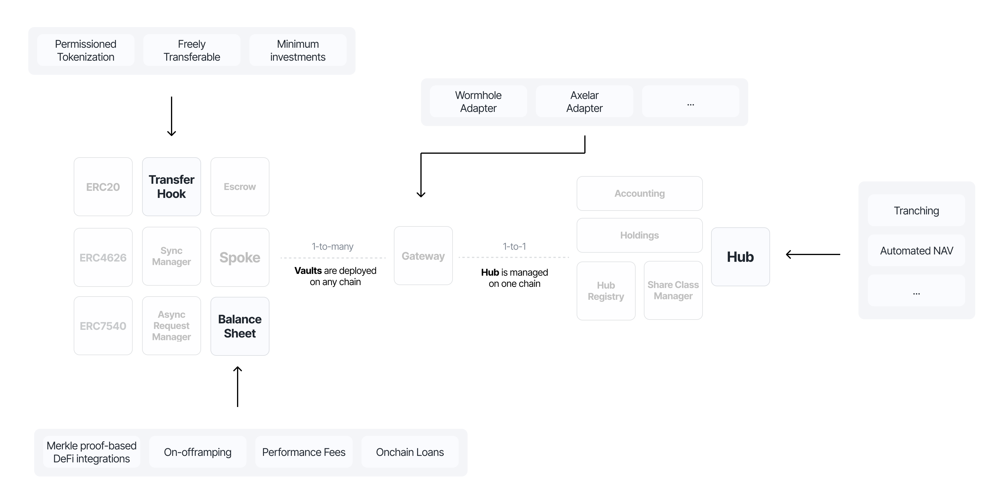

# Modularity

The Centrifuge Protocol is designed as a modular, extensible system to support complex financial products. This architecture empowers builders to plug into various components independently or collectively, enabling permissioned tokenization, cross-chain deployment, custom pricing logic, and diverse collateral management.

Below is an overview of the smart contracts of the Centrifuge Protocol and where builders can plug in, with some examples:

## Transfer Hooks

Transfer Hooks are customizable restrictions and checks that can be applied to ERC20 tokens. They serve as plug-and-play extensions for enforcing:

* Permissioned tokenization: Ensure compliance and access control.
* Freely transferable tokenization: Used for deRWA tokens to integrate into DeFi.
* Minimum investment thresholds: Limit the minimum investment amount.

These hooks integrate directly with ERC20 token logic and enable regulatory and operational controls without changing the core token.

## Hub Managers

The `Hub` is the central smart contract responsible for managing Net Asset Value (NAV) calculations, investor share class logic, and fund-level mechanics. Using Hub Managers, developers can define custom logic for:

* Automated NAV and token pricing
* Waterfall structures and tranching
* Custom share class management
* Request fulfillment logic

This module provides fine-grained control over fund architecture and investor dynamics, enabling fully customizable on-chain fund operations.

## Balance Sheet Managers

Balance Sheet Managers enable the protocol to support and manage any form of collateral. Whether dealing with tokenized real-world assets (RWAs), stablecoins, crypto-native tokens, or other DeFi protocols, Balance Sheet Managers abstract the logic required to:

* On/off ramping for assets
* Integrate DeFi protocols
* Track performance and management fees
* Integrate onchain loans

This makes Centrifuge ideal for bridging traditional finance and DeFi through modular asset management.

## Adapters

Adapters are the interoperability layer of the protocol. They connect pools on Centrifuge to any blockchain, enabling cross-chain vault deployment and communication. Supported adapters include:

* Wormhole adapter
* Axelar adapter

Adapters route cross-chain messages via the `Gateway` contract, maintaining a 1-to-many relationship between a single hub on one chain and many vaults.