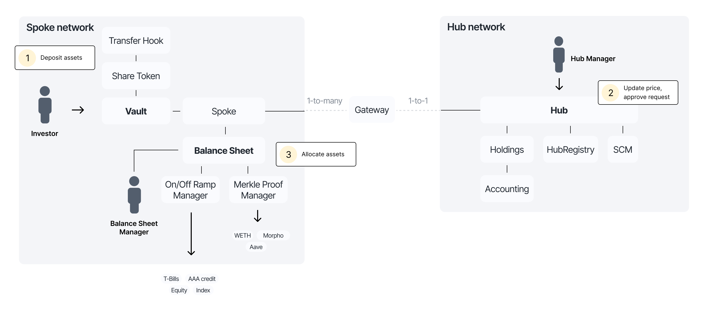

# Overview

The Centrifuge Protocol is an open-source, decentralized protocol for tokenizing and distributing financial products across multiple blockchain networks. Built on immutable smart contracts, it provides the infrastructure for creating customizable asset management products with seamless multi-chain deployment.

The protocol is designed to be non-opinionated and extensible, empowering builders to create diverse financial products, from permissioned investment funds to freely tradable tokenized assets, onchain loans, and custom financial structures.

The protocol has had [21 security reviews](/developer/protocol/security/) to date, and is currently live on [6 blockchains](/developer/protocol/deployments/).

## Key features

### Multi-chain asset management

Using protocol-level [chain abstraction](/developer/protocol/features/chain-abstraction/), issuers can access and manage liquidity across any supported network while maintaining unified control from a single hub chain. The protocol operates on a hub-and-spoke model where one hub chain handles operational management, accounting, pricing, and investment request processing, while multiple spoke chains act as separate balance sheets where tokens can be issued, transferred, and redeemed. Cross-chain transfers use a secure burn-and-mint mechanism for 1:1 token movement between chains.

### Standards-based composability

The protocol provides [vault implementations](/developer/protocol/features/vaults/) that integrate seamlessly with the broader DeFi ecosystem. Share tokens are issued as ERC-20 tokens. ERC-4626 vaults offer the standard tokenized vault interface for synchronous deposits and redemptions, while ERC-7540 vaults provide an asynchronous standard for request-based investment flows. The protocol also supports ERC-7575, enabling multi-asset vaults where a single share token can be exchanged for different accepted assets. These standards enable easy integration with existing DeFi protocols, aggregators, and tools.

### Immutable core, modular extensions

The protocol combines an [immutable core](/developer/protocol/architecture/overview/) with a [modular set of extensions](/developer/protocol/features/modularity/) for customization. The protocol allows customizing investment vaults, transfer hooks for compliance logic, balance sheet managers for asset allocation strategies, hub managers for automated pricing and order management, valuation contracts for asset pricing, per-pool cross-chain adapters, and much more. This architecture enables builders to innovate at the extension layer while maintaining the security guarantees of the immutable core.

### Onchain accounting

The protocol implements [fully onchain and automated accounting](/developer/protocol/features/onchain-accounting/) of tokenized assets across all chains. The Hub maintains a complete double-entry bookkeeping system that records all financial transactions, as well as a ledger for all pool holdings. An automated cross-chain synchronization mechanism ensures that data across many chains can be aggregated in a single smart contract.
The usage of the accounting system is optional, allowing issuers to automate processes according to their needs.

### One-click deployment

The protocol uses monolithic contracts for the immutable core, with automated deployment of share tokens, escrows for pool holdings, vaults and much more. This enables tokenizing financial products and launching tokens and vaults on new chains in a single click.

## Protocol architecture

The Centrifuge Protocol operates on a [hub-and-spoke model](/developer/protocol/features/chain-abstraction/). Each pool selects a single hub chain for management and can tokenize and distribute liquidity on many spoke chains.

### Centrifuge Hub

The hub chain serves as the central control and accounting layer for the entire pool. From a single chain of your choice, you can manage all tokens and vaults across every deployment. The hub maintains consolidated accounting using double-entry bookkeeping, tracking all vault balances and holdings in one place. NAV calculations are performed on the hub, with price oracle updates pushed to all networks

### Centrifuge Spoke

Spoke chains provide the tokenization and distribution layer where end users interact with the protocol. Each spoke deploys ERC-20 share tokens that are customizable with transfer hooks for compliance and restrictions. Both ERC-4626 and ERC-7540 vaults can be deployed for seamless DeFi integration, with multiple vaults supported per share class to accept different payment assets.