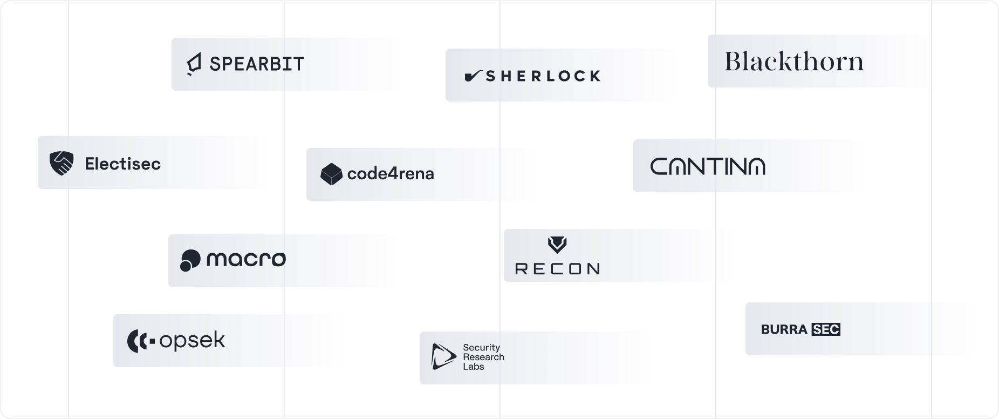

# Security

Centrifuge has best-in-class security process, with highlights including
* 24 security reviews to date for the Centrifuge protocol.
* Launched on mainnet in 2019, 0 exploits.
* Extensive invariant test suite.

The protocol codebase is fully immutable, and any emergency functions are locked behind a 48-hour timelock.

## Security reviews

### Protocol

| Auditor                                              | Scope            | Date            | Engagement                 | Report                                                                                                                                                                      |
| ---------------------------------------------------- | --------------- | --------------- | :------------------------- | --------------------------------------------------------------------------------------------------------------------------------------------------------------------------- |
| [yAudit](https://yaudit.dev/)                      | V3.1        | Jan 2026        | Security review            | [`Report`](https://github.com/centrifuge/protocol/blob/main/docs/audits/2026-01-yAudit.pdf) (draft)                                                                             |
| [Sherlock](https://www.sherlock.xyz/), [Blackthorn](https://www.blackthorn.xyz/)                   | V3.1        | Nov-Dec 2025       | Audit competition            |  [`Report`](2025-12-Sherlock-Blackthorn)                                                                                                                                                                    |
| [xmxanuel](https://x.com/xmxanuel)                   | V3.1        | Dec 2025       | Security review            |  [`Report`](https://github.com/centrifuge/protocol/blob/main/docs/audits/2025-12-xmxanuel.pdf)                                                                                                                                                                    |
| [yAudit](https://yaudit.dev/)                      | V3.1        | Oct 2025        | Security review            | [`Report`](https://github.com/centrifuge/protocol/blob/main/docs/audits/2025-10-yAudit.pdf) (draft)                                                                             |
| [BurraSec](https://www.burrasec.com/)                      | V3.1       | Oct 2025        | Security review            | [`Report`](https://github.com/centrifuge/protocol/blob/main/docs/audits/2025-10-burraSec.pdf) (draft)                                                                             |
| [BurraSec](https://www.burrasec.com/)                      | V3.1       | Sep 2025        | Security review            | [`Report`](https://github.com/centrifuge/protocol/blob/main/docs/audits/2025-09-burraSec.pdf)                                                                             |
| [BurraSec](https://www.burrasec.com/)                      | LayerZero adapter        | Aug 2025        | Security review            | [`Report`](https://github.com/centrifuge/protocol/blob/main/docs/audits/2025-08-burraSec.pdf)                                                                             |
| [Spearbit](https://spearbit.com/)                      | V3.0        | July 2025        | Security review            | [`Report`](https://cantina.xyz/portfolio/5feee047-ded1-4e15-b3a8-0e05afa62ddb)                                                                             |
| [xmxanuel](https://x.com/xmxanuel)                   | V3.0        | May-July 2025       | Security review            |  [`Report`](https://github.com/centrifuge/protocol/blob/main/docs/audits/2025-07-xmxanuel.pdf)                                                                                                                                                                    |
| [Macro](https://0xmacro.com/)                      | Merkle Proof Manager        | June 2025        | Security review            | [`Report`](https://0xmacro.com/library/audits/centrifuge-1.html)                                                                             |
| [yAudit](https://yaudit.dev/)                      | Spoke/Vaults        | June 2025        | Security review            | [`Report`](https://reports.yaudit.dev/2025-07-centrifuge)                                                                             |
| [Spearbit](https://spearbit.com/)                      | V3.0        | May 2025        | Security review            | [`Report`](https://cantina.xyz/portfolio/8b98604d-b303-42ee-95bf-50c9c6eb7b47)                                                                             |
| [BurraSec](https://www.burrasec.com/)                      | Gateway        | May 2025        | Security review            | [`Report`](https://github.com/centrifuge/protocol/blob/main/docs/audits/2025-05-burraSec.pdf)                                                                             |
| [Alex the Entreprenerd](https://x.com/gallodasballo)                     | V3.0        | Apr 2025        | Review + invariant testing            | [`Report`](https://github.com/centrifuge/protocol/blob/main/docs/audits/2025-04-Recon.pdf)                                                                             |
| [BurraSec](https://www.burrasec.com/)                      | Gateway        | Apr 2025        | Security review            | [`Part 1`](https://github.com/centrifuge/protocol/blob/main/docs/audits/2025-04-burraSec-1.pdf) [`Part 2`](https://github.com/centrifuge/protocol/blob/main/docs/audits/2025-04-burraSec-2.pdf)                                                                             |
| [xmxanuel](https://x.com/xmxanuel)                   | V3.0        | Mar 2025       | Security review            |  [`Report`](https://github.com/centrifuge/protocol/blob/main/docs/audits/2025-03-xmxanuel.pdf)                                                                                                                                                                    |
| [Spearbit](https://spearbit.com/)                      | V2.1        | Feb 2025        | Security review            | [`Report`](https://github.com/centrifuge/protocol/blob/main/docs/audits/2025-02-Cantina.pdf)                                                                             |
| [Recon](https://getrecon.xyz/) | V2.0        | Jan 2025  | Invariant testing | [`Report`](https://getrecon.substack.com/p/never-stop-improving-your-invariant) |
| [Spearbit](https://spearbit.com/)                    | V2.0        | July 2024       | Security review            | [`Report`](https://cantina.xyz/portfolio/8c15e83a-08fc-48b9-8cc1-4f9ca76bb064)                                                                            |
| [Spearbit](https://spearbit.com/)                    | Morpho integration        | June 2024       | Security review            | [`Report`](https://cantina.xyz/portfolio/cf6f801f-5c05-488c-a387-3836606600e7)                                                                            |
| [Alex the Entreprenerd](https://x.com/gallodasballo) | V2.0        | Mar - Apr 2024  | Review + invariant testing | [`Part 1`](https://getrecon.substack.com/p/lessons-learned-from-fuzzing-centrifuge) [`Part 2`](https://getrecon.substack.com/p/lessons-learned-from-fuzzing-centrifuge-059) |
| [Spearbit](https://spearbit.com/)                      | V1.0        | Oct 2023        | Security review            | [`Report`](https://cantina.xyz/portfolio/693b6f24-6e47-4194-97b0-356d10dc1df6)                                                                             |
| [Code4rena](https://code4rena.com/)                   | V1.0        | Sep 2023        | Audit competition          | [`Report`](https://code4rena.com/reports/2023-09-centrifuge)                                                                                                                |
| [SRLabs](https://www.srlabs.de/)                     | V1.0        | Sep 2023        | Security review            | [`Report`](https://github.com/centrifuge/protocol/blob/main/docs/audits/2023-09-SRLabs.pdf)                                                                              |

### Operational securitiy

The core team contributing to Centrifuge has completed an operational security review with [OPSEK](https://www.opsek.io/).

## Bug bounty

Centrifuge runs an active bug bounty program with a $250,000 maximum reward, available on [Cantina](https://cantina.xyz/bounties/6cc9d51a-ac1e-4385-a88a-a3924e40c00e).

## Guardian

The protocol is controlled by the Root contract, which has access on all other contracts. The Root conract enforces a 48-hour delay for any upgrades and configuratino changes.

Each deployment has a Guardian role, who is authorized on the Root contract. The Guardian can pause in emergencies, schedule upgrades, and set up adapters to new networks.

| Network          | Guardian |
|------------------|----------|
| Ethereum Mainnet | [`0xD9D30ab47c0f096b0AA67e9B8B1624504a63e7FD`](https://app.safe.global/home?safe=eth:0xD9D30ab47c0f096b0AA67e9B8B1624504a63e7FD) |
| Base             | [`0x8b83962fB9dB346a20c95D98d4E312f17f4C0d9b`](https://app.safe.global/home?safe=base:0x8b83962fB9dB346a20c95D98d4E312f17f4C0d9b)  |
| Arbitrum         | [`0xa36caE0ACd40C6BbA61014282f6AE51c7807A433`](https://app.safe.global/transactions/history?safe=arb1:0xa36caE0ACd40C6BbA61014282f6AE51c7807A433)  |
| Plume            | [`0x2d442069f78561F817d92c94924D5EaddA9C5767`](https://safe.onchainden.com/home?safe=plume:0x2d442069f78561F817d92c94924D5EaddA9C5767)  |
| Avalanche        | [`0xb6642fEd2221e177dD29581BB6d1959Bd1c54185`](https://app.safe.global/home?safe=avax:0xb6642fEd2221e177dD29581BB6d1959Bd1c54185)  |
| BNB Smart Chain  | [`0x57066D897cB9cDef21b9Ecd7CecdD1d39b6eE445`](https://app.safe.global/home?safe=bnb:0x57066D897cB9cDef21b9Ecd7CecdD1d39b6eE445) |
