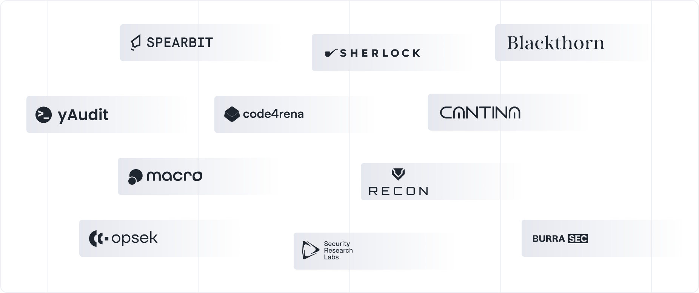

# Overview

Centrifuge security highlights:
* Live on mainnet since 2019 with zero exploits, across more than $3.5B in tokenized assets.
* Fully immutable contracts, with emergency functions locked behind a 48-hour timelock.
* 38 security reviews by 14 independent firms and researchers, including Spearbit, Sherlock, Blackthorn and yAudit.
* Formally verified core protocol across the hub, spoke, and messaging contracts ([report](https://github.com/centrifuge/protocol/blob/main/docs/audits/2026-09-FV.pdf)).
* $250,000 bug bounty program live on [Cantina](https://cantina.xyz/bounties/6cc9d51a-ac1e-4385-a88a-a3924e40c00e).
* Real-time onchain monitoring through [Hypernative](https://www.hypernative.io/).

## Explore

  <a className="card-tile" href="/developer/security/audits">
    <h3>Audits</h3>
    
Full list of protocol security reviews, audit competitions, and invariant testing engagements.

  </a>

  <a className="card-tile" href="/developer/security/pool-access-levels">
    <h3>Pool access levels</h3>
    
Granular pool-level permissioning: hub managers, balance sheet managers, relayers, strategists, and gateway controls.

  </a>

  <a className="card-tile" href="/developer/security/guardian">
    <h3>Guardian</h3>
    
Protocol and ops guardian roles, multisig structure, and the global pause mechanism.

  </a>

  <a className="card-tile" href="/developer/security/application-security">
    <h3>Application security</h3>
    
Access controls, infrastructure isolation, network protection, and Hypernative onchain monitoring.

  </a>

  <a className="card-tile" href="/developer/security/operational-security">
    <h3>Operational security</h3>
    
Team security standards, credential management, and development workflow controls.

  </a>

