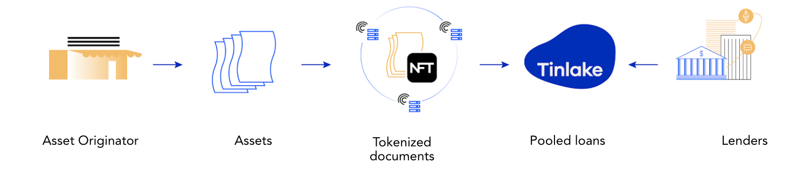

# Tinlake 
## Overview

[Tinlake](https://legacy.tinlake.centrifuge.io/) is Centrifuge's initial Ethereum-based, open, decentralized smart-contract based platform of asset pools bringing together pool issuers looking for financing and investors who seek to utilize the full potential of decentralized finance (DeFi).

**Note that Tinlake has been replaced by the [Centrifuge App](https://app.centrifuge.io/), however _legacy_ Tinlake pools as described below are still live on the App. Newer pools do not use the below smart contracts, but rather are launched on Centrifuge Chain.**

### Tinlake from a borrower perspective

Issuers can responsibly bridge real-world assets, such as invoices, mortgages or streaming royalties into DeFi and access bankless liquidity. They do this by tokenizing their financial assets into Non-Fungible Tokens (“NFTs”), using these NFTs as collateral in Tinlake Pools to draw funding.

Borrowers (the issuers) have individual assets with varying terms and varying durations drawn against their collateral. The collateral is represented as an NFT, which needs to be locked in the Tinlake contracts to draw a loan from it. Pooling the individual assets removes the cumbersome need of p2p financing for matching maturities, risk, and interest rates, and it allows investors to invest in a diversified portfolio of real world assets.

### Tinlake from the investor perspective

Investors earn yield on [TIN and DROP](https://medium.com/centrifuge/a-tale-of-two-tokens-introducing-tin-drop-our-two-investment-tokens-d4c7342c799a), Tinlake’s two investment tokens that are minted in exchange. TIN, known as the “risk token,” takes the risk of defaults first but also receives higher returns. DROP, known as the “yield token,” is protected against defaults by the TIN token and receives stable (but usually lower) returns. This is similar to junior/senior investment structures common in traditional finance.

