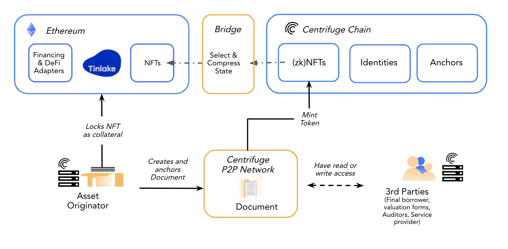

## Introduction

The Centrifuge peer-to-peer (P2P) network provides a secure method to create, exchange and verify asset data between collaborators and tokenize the assets into NFTs. Asset originators can selectively share asset details with service providers who can assess the data and contribute information to the minted NFT. The data origin can be verified using cryptographic signatures.

The components of the P2P network are implemented on libp2p. Centrifuge Chain is used for (i) maintaining identities in a similar format to the ERC725 standard, (ii) anchoring state commitments and (iii) minting NFTs from off-chain documents. These NFTs can be bridged to Ethereum to be locked as collateral into Tinlake to finance these assets.

## Centrifuge Node

Each collaborator runs or accesses a hosted Centrifuge node to connect to the network. The Centrifuge node provides a simple API interface to interact with the p2p network, the Centrifuge chain as well as the Ethereum smart contracts. The Node operates on a “service bus” principal where plugins and outside systems can subscribe to messages about specific objects (e.g., a procurement application can subscribe to changes of order objects). The P2P Node abstracts the events that occur on the public blockchain, sidechain, and P2P Layer and translates them into messages on this internal bus for other applications to consume. The Node also offers the connectivity to Ethereum for applications that build on top of the network.

## Identities

Each entity or collaborator on the P2P network has a verifiable Centrifuge Identity (Centrifuge ID) which is a unique ID assigned to a participant of the P2P network. It keeps track of the different cryptographic keys in use and ensures that this data can be modified only by the creator and/or a delegate chosen by the creator.

The unique identifier of a participant in the Centrifuge protocol is equivalent to the Ethereum address of his/her identity contract. Centrifuge is adopting the DID-compatible ERC725v1 Ethereum standard for self-sovereign identities.

A Centrifuge identity has the following credentials:

- Peer-to-Peer Messaging Encryption Keys: are used for message encryption. These keys are used to identify the nodes over the P2P network and establish an encrypted communication channel between peers.
- Signing Keys: Documents in Centrifuge are signed with signing keys. These signatures are a part of the Merkle root that is anchored on the public chain and verifiable at a later time.
- Ethereum Accounts: When interacting with a smart contract on Ethereum, an account needs to be linked to the identity to act on its behalf. The linked Ethereum accounts are the accounts that are allowed to interact with DApps utilizing Centrifuge.

## Document

A document is a structured set of fields with specific field types representing a financial asset. The network supports any document type as long as the formats are agreed upon (via a schema) and shared between selected collaborators. Documents are exchanged encrypted, and are accessible only for parties involved in this private data exchange. Collaborators can be added and removed from a document. Different collaborators can update a document and publish new versions within the set of nodes with access.

Every Centrifuge node can create a document and share it with others. The transport of a document happens privately over secure channels in the P2P network. Every document collaborator keeps a local copy of a document in their storage. An update of a document can be triggered by multiple collaborators and is not restricted to the initial document creator. Whenever a change is made, a calculated merkle root of a document is committed on chain. A new version is accepted by others only if the document root hash exists in the AnchorRepository and the set of mandatory document fields in the new version satisfies protocol-specific requirements.

A smart contract called AnchorRepository is used for carbon dating state updates ensure that the update is made known to all collaborators. A document anchor is the root hash of the Merkle tree of the document. The tree is constructed by adding all fields of a document together with the collected digital signatures from all collaborators (an identity as defined above) as leaves in the tree.

Publishing this anchor achieves that even if a party is censored on the P2P network, it can find out about the update by checking the Centrifuge chain. A third party can easily verify the correctness of a received document on-chain and off-chain by reconstructing the Merkle root from the document based on the well-known document structure for the respective document type. Structuring the document as a Merkle tree allows creation of proofs revealing only individual fields of the document as opposed to revealing the entire document when making a statement about it.

## Minting an NFT

Based on the documents representing financial assets, Asset Originators can mint privacy-enabled NFTs (non-fungible tokens) that are locked as collateral into Tinlake to access financing.

For many use cases, there is a need to keep data related to the asset private. Centrifuge's privacy-enabled NFTs are tokenized representations of assets/documents, keeping some or all of the assets' attributes private, while a public, decentralized ledger tracks the asset ownership. The NFTs themselves hold only a minimal set of the data of the original document on-chain to avoid leaking private data. The NFT metadata contains a link back to the on-chain anchor as well as a link to the private document on the p2p layer. The on-chain data is used to identify the document uniquely and allows anyone to verify the NFT's data as well as exchange the full document data privately within the network.

Centrifuge NFTs are minted on Centrifuge Chain and bridged to Ethereum. They are compatible with ERC-721 and thus can leverage all infrastructure compatible with ERC-721 NFTs.

We use Merkle proofs that verify the original ownership and document authenticity of an off-chain document, combined with an on-chain document registry that allows the NFT contract to verify the authenticity of a request to mint a specific token. By using precise proofs, we can supply privacy preserving proofs that certain fields are present in the NFT to be minted, without revealing the exact value of these fields. Leaves are created by hashing and encoding the property, value, and salts of the data fields which we want to prove.

The document representing the asset thus receives all of the benefits of standard on-chain NFTs, while an off-chain location holds the verifiable private data. At any point, the current holder of an NFT can gain access to the off-chain document by creating a signature that proves ownership of the private key of the address that owns the NFT. This approach introduces decentralized access control schemes where an NFT ownership change can lead to off-chain access revocation. Typically the metadata and the detailed information of an NFT is publicly readable on Ethereum.

## Resources

- [P2P Node](https://developer.centrifuge.io/cent-node/) and [NFT](https://developer.centrifuge.io/nfts/overview/introduction/) DevDocs
- [Protocol White Paper](https://staticw.centrifuge.io/assets/centrifuge_os_protocol_paper.pdf)
- [Precise Proofs blog post](https://medium.com/centrifuge/introducing-precise-proofs-create-validate-field-level-merkle-proofs-a31af9220df0)
- [NFT White Paper](https://github.com/centrifuge/paper-privacy-enabled-nfts/releases/download/v1.01/paper-privacy-enabled-nfts.pdf)
