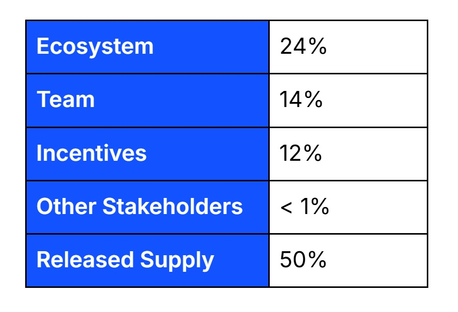
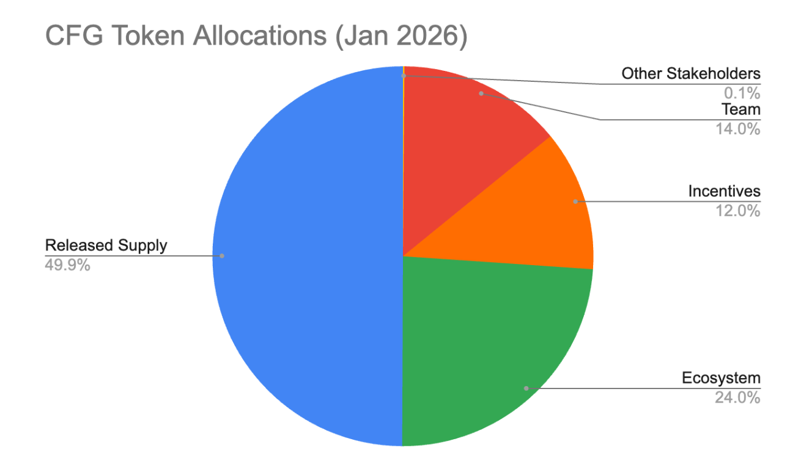
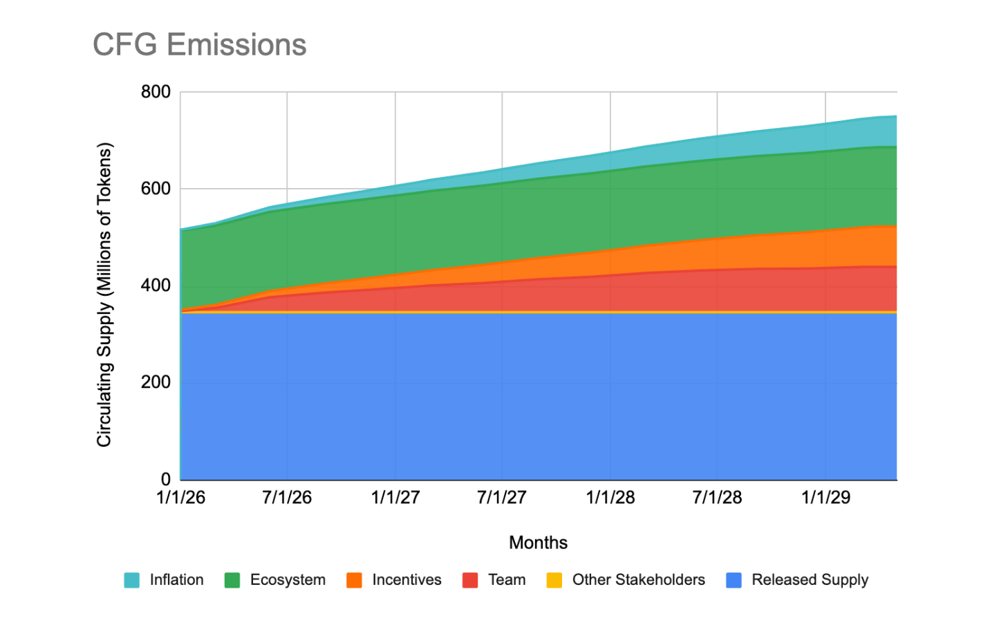

# Centrifuge Tokenomics Overview

## CFG Token Migration

On March 20, 2025, the CFG governance proposal [CP 149](https://github.com/centrifuge/cps/blob/main/cps/CP149/CP149.md) was passed, which introduced a new, [V3 CFG token](https://etherscan.io/token/0xcccccccccc33d538dbc2ee4feab0a7a1ff4e8a94) that consolidated:
- [Legacy CFG from the deprecated Centrifuge Chain](https://centrifuge.subscan.io/)
- [Wrapped CFG (wCFG) on Ethereum](https://etherscan.io/token/0xc221b7e65ffc80de234bbb6667abdd46593d34f0)

into a single, Ethereum-native ERC-20 token: CFG. The migration built on [CP 141](https://github.com/centrifuge/cps/blob/main/cps/CP141/CP141.md), which introduced Centrifuge V3 and migrated the Centrifuge protocol itself to a native EVM execution environment.

## V3 CFG Token Contract

- [0xcccCCCcCCC33D538DBC2EE4fEab0a7A1FF4e8A94](https://etherscan.io/address/0xcccccccccc33d538dbc2ee4feab0a7a1ff4e8a94)

## Migration Overview

The V3 CFG migration took place between **May 20, 2025 - December 15, 2025**. As part of this migration:

- Legacy CFG and wCFG tokens were swapped at a **1:1** ratio for V3 CFG
- Following completion, the bridge between Ethereum and the legacy Centrifuge Chain was fully deprecated

For more details, see the [Token Migration](https://docs.centrifuge.io/getting-started/token-summary/token-migration/) docs.

# CFG Governance Updates

Following the V3 protocol and token migrations initiatives, [CP 171](https://github.com/centrifuge/cps/blob/main/cps/cp171.md) was approved by the Centrifuge DAO on November 3, 2025. Key outcomes of this proposal include:

- The **Centrifuge Network Foundation (CNF)** inherits governance and oversight responsibilities
- The **Centrifuge DAO retains the ability to reassume governance operations** at a future date

These updates to the CFG governance structure eliminate execution bottlenecks and risks associated with decentralized governance structures, allowing Centrifuge to:

- **Reduce coordination challenges** in a hyper-competitive, burgeoning RWA market
- **Maximize value accrual to CFG** by streamlining decision-making and execution

As part of CNF’s commitment to transparency, progress and results will be reported publicly through [centrifuge.foundation](https://www.centrifuge.foundation/) and Centrifuge’s official social channels. For more details, see [Centrifuge Governance](https://docs.centrifuge.io/getting-started/cfg-governance/).

# CFG Tokenomics

## Token Supply

As of January 2026, the total supply of CFG is **691,800,000** tokens. This includes 115,000,000 tokens minted as part of CP 149.

- 15,000,000 of the CP 149 tokens unlocked upon minting in May 2025 to support near-term operational and early stage strategic initiatives
- The remaining 100,000,000 tokens vest linearly through April 2029
- All CP 149 tokens are part of an ecosystem **Incentives program** designed to promote long-term protocol growth

## Token Allocations

As of January 2026, allocations for the CFG token supply are as follows:

### Ecosystem

The Centrifuge ecosystem allocation of 24% includes the Centrifuge Treasury and is allocated for long-term ecosystem growth initiatives. All CP 149 incentives tokens vested as of January 2026 are included in this allocation.

### Team

14% of the total supply is allocated to the Centrifuge team to align long-term ecosystem incentives with the contributors actively building and growing the protocol. The allocation vests gradually through March 2030. 

### Incentives

This allocation consists of the newly-minted CP 149 tokens that are still locked. These incentives are allocated for sole use in ecosystem initiatives to grow and develop the Centrifuge protocol. As of January 2026, 12% of the total supply has been allocated to these incentives and is still locked. These locked tokens will vest linearly into the Centrifuge Treasury through April 2029.

### Other Stakeholders

The majority of other stakeholder CFG allocations have already vested; the remaining 0.1% of the total supply that was allocated to other stakeholders will vest over 3 months, through March 2026. 

### Released Supply

50% of the CFG supply is considered “released” as of January 2026; these tokens are freely circulating and exclude the specific allocations mentioned above for team, incentives, ecosystem and other stakeholders.

### CFG Emissions
CFG has a 3% annual inflation rate based on the total token supply, resulting in a modest increase in total supply over time. All inflationary tokens accrue to the Centrifuge Treasury. 

This release schedule represents the current intended strategy for CFG emissions through June 2029. It is subject to change, with any significant modifications or actions to be communicated to CFG stakeholders.