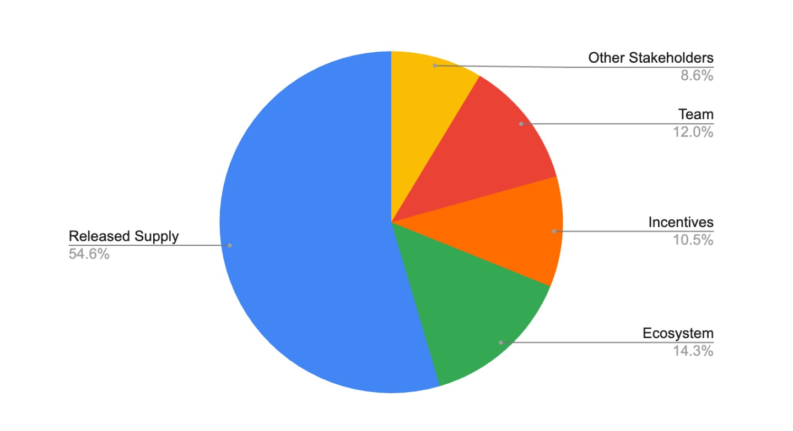
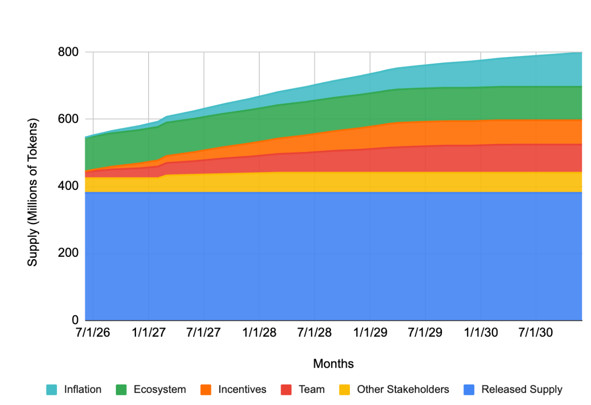

{/* Restructured July 2026. Migration content is deprecated to a short Token History section at the
    bottom of the page */}

# Centrifuge Tokenomics Overview

CFG is the native token of the Centrifuge ecosystem, issued as an ERC-20 token on Ethereum.
 
## Token Contract
 
- **Ethereum:** [0xcccCCCcCCC33D538DBC2EE4fEab0a7A1FF4e8A94](https://etherscan.io/address/0xcccccccccc33d538dbc2ee4feab0a7a1ff4e8a94)

## CFG Tokenomics
 
### Token Supply

As of June 2026, the total supply of CFG is **697,164,473** tokens. This includes 115,000,000 tokens minted as part of [CP149](https://github.com/centrifuge/cps/blob/main/cps/CP149/CP149.md).

- 15,000,000 of the CP149 tokens unlocked upon minting in May 2025 to support near-term operational and early-stage strategic initiatives
- The remaining 100,000,000 tokens vest linearly through April 2029
- All CP149 tokens are part of an ecosystem **Incentives program** designed to promote long-term protocol growth

## Token Allocations

As of June 2026, allocations for the CFG token supply are as follows:

#### CFG Token Allocation (June 2026)

### Ecosystem

The Centrifuge ecosystem allocation of 14.3% includes the Centrifuge Treasury and is allocated for long-term ecosystem growth initiatives. All CP149 incentives tokens vested as of June 2026 are included in this allocation.

### Team

12% of the total supply is allocated to the Centrifuge team to align long-term ecosystem incentives with the contributors actively building and growing the protocol. The allocation vests gradually through May 2030. 

### Incentives

This allocation consists of the newly-minted [CP149](https://github.com/centrifuge/cps/blob/main/cps/CP149/CP149.md) tokens that are still locked. These incentives are allocated for sole use in ecosystem initiatives to grow and develop the Centrifuge protocol. As of June 2026, 10.5% of the total supply has been allocated to these incentives and is still locked. These locked tokens will vest linearly into the Centrifuge Treasury through April 2029.

### Other Stakeholders

The majority of other stakeholder CFG allocations have already vested; the remaining portion that was allocated to other stakeholders will vest over 22 months, through March 2028.

### Released Supply

54.6% of the CFG supply is considered “released” as of June 2026; these tokens are freely circulating and exclude the specific allocations mentioned above for team, incentives, ecosystem and other stakeholders.

### CFG Emissions

CFG has a 3% annual inflation rate based on the total token supply, resulting in a modest increase in total supply over time. All inflationary tokens accrue to the Centrifuge Treasury. 

#### CFG Emissions

This release schedule represents the current intended strategy for CFG emissions through December 2030. It is subject to change, with any significant modifications or actions to be communicated to CFG stakeholders.

## CFG Governance Updates
 
Following the V3 protocol and token migrations initiatives, [CP171](https://github.com/centrifuge/cps/blob/main/cps/cp171.md) was approved by the Centrifuge DAO on November 3, 2025. Key outcomes of this proposal include:
 
- The **Centrifuge Network Foundation (CNF)** inherits governance and oversight responsibilities
- The **Centrifuge DAO retains the ability to reassume governance operations** at a future date
These updates to the CFG governance structure eliminate execution bottlenecks and risks associated with decentralized governance structures, allowing Centrifuge to:
 
- **Reduce coordination challenges** in a hyper-competitive, burgeoning RWA market
- **Maximize value accrual to CFG** by streamlining decision-making and execution
As part of CNF's commitment to transparency, progress and results will be reported publicly through [centrifuge.foundation](https://www.centrifuge.foundation/) and Centrifuge's official social channels. For more details, see [Centrifuge Governance](https://docs.centrifuge.io/getting-started/cfg-governance/).
 
## Token History
 
In March 2025, governance proposal [CP149](https://github.com/centrifuge/cps/blob/main/cps/CP149/CP149.md) introduced the current CFG token, consolidating legacy CFG from the deprecated Centrifuge Chain and Wrapped CFG (WCFG) on Ethereum into a single Ethereum native ERC-20 token at a **1:1** ratio. The change built on [CP141](https://github.com/centrifuge/cps/blob/main/cps/CP141/CP141.md), which migrated the Centrifuge protocol itself to a native EVM execution environment.
 
The migration ran from **May 20, 2025 to December 4, 2025**, followed by a case by case review period that ended on **April 10, 2026**. **The migration is permanently closed** and legacy CFG and WCFG can no longer be exchanged for CFG. A full overview of the timeline and process is available in the [CFG Token Migration Process Recap](https://gov.centrifuge.io/t/cfg-token-migration-process-recap/7341).
