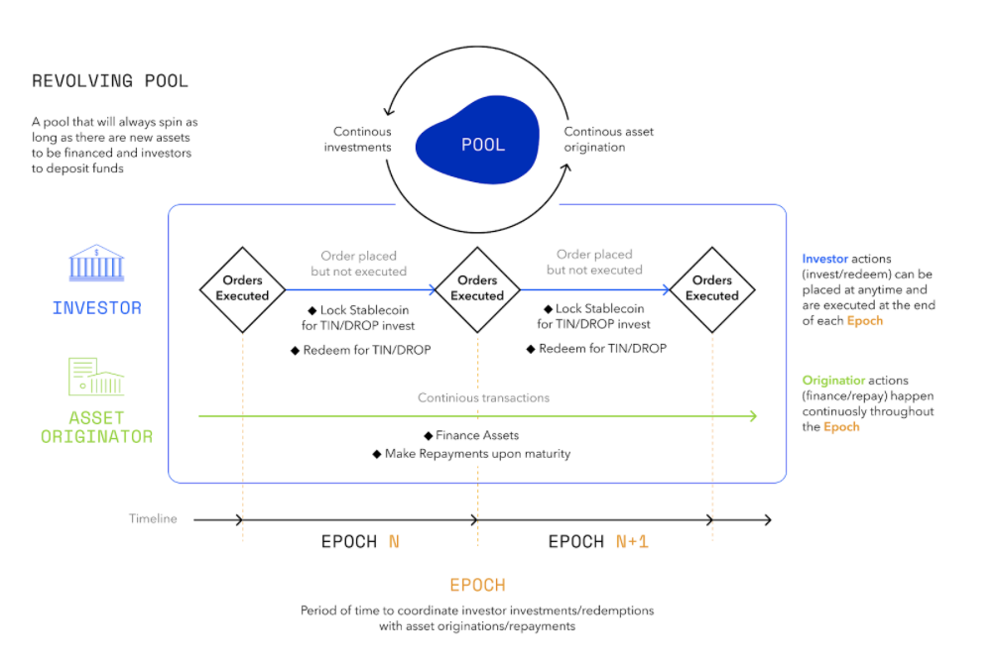

## Overview

[Tinlake](https://tinlake.centrifuge.io/) is an open, smart-contract based marketplace of asset pools bringing together Asset Originators and Investors who seek to utilize the full potential of Decentralized Finance (DeFi). Ultimately, Tinlake will become a fully decentralized financing protocol that interoperates with different blockchains and plugs into a variety of funding sources.

Through Tinlake pools, businesses or "Asset Originators" can responsibly finance real-world assets, such as invoices, mortgages or streaming royalties through DeFi and access bankless liquidity. They do this by tokenizing their financial assets into Non-Fungible Tokens (“NFTs”) and use these NFTs as collateral in their Tinlake pool to finance their assets.

These assets create a safe, stable return for DeFi investors and DeFi protocols who provide the liquidity and earn yield and CFG rewards. For every Tinlake pool, investors can invest in two different tokens: [TIN and DROP](#drop--tin-the-two-tranches). TIN, known as the “risk token,” takes the risk of defaults first but also receives higher returns. DROP, known as the “yield token,” is protected against defaults by the TIN token and receives stable (but usually lower) returns. This is similar to Junior/Senior investment structures common in traditional finance.

Every Asset Originator creates one pool for their assets. If you are interested in investing into a Tinlake pool, you can check out the current pools open on Tinlake [here](https://tinlake.centrifuge.io/) and find an investment guide [here](/use/invest/#investment-guide). All Tinlake pools have different risk/return profiles, so make sure you find the right one for your investment preferences (see [here](/use/invest/#assess-a-pool) how to asses a pool).

Tinlake pools are set-up as "revolving" or open-ended pools where investors can join and leave at any time and the provided capital can be continuously re-deployed by the Asset Originator unless it is redeemed by the investors.

## Revolving pools - Continuous liquidity

### Intro

Revolving pools allow investors to invest/redeem independently at any time. A decentralized solver mechanism matches investments and redemptions and ensures that certain preferences (e.g. DROP redeem seniority) are considered and the pool's risk metrics are intact. This ensures that Asset Originators have a constant source of liquidity while investors can flexibly invest and redeem.

### Investing into Tinlake

Investors can be whitelisted for either one (or both) of Tinlake's two tranches. To invest into TIN or DROP investors lock their investment in DAI into the Tinlake pool at any time during an epoch. Investments and redemptions are then executed at the end of an epoch, usually every 24 hours. A decentralized, automatic mechanism matches investments and redemptions making sure the pool's risk metrics remain intact, e.g. the DROP tranche is always protected by a minimum of TIN investors who take the loss first.

When the investments are executed the investors receive TIN or DROP tokens in exchange for the DAI locked. Transactions are executed at the current token prices reflecting the accrued interest and value according to the underlying [NAV model](/use/tinlake-financial-concepts/#asset-valuation) over time. The DROP token accrues interest at the DROP rate on the deployed capital. The TIN token additionally captures the spread between DROP rate and financing fee but also bears potential losses in the form of write-offs. To redeem TIN/DROP tokens investors lock these tokens into Tinlake and after the execution of the order they can collect the corresponding amount in DAI based on the current token price. TIN and DROP tokens for investments and received DAI for redemptions can be collected at any time, independent of an epoch. Until collection TIN and DROP tokens remain securely locked in the Tinlake smart contracts and already accrue interest and earn CFG rewards.

### Financing an asset

The Asset Originator can use the capital provided by investors to finance assets. To do this, he locks an NFT representing a tokenized "Real-World Asset" into the set of smart contract as collateral. The NFT is minted based on a document created and shared through Centrifuge's P2P protocol. Financing fees and Principal/Maximum Financing amounts for these NFTs/tokenized assets are provided by an on-chain pricing scorecard and going forward determined by external service providers through "Pricing Oracles". Once the NFT is priced the Asset Originator can draw down the financing. Upon repayment of the financing, the NFT is unlocked and transferred back into the Asset Originator's wallet.
