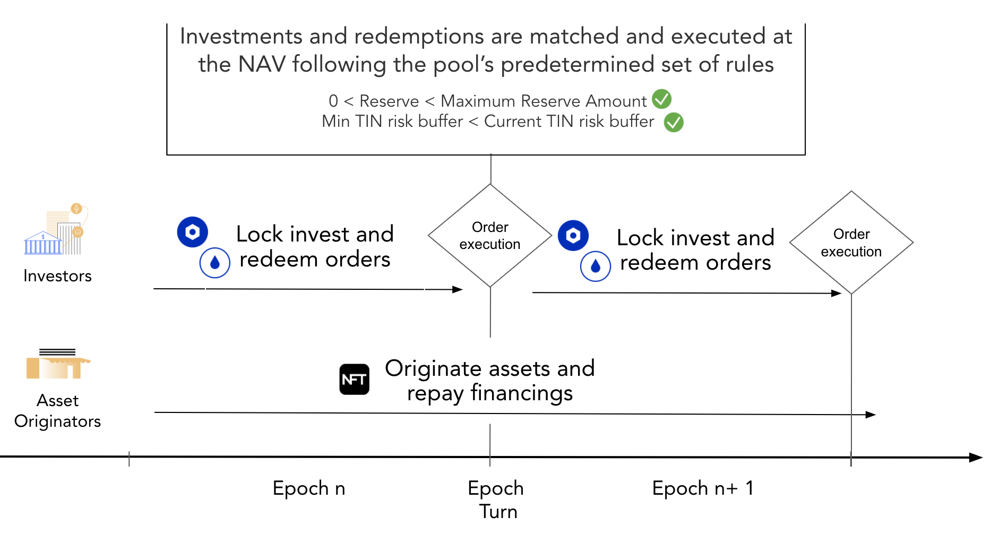
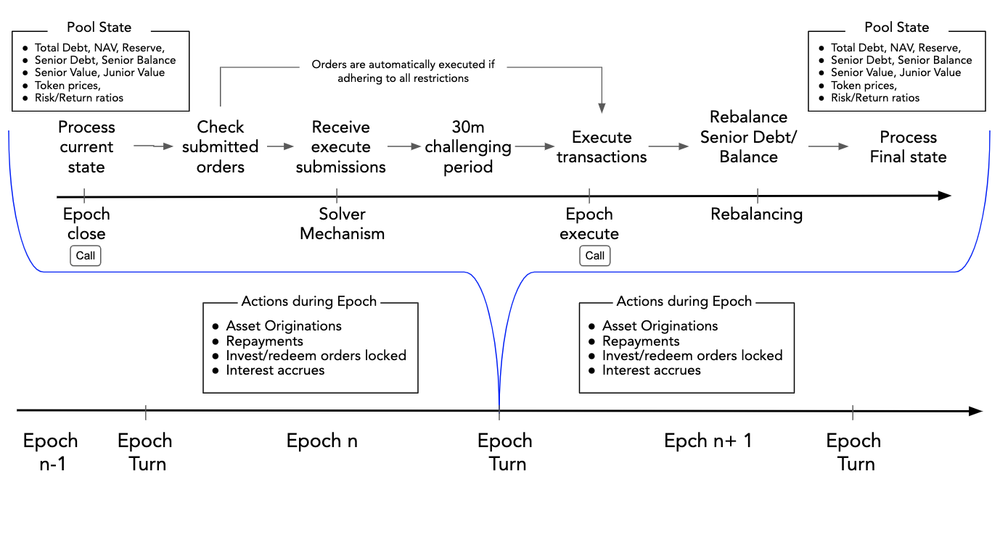

## Overview

A decentralized pool where investor can invest/redeem and AOs originate/repay repay at anytime needs a decentralized mechanism to coordinate investments, redemptions, originations and repayments. Welcome the `Epoch`.

For Tinlake's Revolving Pools all investment inflows/outflows are locked over a defined period of time ("Epoch") and automatically executed at the and of this period following predetermined priorities and risk metrics. The Asset Originator can use the available liquidity reserve after the invest/redeem transactions have been executed to finance Asset Originations throught the next epoch. Repayments can also happen at any time throughout the epoch, but are collected in a seperated reserve and can only be used for financings in the next epoch to allow investors priority for their redemptions.

To summarize: The following types of inflos/outflows of the asset side can happen during an Epoch by the Asset Originator:

- Financing repayments
- Asset Originations / Financing Drawdowns

The following types of inflows/outflows on the investment side are locked during the epoch and exected at the end of the epoch:

- DROP redemptions
- TIN redemptions
- DROP investments
- TIN investments

## Length of an Epoch

On the smart contract level, Tinlake epochs have a minimum length that the smart contracts will enforce. Thus an epoch cannot be closed before the minimum length has passed. An epoch does not have a maximum length. After the minimum length has passed the contracts can be called to close the current epoch. So if e.g. the minimum length of an epoch is set at 24h, an epoch will have to last at least 24h but can also last longer. This allows for a flexible set-up to have longer more flexible epochs at the start of a pool to ramp up funding or to allow for more effecient transaction costs e.g. in times of high gas prices or ensures that a pool can start slower at the beginning. A mature, liquid pool can have a service added that limits the epochs to a certain length by closing the epoch at a pre-defined interval. Once the epoch is closed the smart contracts start to process the current state of the pool and process all locked orders (see more details below).

## The invest/redeem process

Investors can supply more liquidity at any point in time during the epoch. The supplied Dai would be locked in the Tinlake contracts until the end of the epoch. The investor can cancel his lock as long as the current epoche is active. In that case, the locked DAI will be transferred back to his wallet. At the end of the epoch, all locked orders will be processed and executed at the current TIN/DROP prices considering the max reserve amount and min TIN risk buffer. After the epoch turn, investors can collect the executed orders in the UI. If part of the investment/redemption could not be executed, it will be rolled over into the next epoch, thus the DAI remain locked. This locked order can be cancelled at any time.

The redeem process works similarly. If Existing TIN/DROP investors want to redeem (part of their) TIN/DROP tokens they can lock this Tokens into Tinlake at any point during the epoch. At the end of the epoch, all locked orders will be processed and executed at the current TIN/DROP prices considering the max reserve amount and min TIN risk buffer. After the epoch turn, investors can collect the DAI from the executed orders in the UI. If part of the investment/redemption could not be executed, it will be rolled over into the next epoch, thus these tokens remain locked. This locked order can be cancelled at any time.

## The turn of the Epoch

Once the minimum length of an epoch has passed anyone can call the contracts to "close" the epoch. Once the epoch is closed investor's can't unlock their orders anymore. All Orders locked after the close will be collected and processed. If an epoch close is called without any locked invest/redeem transactions the epoch number will be bumped but the process described below will not be started.

At the Epoch turn, the contracts first process the current state of the pool:

- Total Debt
- NAV
- Reserve
- Senior Debt
- Senior Balance
- Senior Value
- Junior Value
- TIN/DROP Token prices
- TIN risk buffer

Then the contracts check whether all set orders can be executed with the capital available and without breaking the TIN risk buffer or the Max reserve restrictions. If this is the case all orders are immediately executed and the contracts process the new state of the pool. Please find a simple model that illustrates the processing of orders and calulation of the pool state [here](https://docs.google.com/spreadsheets/d/1mkIbWzhD7IXbnbYXKreTMYuaZJEzyTVqllhJnP4YdPs/edit#gid=161507348)

If not all orders can be executed, e.g. because there is not enough capital available in the Reserve (plus new investments) to serve all redemption orders or executing all DROP investments would break the Min TIN risk buffer the Tinlake "Solver mechanism" would be initiated.

## The Solver mechanism

### Why introduce a solver mechanism?

If not all orders can be executed a mechanism is required to find the optimal solution to ensure as many transactions as possible are executed while adhering to certain restrictions such as the Max Reserve amount, min TIN risk buffer, DROP sovereignity etc. Finding the optimal solution for the four invest redeem transactions type of transactions (DROP redemptions, TIN redemptions, DROP investments, TIN investments) under a defined set of restrictions depicts a classic maximization problem that can be solved with linear programming.

### How it works

Implementating linear programming in smart contracts is theoretically possible but in practice very complex and expensive in terms of gas fees paid. Tinlake smart contracts thus have a decentralized approach where anyone can run a solver and submit the solution for executed orders four invest/redeem transaction types via a simple contract call. The smart contracts check that the state resulting by this submission adheres to all restrictions described above. If this is the case, a 30min challenging period starts in which anyone can submit a superior solution. The superiority of solutions is determined by a "max weight function" multiplying the amount of orders executed with weights. The weights for this function can differ between pools but usually, e.g. DROP redemption would contain the highgest weight to ensure DROP senority.

If a competing viable solution is submitted resulting in a higher "max function" a new 30min challenging period starts. If no superior solution is submitted anyone can call the "Epoch execute" function after the 30min challenging period to execute the pending transactions according to the accepted solution.

### The solver optimization

The linear programming of the Tinlake solver maximizes the execution of the four invest/redeem orders (all in DAI values)

- TINInvestOrder
- DROPInvestOrder
- DROPRedeemOrder
- TINRedeemOrder

according to a max function that allocates a weight to each of the executed order types. Sample weights to ensure a waterfall-like priority focused on DROP seniority could e.g.

- DROP redemptions: 100,000,000,000 [Ensure seniority]
- TIN investments: 100,000,000 [Build up risk buffer]
- DROP investments: 100,000
- TIN redemptions: 100 [Ensure Min TIN risk buffer stability]

The according sample max function could e.g. be

$$
Maxfunctionresult = DROP redemptions * 100,000,000,000 +  TIN investments * 100,000,000 + DROP investments * 100,000 + TIN redemptions * 100
$$

The restrictions for this optimization problem are:

- Executed order needs to be smaller or equal to the submitted order [e.g. Total executed TIN invest <= Total locked TIN invest]
- All executed orders need to be larger than or equal to zero [e.g. Total TIN invest > 0]
- The Reserve is larger than zero and smaller smaller than the `max Reserve amount` after all transactions are executed [0 < Reserve < Maximum Reserve Amount]
- The Tin ratio of the resulting state is larger than the MIN TIN ratio and smaller than the Max TIN ratio [Min TIN risk buffer < Current TIN risk buffer]

## Senior Debt Rebalancing

With every epoch that has executed invest/redeem transactions the relation between Senior and Junior Tranche changes. This also needs to be reflected in `Senior Debt` to ensure that interest accrued on Senior Debt is in line with the Junior/Senior relation and the Senior Tranche does not accrue too much or too little interest. To ensure this, Senior Debt is rebalanced in line with the relation between the `Senior Value = (Senior Debt + Senior Balance)` and the `Pool Value = (NAV + Reserve)`. This relation is called `Senior Ratio`.

$$
Senior Ratio = \frac{Senior Debt + Senior Balance}{NAV + Reserve}
$$

The Senior Ratio is multiplied with the NAV to calculated the `Target Senior Debt` and the Senior Debt and Senior balanced are re-balanced to set the 'Senior Debt' equal to `Target Senior Debt`. Note that the `Senior value` remains unchanged. Please find a simple model that illustrates the re-balancing mechanism [here](https://docs.google.com/spreadsheets/d/1mkIbWzhD7IXbnbYXKreTMYuaZJEzyTVqllhJnP4YdPs/edit#gid=880740688)

## Process Overview

The following graphs summarizes the entire flow of the turn of an Epoch:

