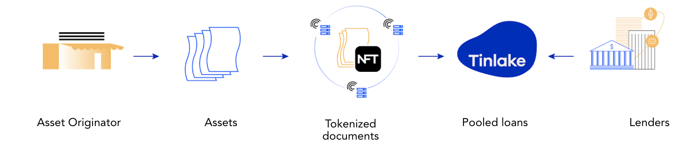
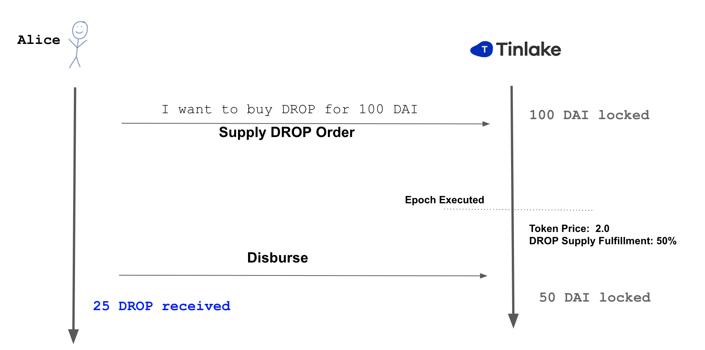
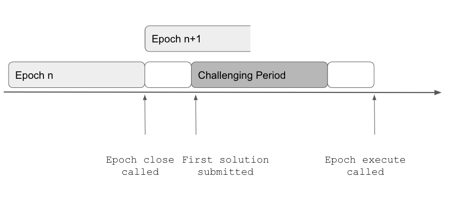

## Introduction

[Tinlake](https://tinlake.centrifuge.io/) is an open, smart-contract based marketplace of asset pools bringing together Asset Originators and Investors which seek to utilize the full potential of Decentralized Finance (DeFi). Ultimately, Tinlake will become a fully decentralized financing protocol that interoperates with different blockchains and plugs into a variety of funding source.

Through Tinlake pools, businesses or "Asset Originators" can responsibly finance real-world assets, such as invoices, mortgages or streaming royalties through DeFi and access bankless liquidity. They do this by tokenizing their financial assets into Non-Fungible Tokens (“NFTs”) and use these NFTs as collateral in their Tinlake pool to finance their assets.

These assets create a safe, stable return for DeFi investors and DeFi protocols who provide the liquidity and earn yield and CFG rewards. For every Tinlake pool, investors can invest in two different tokens: [TIN and DROP](#drop--tin-the-two-tranches). TIN, known as the “risk token,” takes the risk of defaults first but also receives higher returns. DROP, known as the “yield token,” is protected against defaults by the TIN token and receives stable (but usually lower) returns. This is similar to Junior/Senior investment structures common in traditional finance.

Every Asset Originator creates one pool for their assets. If you are interested in investing into a Tinlake pool, you can check out the current pools open on Tinlake [here](https://tinlake.centrifuge.io/) and find an investment guide [here](link to investment guide section). All Tinlake pools have different risk/return profiles, so make sure you find the right one for your investment preferences (see [here](link to asses a pool section) how to asses a pool).

Tinlake pools are set-up as "revolving" or openend-ended pools where investors can join and leave at any time and the provided capital can be continuously re-deployed by the Asset Originator unless it is redeemed by the investors.

## Revolving pools - Continous liquidity

### Intro

Revolving pools allow investors to invest/redeem independently at any time. A decentralized solver mechanism matches investments and redemptions and ensures that certain preferences (e.g. DROP redeem seniority) are considered and the pool's risk metrics are intact. This ensures that Asset Originators have a constant source of liquidity while investors can flexibly invest and redeem.

### Investing into Tinlake

Investors can be whitelisted for either one (or both) of Tinlake's two tranches. To invest into TIN or DROP Investors lock their investment in DAI into the Tinlake pool at any time during an epoch. Investments and are redemptions are then executed at the end of an epoch, usually every 24 hours. A decentralized, automatic mechanism matches investments and redemptions making sure the pools risk metrics remain intact, e.g. the DROP tranche is always protected by a minimum of TIN investors who take the first loss.

When the investments are executed the investors receive TIN or DROP token in exchange for the DAI locked. Transactions are executed at the current token prices reflecting the accrued interest and value according to the underlying [NAV model](link to valuation section) over time. DROP token acrrue interest at the DROP rate on the deployed capital. The TIN token additionally captures the spread betwee DROP rate and Financing Fee but also bears potential losses in the form of write-offs. To redeem TIN/DROP tokens Investors lock these tokens into Tinlake and after the execution of the order they can collect the corresponding amount in DAI based on the current token price. TIN and DROP tokens for investments and received DAI for redemptions can be collected at any time, independent of epochs. Until collection TIN and DROP tokens remain securely locked in the Tinlake smart contracts and already accrue interest and earn CFG awards.

### Financing an asset

The Asset Orginiator can use the capital provided by investors to finance assets. To do this, he locks an NFT representing a tokenized "Real-World Asset" into the set of smart contract as collateral. The NFT is minted based on a document created and shared through Centrifuge's P2P protocol. Financing fees and Principal/Maximum Financing amounts for these NFTs/tokenized assets are provided by an on-chain pricing scorecard and going forward determined by external service providers through "Pricing Oracles". Once the NFT is priced the Asset Originator can draw down the financing. Upon repayment of the financing, the NFT is unlocked and transferred back into the Asset Originator's wallet.

## The Epoch - How investments and redemptions are executed

### Overview

A decentralized pool where investor can invest/redeem and AOs originate/repay repay at anytime needs a decentralized mechanism to coordinate investments, redemptions, originations and repayments. Welcome the `Epoch`.

For Tinlake's Revolving Pools all investment inflows/outflows are locked over a defined period of time ("Epoch") and automatically executed at the and of this period following predetermined priorities and risk metrics. The Asset Originator can use the available liquidity reserve after the invest/redeem transactions have been executed to finance Asset Originations throught the next epoch. Repayments can also happen at any time throughout the epoch, but are collected in a seperated reserve and can only be used for financings in the next epoch to allow investors priority for their redemptions.

To summarize: The following types of inflos/outflows of the asset side can happen during an Epoch by the Asset Originator:

- Financing repayments
- Asset Originations / Financing Drawdowns

The following types of inflows/outflows on the investment side are locked during the epoch and exected at the end of the epoch:

- DROP redemptions
- TIN redemptions
- DROP investments
- TIN investments

### Length of an Epoch

On the smart contract level, Tinlake epochs have a minimum length that the smart contracts will enforce. Thus an epoch cannot be closed before the minimum length has passed. An epoch does not have a maximum length. After the minimum length has passed the contracts can be called to close the current epoch. So if e.g. the minimum length of an epoch is set at 24h, an epoch will have to last at least 24h but can also last longer. This allows for a flexible set-up to have longer more flexible epochs at the start of a pool to ramp up funding or to allow for more effecient transaction costs e.g. in times of high gas prices or ensures that a pool can start slower at the beginning. A mature, liquid pool can have a service added that limits the epochs to a certain length by closing the epoch at a pre-defined interval. Once the epoch is closed the smart contracts start to process the current state of the pool and process all locked orders (see more details below).

### The invest/redeem process

Investors can supply more liquidity at any point in time during the epoch. The supplied Dai would be locked in the Tinlake contracts until the end of the epoch. The investor can cancel his lock as long as the current epoche is active. In that case, the locked DAI will be transferred back to his wallet. At the end of the epoch, all locked orders will be processed and executed at the current TIN/DROP prices considering the max reserve amount and min TIN risk buffer. After the epoch turn, investors can collect the executed orders in the UI. If part of the investment/redemption could not be executed, it will be rolled over into the next epoch, thus the DAI remain locked. This locked order can be cancelled at any time.

The redeem process works similarly. If Existing TIN/DROP investors want to redeem (part of their) TIN/DROP tokens they can lock this Tokens into Tinlake at any point during the epoch. At the end of the epoch, all locked orders will be processed and executed at the current TIN/DROP prices considering the max reserve amount and min TIN risk buffer. After the epoch turn, investors can collect the DAI from the executed orders in the UI. If part of the investment/redemption could not be executed, it will be rolled over into the next epoch, thus these tokens remain locked. This locked order can be cancelled at any time.

### The turn of the Epoch

Once the minimum length of an epoch has passed anyone can call the contracts to "close" the epoch. Once the epoch is closed investor's can't unlock their orders anymore. All Orders locked after the close will be collected and processed. If an epoch close is called without any locked invest/redeem transactions the epoch number will be bumped but the process described below will not be started.

At the Epoch turn, the contracts first process the current state of the pool:

- Total Debt
- NAV
- Reserve
- Senior Debt
- Senior Balance
- Senior Value
- Junior Value
- TIN/DROP Token prices
- TIN risk buffer

Then the contracts check whether all set orders can be executed with the capital available and without breaking the TIN risk buffer or the Max reserve restrictions. If this is the case all orders are immediately executed and the contracts process the new state of the pool. Please find a simple model that illustrates the processing of orders and calulation of the pool state [here](https://docs.google.com/spreadsheets/d/1mkIbWzhD7IXbnbYXKreTMYuaZJEzyTVqllhJnP4YdPs/edit#gid=161507348)

If not all orders can be executed, e.g. because there is not enough capital available in the Reserve (plus new investments) to serve all redemption orders or executing all DROP investments would break the Min TIN risk buffer the Tinlake "Solver mechanism" would be initiated.

### The Solver mechanism

#### Why introduce a solver mechanism?

If not all orders can be executed a mechanism is required to find the optimal solution to ensure as many transactions as possible are executed while adhering to certain restrictions such as the Max Reserve amount, min TIN risk buffer, DROP sovereignity etc. Finding the optimal solution for the four invest redeem transactions type of transactions (DROP redemptions, TIN redemptionsm, DROP investments, TIN investments) under a defined set of restrictions depicts a classic maximization problem that can be solved with linear programming.

#### How it works

Implementating linear programming in smart contracts is theoretically possible but in practice very complex and expensive in terms of gas fees paid. Tinlake smart contracts thus have a decentralized approach where anyone can run a solver and submit the solution for executed orders four invest/redeem transaction types via a simple contract call. The smart contracts check that the state resulting by this submission adheres to all restrictions described above. If this is the case, a 30min challenging period starts in which anyone can submit a superior solution. The superiority of solutions is determined by a "max weight function" multiplying the amount of orders executed with weights. The weights for this function can differ between pools but usually, e.g. DROP redemption would contain the highgest weight to ensure DROP senority.

If a competing viable solution is submitted resulting in a higher "max function" a new 30min challenging period starts. If no superior solution is submitted anyone can call the "Epoch execute" function after the 30min challenging period to execute the pending transactions according to the accepted solution.

#### The solver optimization

The linear programming of the Tinlake solver maximizes the execution of the four invest/redeem orders (all in DAI values)

- TINInvestOrder
- DROPInvestOrder
- DROPRedeemOrder
- TINRedeemOrder

according to a max function that allocates a weight to each of the executed order types. Sample weights to ensure a waterfall-like priority focused on DROP seniority could e.g.

- DROP redemptions: 100,000,000,000 [Ensure seniority]
- TIN investments: 100,000,000 [Build up risk buffer]
- DROP investments: 100,000
- TIN redemptions: 100 [Ensure Min TIN risk buffer stability]

The according sample max function could e.g. be

$$
Maxfunctionresult = DROP redemptions * 100,000,000,000 +  TIN investments * 100,000,000 + DROP investments * 100,000 + TIN redemptions * 100
$$

The restrictions for this optimization problem are:

- Executed order needs to be smaller or equal to the submitted order [e.g. Total executed TIN invest <= Total locked TIN invest]
- All executed orders need to be larger than or equal to zero [e.g. Total TIN invest > 0]
- The Reserve is larger than zero and smaller smaller than the `max Reserve amount` after all transactions are executed [0 < Reserve < Maximum Reserve Amount]
- The Tin ratio of the resulting state is larger than the MIN TIN ratio and smaller than the Max TIN ratio [Min TIN risk buffer < Current TIN risk buffer]

### Senior Debt Rebalancing

With every epoch that has executed invest/redeem transactions the relation between Senior and Junior Tranche changes. This also needs to be reflected in `Senior Debt` to ensure that interest accrued on Senior Debt is in line with the Junior/Senior relation and the Senior Tranche does not accrue too much or too little interest. To ensure this, Senior Debt is rebalanced in line with the relation between the `Senior Value = (Senior Debt + Senior Balance)` and the `Pool Value = (NAV + Reserve)`. This relation is called `Global Senior ratio`.

$$
Global Senior ratio = \frac{Senior Debt + Senior Balance}{NAV + Reserve}
$$

The global Senior Ratio is multiplied with the NAV to calculated the `Target Senior Debt` and the Senior Debt and Senior balanced are re-balanced to set the 'Senior Debt' equal to `Target Senior Debt`. Note that the `Senior value` remains unchanged. Please find a simple model that illustrates the re-balancing mechanism [here](https://docs.google.com/spreadsheets/d/1mkIbWzhD7IXbnbYXKreTMYuaZJEzyTVqllhJnP4YdPs/edit#gid=880740688)

### Process Overview

The following graphs summarizes the entire flow of the turn of an Epoch:

## Tinlake Terms

### Asset side

#### Total Debt

Currently outstanding debt of the pool (~financed assets incl. accrued interest). Every financing accruess secondly compounded interest at the `Financing Fee`. `Total Debt` is the sum of all currently outstanding Debts per assets.

#### NAV

The `NAV` (Net asset value) reflects the present value of the outstanding portfolio of financings. It is basically the sum of present values of the risk-adjusted expected repayments of all outstanding financings. It is calulated through Tinlake's Pricing and Valuation Smart contract ("NAV feed") at every `Epoch` based on an on-chain a fair value valuation (“marked to model”). Valuation parameters are also provided by the document underlying the NFT, which is created and shared through Centrifuge's p2p Protocol. The NAV ultimately determines the tranches values and thus token prices at which investors invest and redeem at every epoch. Please find more details about Tinlake's valuation approch, including simplified examples [here](https://centrifuge.hackmd.io/PgKrCfcUT3Ot63d_YfeNYw).

#### Reserve

The `Reserve` is the current liquidity in the pool that is not deployed to finance assets ("~cash" in traditional finance). It is available for redemption by investors and asset orginations by the Asset Originator and limited by the "Max reserve amount".

#### Senior Debt

The share of `Total Debt` that accrues interest at the `DROP APR` for the DROP tranche. The "Senior Debt" is rebalanced at every epoch to reflect the share of DROP invested into the pool. Please find more information on the rebalancing mechanism below.

#### Senior Balance

Share of the DROP tranche that is currently not deployed in financings and thus does not accrue interest at the `DROP APR`.

### Investment Side

#### Senior Tranche

The senior tranche holds all DROP investments. DROP, known as the “yield token,” is protected against defaults by the TIN token and receives stable (but usually lower) returns.

#### Junior Tranche

The junior tranche holds all TIN investments. TIN, known as the “risk token,” takes the risk of defaults first but also receives higher returns.

#### Senior Value

The Senior Value represents the value of the senior/DROP tranche. It is calculated as

$$
seniorValue = min(Senior Debt + Senior Balance, NAV + Reserve)
$$

If NAV + Reserve are smaller then the Senior Value or in other words the sum of senior Debt + Senior Balance , TIN's risk cusion would be worthless (e.g. taken all losses). Then the entire NAV and the currency left in Reserve belong to the senior tranche. The senior value is used to calculate the DROP tokenprice.

#### Junior Value

Junior Value denominates the current value of the junior/TIN tranche. It is mainly driven by the NAV and Reserve and calculated as:

$$
juniorValue = max(NAV + Reserve - Senior Value,0)
$$

The Junior value is used to calculate the TIN token price.

#### Pool Value

The Pool Value is the sum of Senior and Junior Value:

$$
Pool Value = Junior Value + Senior Value = NAV + reserve
$$

Note that it is equivalent to the sum of NAV and reserve.

#### TIN/DROP Token Supply

TIN/DROP Token Supply denote the amount of outstanding TIN and DROP tokens per pool.

#### TIN/DROP Price

The price per TIN/DROP token is calculated by:

$$
DROP Token Price=\frac{senior Value}{DROP Token Supply}
$$

and

$$
TIN Token Price =\frac{juniorAssetValue}{TINTokenSupply}
$$

### Interest rates

#### Financing Fee

This is the rate at which the Debt of an indiviual Financings accrues interest. It is expressed as an APR and compounds interest every second. Different assets can have different Financing Rates depending on their individual `Risk Score`.
The Financing Fee per risk score is stored in a `Risk Scorecard` in a smart contract. A pricing oracle determines the risk score and value of every NFT locked into Tinlake based on the underlying document and NFT shared/minted via the Centrifuge p2p Protocol. The `Financing Fee` per Financing is determined automatically based on the set `Risk score` of the underlying NFT. Please find more information how pricing based ona Scorecard works [here](TODO link blogpost).

#### DROP APR

This is the rate at which the `Senior Debt` accrues interest per second. Note, that this is only applied on deployed Senior tranche capital but not on the `Senior Reserve`. The actual DROP return may thus differ from the DROP APR.

#### TIN return

The `Junior Tranche` does not have a pre-defined fixed or variable interest rate. TIN tokens capture the increasing value of the portfolio and the spread between `Financing rates` and `DROP APRs`.

#### Pool risk metrics and restrictions

##### Current TIN risk buffer

The `Current tin risk buffer` describes the extend of TIN protection for the DROP tranche. It is calulated as

$$
Current TIN risk buffer = \frac{Junior Value}{Junior Value + Senior Value} = \frac{Junior Value}{Pool Value}
$$

The higher the `Current TIN Ratio` the higher the TIN risk protection for DROP.

##### Min TIN risk buffer

The Min TIN risk buffer is the lower limit of the `Current TIN risk buffer`. It ensures that DROP investors are protected by a certain amount of TIN invested in the pool at any time.
If the `Current TIN risk buffer` is below the Min TIN risk buffer DROP Investments, TIN Redemptions and Asset Originations are not possible any more until the the min TIN risk buffer is restored e.g. through further TIN investments. Correspondingly no DROP Investments or TIN redemptions would be accepted that would break the ratio.

##### MAX Reserve amount

A high reserve drags down the DROP and TIN returns as this capital is not generating interest income.This is why the AO can limit the amount of investments it is willing accept with the `Maximum reserve amount`. No investments will be accepted if the current `Reserve` is larger than the `Max reserve amount`. The `Max reserve amount` can be set and adjusted by the Asset Originator on a constant basis to manage the investments allowed into the pool based on their need for liquidity.

## DROP & TIN: The Two Tranches

### Introduction

Investors often want different kinds of risk exposure and yield on the same asset class. In the traditional finance world, one way to achieve this is by using structured finance products and introducing a tiered investment structure or in other words, different tranches. This means that investors can invest in the same asset through different classes of shares with different risk/return profiles. Tinlake implements this functionality by offering the option to issue two tokens, the Tin and Drop tokens, which behave very similarly to how tranches work in the traditional finance world. Note, that Tinlake can also be deployed with just one token (Tin).

### Two-tiered structures in finance: Tinlake's DROP and TIN

While there can be several different tranches in structured finance products, Tinlake's default implementation is a common two-tiered structure, with two different tranches. In finance, this is usually called an A/B tranche or junior/senior tranche structure. In this case, the first class of shares (A/Senior class) usually has a rather stable but lower return than the second class (B/Junior class). In exchange, the junior class usually has higher, but also more variable returns, as it protects the senior class from losses (e.g. from defaulted assets).

Tinlake’s two tokens behave very similarly to how tranches work in a common two-tiered structure. The Tin token can be seen as the junior tranche and token holders that own these tokens take second priority to the Drop token holders when money flows from borrowers back to funders, but depending on the performance of the pool also have the potential to generate a much higher return on their token value than Drop token holders.

### Allocation of Proceeds ("Waterfall")

In a standard investment vehicle, investors share the risk and return of the investments pro rata, meaning they share it corresponding to their investment volume. In a tiered investment structure, investors do not share all risks and returns pro rata. Therefore, it somehow needs to be defined how the proceeds are allocated between the different tranches. This is called the waterfall.

Most waterfalls usually follow the principle that proceeds are distributed from top (senior tranche) to bottom (junior tranche). This implicitly means, that losses/defaults are allocated from bottom to top, meaning they are borne by the junior tranche that protects the senior tranche. Therefore, the junior tranche is also sometimes referred to as a _first loss piece_.

A simple waterfall could be, for example, that the senior tranche receives their investment back first and also their (fixed) returns. The remaining proceeds are then allocated to the junior tranche. The higher the proceeds left in the waterfall for the junior tranche are, the higher the return. However there are many different configurations. Another setup could be that the senior tranche receives their investment back first, then the junior tranche receives their investment back, then the senior tranche receives their (fixed) return and the remaining proceeds go the junior tranche.

### A Simplified example

To illustrate how the DROP and TIN tokens work in more detail, let’s look at a hypothetical $1M fund investing in SME invoices targeting an average annual interest rate of 9%. When setting up a structured fund, part of the paperwork is to define how many shares are being issued in each class. For example, the issuer could say they will sell 20% of the $1M investment in a junior tranche and 80% in a senior tranche. Let’s assume the senior tranche is guaranteed a fixed return of 5%. The junior tranche has a variable return depending on the success of the investment. Now let’s look at a few different scenarios to explain how this structure affects the risk and return of the different investment classes.

#### Base case scenario

Assume that the money to return to investors is $1.09M based on the 9% interest rate ($1M in principal and $90k in interest). During the lifetime of the fund, any repayments are first used to repay the share of the senior investors along with the 5% interest accrued on their investment (5% of $800k = $40k). Once all outstanding senior debt and interest has been paid off, the waterfall pays out the remaining proceeds to the junior investors. That means that if there are no losses, the junior investors will be paid $50k on a \$200k investment. This is equivalent to a 25% return.

#### Partial Loss for the Junior Tranche

Let’s assume again that out of the $1M lent, $1.09M were due incl. accrued interest. However, there is a 6% default rate resulting in a total loss of $60k of the portfolio. For simplicity, we further assume that interest is impacted similarly, so the total interest paid from the portfolio is $84.6k. The senior tranche is not impacted and still returns 5% of $800k equal to $40k. The junior investors take the first loss and their net value drops to $140k. The junior tranche still receives the remaining interest payments of $44.6k from the waterfall. Thus, overall the junior tranche has an ending net value of \$188.6k equal to a loss of 7.7%.

#### Losses for Senior Tranche

The senior tranche would be protected against any losses of their investment and their guaranteed fixed return as long as potential defaults do not exceed the volume of the junior tranche. This would be the case up to a default rate of 22.9% under the above assumptions. With a default rate of 22.9% the loss of the portfolio is $229k leaving a total of $771k of the loan portfolio being paid back. The total interest still paid from the portfolio is $69k. Thus, the senior tranche is not impacted, receiving $840k ($771k + $69k) and still returns 5%. The junior tranche takes the first loss again and their net value drops to \$0k. For defaults higher than 22.9% the senior tranche would also start to accrue losses, first on their expected return, and then on their initial investment.

#### Interest Rate Model

The Drop token’s return is defined by a fee function. Unless modified, the default implementation has a fixed interest per pool compounding per second. The interest is only charged on the deployed capital. The Tin token only gets a return on their investment if the Drop token holders have all been fully redeemed. Therefore, Tin token holders do not have a guaranteed fee or return but measure their return by what the Drop token contract leaves in the system.

An overview of how to calculate interest rates for Tinlake contracts can be found [here](#interest-rate-methodology).

### Minimum Tranche Ratio

A Drop purchaser taking the senior tranche would want to have a guarantee that there is at least a minimum percentage of Tin in the pool to make sure that they are protected against a certain amount of losses. Setting this variable guarantees them a certain risk profile. When deploying a pool this variable is set upon initialization and enforced by the contracts. When the minimum ratio is broken, investments and the issuance of additional Drop token is stopped until the minimum ratio is restored.

## Interest Rate Methodology

Tinlake uses an interest rate mechanism that is typically implemented as compounding per second. The implementation can be found in [github.com/centrifuge/tinlake-math](https://github.com/centrifuge/tinlake-math).

Below we show abstract examples of how this is calculated:

| Variable     | Description                                                                                                                   |
| ------------ | ----------------------------------------------------------------------------------------------------------------------------- |
| $P$          | Principal                                                                                                                     |
| $D$          | Debt                                                                                                                          |
| $rate$       | interest rate per second                                                                                                      |
| $n$          | the number of times the interest is compounded, compounding is once per second, so "n" is seconds past since last calculation |
| $\mathtt{R}$ | Nominal interest rate (5% would be 0.05)                                                                                      |
| $\mathtt{A}$ | Annual Percentage Rate (APR)                                                                                                  |
| $\mathtt{y}$ | constant, seconds in a year: $3600 \cdot 24 \cdot 365 = 31536000$                                                             |

The basic formula is:

$$
D = P \cdot rate^{n}
$$

Debt equals to Principal (or the previous debt amount) times rate to the power of seconds since last calculation.

### Example: Interest rate compounding per second

$$
P = 100 \newline
r = 0.05 \newline
n = 3600 \cdot 24 \cdot 365 = 31536000 \newline
$$

Using the formula above, the Debt $D$ after half a year
$(n = \mathtt{y} / 2 = 15768000)$ would result in $D = 102.5315$.

After one year ($n = \mathtt{y}$) the $D$ would be $105.1271$.

Thus a 5.00% interest rate compounded every second is equivalent to an annually compounded rate of 5.127%.

The annual percentage rate $\mathtt{A}$ could also be calculated directly from the percentage rate $\mathtt{R}$ (using $n = \mathtt{y} = 31536000$):

$$
\mathtt{A} = (1 + \frac{\mathtt{R}}{\mathtt{y}})^\mathtt{y} = 1.05127
$$

#### Rate per Second

To calculate the Debt, we initialize an interest rate in Tinlake with a variable called `ratePerSecond` or $rate$. The ratePerSecond represents the interest accrued per second in Tinlake.

$$
rate = 1 + \frac{\mathtt{R}}{\mathtt{y}}
$$

#### Calculate Debt

$$
D = P * rate^t
$$

The debt can be calculated by multipling the principial $P$ with $rate$ to the power of $n$. The variable $n$ represents the time passed in seconds since the loan has been borrowed.

Continuing the example from above for annual interest:

$$
rate  = 1 + \frac{0.05}{31536000} = 1.0000000015854900 \newline
D = 100 \cdot 1.0000000015854900^{31536000} = 105.1271
$$

### Using an annual percentage rate (APR) in Tinlake

The Tinlake User Interface uses an annual percentage rate (APR) as input. Tinlake transforms this annually compounded rate $\mathtt{A}$ into the equivalent rate used for compounding per seconds $rate$. This is achieved by solving the equation:

$$
\mathtt{A} = (1 + \frac{rate}{\mathtt{y}})^\mathtt{y}
$$

for $r$:

$$
r = \mathtt{y} \cdot (\mathtt{A}^{\frac{1}{\mathtt{y}}}-1)
$$

Using the calculated $r$ compounding every second leads to the same amount of debt like using $\mathtt{A}$ compounding annually over the course of a year. Thus, the calculated `rate` can be used to achive an interest per year (APR) behaviour with the compounding per second implementation in Tinlake.

Continuing the example from above with an 5.00% annual interest rate (APR):

### Decimal Precision

We use fixed precision decimals for any monetary amounts. Interest Rates are typically of type `ray` with 27 digits precision and amounts are of type `wad` which has 18 digits precision.

This is usually explicitally mentioned in throught the codebase.

## Asset Pricing

Centrifuge’s Tinlake is an asset-backed smart contract lending platform built to responsibly bridge real-world assets, such as invoices, mortgages or streaming royalties to the DeFi ecosystem. This post is the first in a multiple part series about how valuation and pricing of **real-world assets** work within the Tinlake ecosystem. Collectively, this series will form our knowledge base on real-world asset pricing and will be used to educate the DeFi community as we bridge non-native crypto assets into the decentralized finance ecosystem.
This post starts with the **fundamentals of pricing real-world assets.** It will focus on one particular asset — an invoice — and explain which factors are usually considered in pricing this asset and how these factors may be turned into an interest rate. Invoices are particularly interesting collateral for Tinlake and DeFi because they have historically low default rates and a short maturity of 30–90 days.

### Financing an Invoice

For our purposes, an invoice is a bill sent from one entity (supplier) to another (buyer) in connection with the delivery of goods or services. Key data points on an invoice usually are:

1. Invoice amount
2. Counterparty name and address
3. Issuance date
4. Due date
5. Line items (e.g. type and quantity of goods)
6. Payment terms and conditions

Suppliers around the world typically have to wait for 30–90 days to get paid for an invoice. Instead of waiting several months until the invoice is due, the supplier has an alternative: find a way to convert the invoice into capital quickly by financing it through a capital provider, e.g. an Asset Originator or a factor.

The parties involved in issuing and financing an invoice through Tinlake usually are the following:

| Roles             | Description                                                                                                                              |
| ----------------- | ---------------------------------------------------------------------------------------------------------------------------------------- |
| Supplier/Borrower | Invoices the buyer for delievered goods or services; has to wait for payment by the buyer; finances this invoice to get paid right away. |
| Buyer             | Purchases the goods or services and incurs the charges related to the invoice for the goods or services                                  |
| Asset Originator  | Provides capital to supplier at a discount to the face value of the invoice, and 100% of the collections related to the invoices.        |
| Lender            | Lends money to the Asset Originator in exchange for certain rights and privileges regarding the invoice payments of buyers.              |

Financing an invoice can be structured as a simple loan with one bullet repayment. The two decisive pricing parameters are **advance rate** and **interest rate.** The advance rate acts as a reserve or protection for the Lender against losses. The interest amount/finance fee is usually deducted up-front and the loan is then paid back in relation to the payment due date of the invoice.

Imagine e.g. an invoice with a face value of _USD 100_ due in 90 days. A supplier may use this invoice as collateral to receive early payment in form of a short term loan. Assuming an 80% advance rate and a 7.0% interest rate (APR) a supplier could receive a loan (“early payment amount”) of USD _78.6_ (deducting interest of USD 1.4 = _USD 80_ _ (7.5% _ (90/360)) and pay back _USD 80_ after 90 days when he receives the payment of the buyer. If the supplier wants to finance this invoice through Tinlake, he could turn to an Asset Originator who would tokenize it and use a Tinlake pool to draw funding in stablecoin from a Lender, e.g. from a decentralized lending protocol, against the invoice NFT as collateral.

### Factors for Pricing Invoices

There are several different factors to consider when setting advance rate and fee/interest rate for financing an invoice. These different factors are relevant for both the Asset Originator as well as the Lender. _For brevity, I will refer to both parties as just the Lender in the section below:_

#### 1. Buyer Credit Risk

The value of an invoice is firstly based on the buyer’s ability and willingness to pay. In some cases, this can be represented by publicly available credit ratings. In others, credit bureau data, the payment history of the buyer or publicly available news may be used.

#### 2. Supplier Credit Risk

The stability of the supplier is another important factor to be considered. Lenders are underwriting the supplier as much as the invoices themselves. The suppliers working capital management is of particular importance. Is the supplier’s net working capital positive or negative? How have its metrics trended in the past? What is the supplier’s collection history with this specific buyer? Also, what is its history of commercial disputes and/or failures to deliver?

#### 3. Industry and Country

In addition to the supplier’s and buyer’s individual credit risk, the market impact on pricing by industry and country is another important factor. While some industries have a robust, constant supply chain, other industries may be subject to seasonality or prone to disruption. Each country carries with it some amount of systematic risk that trickles down to suppliers and its ability to pay. Further, the recovery of defaulted amounts or the ability to collect an overdue payment often depends on a country’s legal system.

#### 4. History

There is inherent bias baked into repeating relationships that can be either positive or negative. If a Lender has some track record with a supplier/borrower, then the impact of a continuing relationship will work its way into the pricing. For instance, if an efficiently run supplier has a long track record, with invoices based on contracts with stable counterparties, they will get favorable pricing on its invoice population.

#### 5. Portfolio Volume

The most important factor when estimating the advance rate/fee for invoices is volume. To a Lender, a large number of invoices means the risk of non-payment is spread across a number of counterparties — more invoices are better than less. If one is pricing a pool of invoices, the statistics around the invoice pool can be considered. One can think of a distribution function where a great sample amount means a smoother distribution. Lower invoice counts mean that collecting on the discrete, single invoice has a more significant impact on the pool’s return.

### Estimating Advance Fee and Rate

Now let’s take a look at how considering all these factors may translate into advance rate and a fee/interest rate for financing an invoice. This will be illustrated with a very simple example. Having this in mind, please note that valuation and pricing generally come with a large variety of approaches and different, usually higher levels of complexity.

Imagine a large Buyer, “Sneaker Group” and a Supplier, “Laces Inc”. There is also “Lender Co” willing to provide financing. Laces invoices Sneaker for its delivery of laces worth USD \$1,000 with payment due in 90 days. Laces wants to request financing from Lender with the invoice as collateral.

To set interest and advance rates, the Lender may use a homemade risk scorecard. These scorecards come in a variety of forms and different levels of complexity. For this purpose, we will assume a very simple scorecard, where with five individual factors described above (Note, that portfolio aspects are not considered for this simple example of an individual invoice) contribute equally with a score from 1 (the worst) to 10 (the best) to an overall risk score of up to 50. Let’s assume the following scores for Laces Inc:

| Factor                                     | Score | Description                                                                                                                                                                                                                                                             |
| ------------------------------------------ | ----- | ----------------------------------------------------------------------------------------------------------------------------------------------------------------------------------------------------------------------------------------------------------------------- |
| Supplier Credit Worthiness ("Laces, Inc.") | 7     | Laces provides its financial information, tax returns, bank statements to AO so that it can estimate credit worthiness. The analysis leads to an above average score which implies risk of default is lower compared to the overall market. Lower advance rates needed. |
| Buyer Credit Worthiness (“Sneaker Group”)  | 10    | Sneaker is a large buyer and publicly traded with excellent credit ratings provided by established rating agencies                                                                                                                                                      |
| Relationship/History                       | 7     | A strong relationship means less variance around the outcome, thus lower risk.                                                                                                                                                                                          |
| Industry                                   | 5     | Lace’s industry is cyclical and can impact collections.                                                                                                                                                                                                                 |
| Country                                    | 7     | Sneaker and Laces operate lower risk jurisdictions and warrant pricing that reflects this lower risk.                                                                                                                                                                   |

Adding up the individual scores for each of these factors leads to a risk score of 36 for Laces.

This risk score can be mapped on a risk scorecard with assigned advance and interest rates for risk scores. The typical advance rate is usually between 70% to 90%. As of the writing of this blog, annual rates (APR) around 6% to 8% on a loan 90-day invoice are consistent with observable market rates. These rates would also include and reflect the Lenders operational costs and cost of capital, which are similar for all loans. Having this in mind, a simple scorecard could look like this:

| Risk Rating | Score | Advance Rate          | Interest Rate    |
| ----------- | ----- | --------------------- | ---------------- |
| A           | 45-50 | 90%                   | 5.00%            |
| B           | 40-44 | 80%                   | 6.00%            |
| C           | 30-39 | 80%                   | 7.00%            |
| D           | 20-29 | 70%                   | 8.00%            |
| F           | 5-20  | No financing approved | ("Risk cut-off") |

Based on this scorecard, Laces would be assigned a risk rating of C and Lender could offer Laces financing with an advance rate of 80% and an interest rate/fee of 7.00% against the invoice as collateral. The Asset Originator would advance $786 (80% advance less $14 interest at 7% interest) and collect \$800 in 90 days from Laces.

## Asset Valuation

### Intro

Asset Valuation is the process of determining the current worth of an asset or portfolio by assigning a monetary value. The value of a portfolio of assets is often also expressed as the net asset value (NAV).

A NAV is usually required when a portfolio is sold or when investors want to join/exit an existing investment pool. Then the portfolio value ultimately determines the investment/redemption price. Note that for these purposes the portfolio value may be different to the book value or accounting value of a portfolio.

Determining the value of illiquid assets is notoriously difficult because – by definition – there isn’t a liquid secondary market to determine the value, unlike many stocks, bonds or most fungible tokens. For illiquid asset portfolios the valuation methodology is thus often based on a fair value valuation utilizing a financial model ("marked to model"). This often comes down to valuing the present value of future cash flows expected to receive based on these financings - the so-called discounted cash flow (“DCF”) method.

### Tinlake's approach - Fair value DCF

#### Step-by-step overview

Tinlake's valuation methodology is also based on a fair value valuation ("marked to model") utilizing a discounted cash flow model. The approach can be summarized as follows:

1. **Derive Expected Cash flows**
   For every outstanding financing of an asset, the expected cash flow is calculated. The current implementation allows to calculate the Expected Repayment of simple bullet loan structures which are common in particular in invoice financing and trade finance. The `Expected Cash Flow` is calculated based on (i) the expected repayment dates and (ii) the expected repayment amounts.
   (i) The expected repayment date is derived on contractual obligations associated with the financing, e.g. the due date of the underlying invoice. This is provided through an Oracle based on the documents underlying the NFT minted on Centrifuge's P2P Protocol.
   (ii) The expected repayment amount is projected based on the outstanding Tinlake financing by applying the financing fee on the current debt until the repayment date.

2. **Risk-adjust expected cas flows**
   The expected Cash Flow is risk-adjusted for credit risk by the `Expected loss`. Every financing is allocated a risk class that has a `Probability of Default (PD)` and `Loss Given Default (LGD)` assigned to it. The `Expected Loss` is calculated as `Expected loss = Expected Cash Flow * PD * LGD` and substracted from the expected repayment amount to adjust for credit risk. Note that PDs are often communicated per anno and may need to be adjusted to the term of the underlying asset.

3. **Discount risk-adjusted expected cash flows**
   The risk-adjusted expected cash-flows are discounted with an appropriate discount rate (this depends on asset class and pool) to derive the present value of a financing. The discount rate usually reflects the rate
   of return an investor could earn in the marketplace on an investment of comparable size, tenor and risk. Note, that the discount rate is the same for every financing of a pool.
   The standard formula to calculate the PV of a cash flow is
   
   
   
   with `r = discount rate` and `t = period of cash flows`. As we deail with intra-year cash flows, the formula becomes
   
   
   
   with `n = number of discounting periods per year` e.g. 360 days for a financial year.

4. **Calculate NAV**
   Adding up the present values of the risk-adjusted expected cash flows for all financings in the pool leads to the (portfolio) NAV. The NAV plus the liquidity currently in the Reserve of the Pool gives the Pool Value.

#### Write-offs

Tinlake allows for a flexible treatment of write-offs. If a financing is overdue the expected repayment amount can be (partially) reduced by defined percentages after a defined number of days following pre-determined criteria (e.g. a grace period and collection period).

#### Operational costs

Average loan maintainance/running costs (such as legal, SPV, servicing) could be substracted from the PV. At the moment these are set to zero in Tinlake's NAV calculation as operating costs are currently borne by the SPV of the issuer.

### Sample calculations

#### Simple example for one financing

**General Assumptions:**
Today = 31.03.2020
Discount rate `r` = 5.00%
Days per year: 360
Seconds per year: 31536000

**Financing parameters:**
Financing date = 01.01.2020
Financing amount = 100 DAI
Financing fee = 10% APR
Expected repayment date = 30.06.2020
Expected loan duration = 180 days
(Annual) PD = 4%
LGD = 50%

**Calculations**

1. Calculate the expected cash flow on the 30.06.2020

Remember the textbook compounding formula is

$$
Expected CF = P * (1 + \frac{r}{n})^{(n*t)}
$$

where
P = Principal in DAI [=100]
r = Interest rate (decimal [0.1])
t = Time --> Loan duration i years
n = Number of times interest is compounded per unit `t`

Applying this to our financing assuming compounding per second gives
P = 100 DAI
r = 0.1
t = loan duration in years = 180/360 days = 0.5
n = 31536000 seconds per year

$$
Expected CF = 100 DAI * (1 + \frac{0.1}{31536000})^{(31536000*\frac{180}{365})} = 105.13 DAI
$$

2. Adjust the expected cash flow for default risk:

The Expected Loss with the risk parameters given is

$$
Expected Loss = 105.13 DAI * (0.04/180*360) * 0.5 = 1.05 DAI
$$

Note that the PD is adjusted to reflect the term of the asset. This is substracted from the Expected CF to calculate the risk-adjusted expected CF: 105.13 DAI - 1.05 DAI ~ 104 DAI

3. Discount the risk adjusted expected Cash Flow
   Assuming that today is the 31.03.2020 we first calulate the remaining time till the expected cash flow (30.06.2020) which is 90 days. Applying the discounting formula above with
   r = 0.05
   t = 90 / 360 = 0.25 = loan duration in years
   n = 31536000 seconds per year
   gives:

$$
PV = \frac{104 DAI}{(1 + \frac{0.05}{31536000})^{0.25*31536000}} = 101.5 DAI
$$

4. NAV
