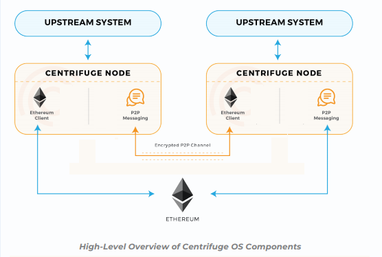

## Centrifuge Operating System

Centrifuge is an open, decentralized operating system which provides a method to create, exchange, and use the data that exists in the financial supply chain. It creates transparent and shareable relationships between interacting companies. Data owners can selectively share the information with their business partners or other users of the OS. This creates the foundation for data ownership, privacy, and transparency throughout the financial supply chain. It also allows third parties to offer additional services based on the information shared with them. The data owners have the power to decide whether or not to take advantage of those services.

Centrifuge OS provides a censorship resistant way to verify the authenticity of data that is transacted through and stored in it.

## Ethereum

Ethereum is a decentralized platform that runs smart contracts. Smart contracts are applications that run exactly as programmed without any possibility of downtime, censorship, fraud or third-party interference. Functionality deployed on Ethereum acts as the primary and trusted entry point and anchor for the other Centrifuge OS components. The censorship­ resistance and decentralized nature of the platform provide trustless lookups for Centrifuge OS users. Ethereum allows users to publish identity, reputation management, and document information through Centrifuge OS Smart Contracts without relying on any third party. Furthermore, Ethereum’s architecture provides a well-tested system for the issuance of
tokens to incentivize honest participation within the OS, issuance of tokens directly related to business documents, as well as decentralized governance layers of the OS at large.

For more information, see [Ethereum Project](https://www.ethereum.org/)

## Centrifuge Identity

A Centrifuge Identity (CentrifugeID) is a unique ID assigned to a participant of the Centrifuge OS in a network. When a new CentrifugeID is generated, a unique public representation of the Identity is created in the public blockchain as a _smart contract_. The data associated with a CentrifugeID is only modifiable by the creator and/or a delegate chosen by the creator.

A CentrifugeID has the following credentials:

* Peer to Peer Messaging Encryption Keys: are responsible for message encryption. These keys are used to identify the nodes over the P2P protocol.

* Signing Keys: Documents that pass through the P2P layer are signed with the signing keys. These signatures are a part of the merkle root that is anchored on the public chain and verifiable at a later time.

* Ethereuem Accounts: When interacting with a smart contract on Ethereum, an account needs to be linked to the identity to act on its behalf. The linked Ethereum accounts are the accounts that are allowed to interact with DApps utilizing Centrifuge OS.

Centrifuge OS users register their identity on the public Ethereum network and
maintain a set of public keys as part of their identity. These identities and their keys are used to resolve nodes on the P2P layer when one node wants to transmit data to
another Centrifuge user. This means that nodes on the P2P layer find others by
looking up their public keys from the public identity register based on CentrifugeID.

## Centrifuge Peer-to-Peer Network

A peer-to-peer (P2P) network consists of two or more systems connected and sharing resources without going through a separate server. Centrifuge consists of a P2P network for decentralized data exchange using smart contracts on Ethereum. The Centrifuge P2P node supports handling of incoming and outgoing data using a service bus principal where plugins and outside systems can subscribe to messages about specific objects.

## Centrifuge Node

The Centrifuge Node serves an interface to the upstream system in addition to being a part of the peer to peer network that forms the Centrifuge OS ecosystem.<!-- (Need more information here).-->

## Centrifuge Sidechain

The Centrifuge sidechain is a public Ethereum-based blockchain that deploys proof-of-authority consensus algorithm. The collaborators operating on the sidechain are voted in or out based on a token curated registry (TCR) located on the Ethereum mainnet.

## Merkel Tree

In a block, the Merkel tree is a tree in which every lead node is assigned a hash of the data block and every non-leaf node is labelled with a cryptographic hash of the lables of its child nodes. Merkel trees allow you to validate that any element in a large set of values is a part of one Merkel root hash. In the Ethereum blockchain, Merkle trees are created for each block to verify that a specific transaction is part of a mined block.

Centrifuge OS uses Merkel trees fir proving data validation for documents. In the Centrifuge OS, Merkel trees can be used to share the subset of a document with a third party to prove authenticity of the whole data structure while keeping the rest of the document private.

## Centrifuge OS Architecture

The core components of the Centrifuge OS are:

* Contracts deployed on Ethereum.

* Centrifuge nodes that facilitate data exchange on a P2P layer.

* An Ethereum-based sidechain with Centrifuge specific contracts and data.

The following image describes the Centrifuge OS architecture and the components:

## Contributing to the Centrifuge Project
To become a part of the Centrifuge community, read the [Code of Conduct](https://developer.centrifuge.io/docs/further-reading/code-of-conduct) and join [Slack](https://centrifuge-io.slack.com/). If you find a bug, file an issue on [GitHub](https://github.com/centrifuge/go-centrifuge/issues).
