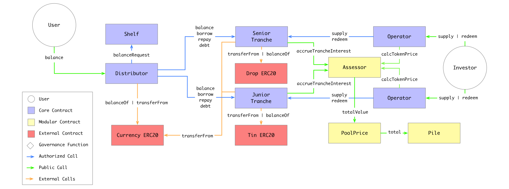

## Architecture
The contracts are separated into two logical areas: loan contracts and investor contracts. They mostly function independently of each other and are explained individually.

## Borrower
The loan contracts look as follows:

### Currency
Tinlake functions with any ERC20 contract. When deploying an instance of Tinlake, the address of the ERC20 token, we refer to as currency, is set.

### Title
The Title is an NFT registry that is used to control access to a loan. Every Tinlake loan is an ERC721 token and can be freely transferred from one address to another.

In the above diagram, all green method

`issue(address usr)` mints an NFT into the `usr` address.
`close(uint token)` burns the NFT

### Shelf
The `Shelf` is the main contract handling custody of the NFT and allowing the borrower to borrow and repay.

It depends on other contracts for certain parts of the logic. These contracts can be customized to fit a deployment's needs:
1) Pile: keeps track of the outstanding debt per loan
2) Ceiling: this module can be used to control when and how much may be borrowed/repaid per loan and wh.

It also allows for the collector to `seize` bad loans (take the NFT away from the borrower).

#### `issue(address registry, uint token)`
Issue a loan for the specified collateral NFT (registry address & token). Internally calls `Title` to issue a loan NFT into the sender's account.

The Shelf keeps track of NFTs already linked to a loan and ensures no two loans for one collateral NFT can be created. If there is a previous loan open for an NFT, the method `close` needs to be called.

#### `lock(uint loan)`
Transfers the collateral NFT from the sender to the Shelf. This is a prerequisite to borrow currency after.

#### `unlock(uint loan)`
Transfers the collateral NFT from the Shelf to the sender. Requires `Pile.debt(loan)` to return 0.

#### `borrow(uint loan, uint wad)`
Allows borrowing of `wad` amount in currency from Tinlake. Provided all checks are met, the loan's `balance` is increased by `wad` which will allow the user to withdraw their balance.

This method ensures a few conditions are met:
* The collateral NFT is locked into the Shelf
* Pile.borrow(loan, wad) is called and needs to not revert to make the Pile aware of the increase in debt
* Ceiling.borrow(loan, wad) is called and needs to not revert to make the Ceiling aware of the increase in debt

#### `withdraw(uint loan, uint wad, address usr)`
Withdraw `wad` amount of currency from Tinlake. This subtracts `wad` from the loan `balance` and triggers an ERC20 token transfer of `currency` from the Shelf to `usr`.

#### `repay(uint loan, uint wad)`
Repay `wad` amount in currency for the given loan. Provided all checks are met, this triggers an ERC20 token transfer of `currency` to the shelf.

This method does a few calls:
* Pile.repay(loan, wad) is called and needs to not revert to make the Pile aware of the decrease in debt
* Ceiling.repay(loan, wad) is called and needs to not revert to make the Ceiling aware of the decrease in debt

### Pile
The default implementation of the Pile allows creating of different interest rate groups and assigning each loan a rate group. Each interest rate group has an interest rate that is calculated on a per second compounding basis.

It's task is to report the outstanding debt for each loan with the method `debt(uint loan) returns (uint)`.

The method `accrue(uint loan)` needs to be called by the Shelf before any modification of the debt is made to update the current debt. This is to ensure that any other methods relying on that data (such as the Ceiling contract) get the most up to date debt().

Whenever `decDebt` and `incDebt` are called, first the debt is updated with the compounded interest and then the debt is increased or decreased by the specified amount.

### Ceiling
The purpose of the Ceiling contract is to ensure any borrow/repay transaction is allowed to succeed. It is used to determine whether a borrower is allowed to borrow for a certain amount.

If the Shelf has an NFT locked and a borrower calls `borrow` or `repay` on it, it will call the Ceiling contract with the amount the borrower wants to borrow. The Ceiling contract can then either revert the transaction to reject this request or return to let it succeed. In the default repository there are two different implementations for the Ceiling contract module:

1) Principal: The Principal ceiling let's a loan borrow up to a given amount exactly once. Wards can set different amounts for each loan using the `file` method. When the user wants to borrow, the amount will be deducted from the user's principal.
2) Creditline: This ceiling contract keeps track of a credit limit. It will allow any borrow request to go through provided sum of the requested amount and the debt reported by the Pile for the loan is not greater than the credit limit. The credit limit can be set by a ward on the contract using the `file` method.

### Collector
The Collector contract handles the collection of undercollaterized loans. If the Debt of a loan is larger than the Treshold, Collector then allows Liquidators/Keepers to collect the underlying NFTs from Tinlake.

To initiate the collection, any user can call `seize` on the Collector. The Collector then calls `get` on Threshold. If Debt < Threshold, Collector aborts the action. If Debt > Threshold, Collector calls `claim` to move the NFT from the Shelf to the Collector. From there, Liquidators can collect the NFT at a price set by a service provider. Note, that only whitelisted Liquidators can call `collect`.

## Lender Contracts
The Lender Contracts interact with the borrower side by supplying an amount of Currency ERC20 as requested by the Shelf.balanceRequest() method.

Tinlake enables lenders to invest two differenct tranches: A senior tranche issuing a token called DROP, and a junior tranche issuing a token called TIN. This structure is similar to [senior/junior structures in finance](blah).

In a set-up with two tranches, risk and returns of the portfolio are usually not allocated "pro rata" (corresponding to their investment volume) but according to a predefined waterfall.

Usually senior tranches have a lower/stable return and bear less risk, while junior tranches have higher/more volatile returns and take on more risk, thus protecting the senior tranche.

This means, that the senior tranche usually receives proceeds from loans first, until the (fixed) return is met. The remaining (variable) proceeds are then allocated to the junior tranche.

### Distributor
The Distributor module manages how money is moved from lenders to the Shelf that then distributes it to the borrowers. It also is responsible to move money from the Shelf to the Tranches to return it to investors. The Distributor implements a waterfall and makes sure that as long as the Senior tranche reports any outstanding debt it is repaid first.

The Distributor calls the method `balanceRequest` on the Shelf contract to find out if it needs to give money to the borrower side or take money from it. The logic to do so is implemented in the `balance` method which can be called at any point in time by anyone. This method is called by default from certain borrower actions.

#### Waterfall
The Distributor implements a waterfall for repayments and makes sure that as long as the Senior tranche reports any outstanding debt it is repaid first.

##### Borrowing in Waterfall
Let's say `Shelf.balanceRequest()` returns that 100 DAI are needed. The Distributer calls for the balance of both senior and junior. `Senior.balance()` says that 200 DAI are available and `Junior.balance()` says that 50 DAI available. Thus the Distributor calls `Junior.borrow(50DAI)` and then `Senior.borrow(50DAI)` allocating the investment equally between the tranches.

##### Repaying in Waterfall
Let's say `Shelf.balanceRequest()` returns that 75 DAI are available. The Distributor calls for the debt of senior first. `Senior.debt()` says that 60 DAI debt are outstanding. Thus Distributor calls `Senior.repay(60 DAI)` first and then repays the remain to the Junior Tranche with `Junior.repay(15 DAI)`.

### Junior/Senior Tranche
The Tranche contract is responsible for tracking investments from investors and its outstanding debt. The debt is calculated with an external interest accrual function that can be configured at deployment. It mints/burns and transfers tokens to investors in exchange for `Currency` ERC20.

It requires an ERC20 contract to be configured that is used to track ownership by an investor in the tranche. The tranche itself does not have any logic to enforce limits and permissions on who may invest and redeem how much at what point in tiem. This responsibility is delegated to an `Operator` contract that can implement different mechanisms (for example an automated market maker, auction contracts or a trusted fund manager).

#### `borrow(address usr, uint amount)` and `repay(address usr, uint amount)`
The `Distributor` interacts with the Tranches using the `borrow` and `repay` methods. These methods tell the Tranche to move funds to the specified address. Internally the Tranche updates the borrowed balance and can instruct the `Assessor` to start accruing interest.

#### `supply(address usr, uint amount)` and `redeem(address usr, uint amount)`
The `Operator` calls the `supply` and `redeem` methods. When an investor wants to provide liquidity, the supply method is used to take a specified amount of `Currency` and issue an amount of Tranche tokens. The conversion rate is defined by the `Assessor`'s `calcTokenPrice(address tranche)` method.

### Operator
TODO

### Assessor
The `Assessor` contract is responsible for tracking a few different metrics used to define the beavior of the lender side:
* Tranche token (Tin & Drop) prices
* Interest accumulated in a tranche
* Required investment ratio between Senior & Junior tranche

#### Tranche Token Price: `calcTokenPrice(address tranche)`
The token price can be calculated in a number of ways by the assessor. For example it can take the outstanding debt from all borrowers and discount it by a factor (as implemented in the default). It could also rely on an external price oracle to provide a market price of the tokens.

#### Interest
// TODO
#### Ratio
// TODO
