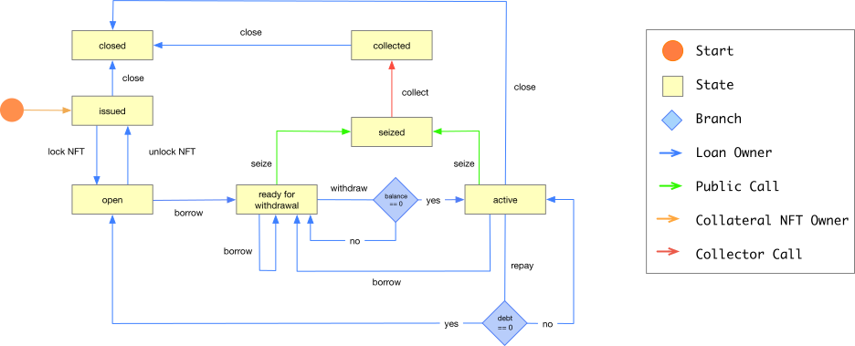

[Tinlake](https://centrifuge.io/technology/tinlake) is a set of smart contracts that enables borrowers to draw loans against non-fungible assets, such as invoices, royalty payments or warehouse receipts. Anything that can be represented on-chain as NFTs (Non-Fungible Tokens) can be financed using the Tinlake infrastructure. This is done by issuing an ERC20 token, the Collateral Value Token (CVT), against all of the collateral NFTs that are deposited into the Tinlake contracts.

## System Overview
Tinlake’s set of smart contracts pools NFTs that represent non-fungible assets and issues fungible, interest bearing tokens that represent a claim on a fraction of the proceeds of the entire pool. These fungible tokens can be locked in DeFi lending protocols or transferred to investors to draw funding. When liquidity is injected into Tinlake tokens are minted accordingly. The same mechanism applies in reverse when funding is paid out and tokens are burned.

Tinlake enables lenders to invest two different tranches: A senior tranche issuing a token called DROP, and a junior tranche issuing a token called TIN. The senior tranche has a lower/stable return and bears less risk, while the junior tranche has higher/more volatile returns and takes on more risk of defaulted loans, thus protecting the senior tranche.This structure is similar to common A/B or senior/junior structures in finance.

## Loan Lifecycle

## User roles
### Borrowers and Lenders
Tinlake interacts with borrowers and lenders. Generally, borrowers have individual loans with varying terms and varying durations drawn against their collateral. Lenders invest in the entire collateral portfolio at a defined rate. Borrowers can borrow by depositing an NFT collateral representing ownership of an asset, which they can get back upon repaying their debt.

### Administrator
Generally, an administrator determines what assets borrowers are allowed to bring in as collateral and how much they are allowed to borrow against the assets. This administrator could be a single centralized entity, a set of smart contracts automatically qualifying and pricing an asset or a decentralised autonomous organisation (DAO) that manages the Tinlake deployment.
