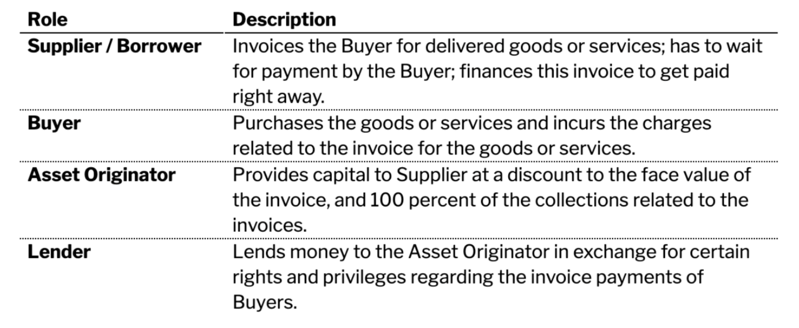
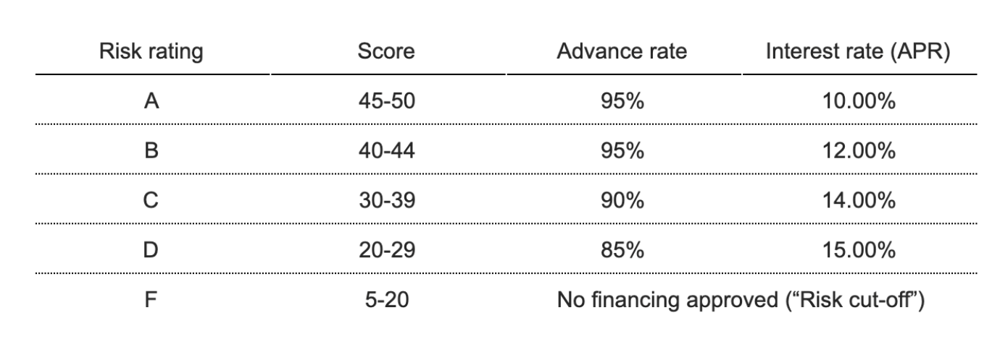

# How To Price Real-World Assets
*This post is co-written by Dennis Wellmann, Product Manager at Centrifuge and Howard Krieger, Founder of Residual Token Inc. Howard is an experienced valuation professional with nearly 20 years of experience and specializes in the valuation of fixed income securities and complex financial instruments. He is a Managing Director for a top 10 U.S. accounting firm, a former Big-4 Senior Manager responsible for a variety of structured finance valuation assignments, and a leading pricing expert in the crypto community.*

## Introduction
Centrifuge’s Tinlake is an asset-backed smart contract lending platform built to responsibly bridge real-world assets, such as invoices, mortgages or streaming royalties to the DeFi ecosystem. This post is the first in a multiple part series about how valuation and pricing of **real-world assets** work within the Tinlake ecosystem. Collectively, this series will form our knowledge base on real-world asset pricing and will be used to educate the DeFi community as we bridge non-native crypto assets into the decentralized finance ecosystem.
This post starts with the **fundamentals of pricing real-world assets.** It will focus on one particular asset — an invoice — and explain which factors are usually considered in pricing this asset and how these factors may be turned into an interest rate. Invoices are particularly interesting collateral for Tinlake and DeFi because they have historically low default rates and a short maturity of 30–90 days.

## Financing an Invoice
For our purposes, an invoice is a bill sent from one entity (supplier) to another (buyer) in connection with the delivery of goods or services. Key data points on an invoice usually are:
1. Invoice amount
2. Counterparty name and address
3. Issuance date
4. Due date
5. Line items (e.g. type and quantity of goods)
6. Payment terms and conditions

Suppliers around the world typically have to wait for 30–90 days to get paid for an invoice. Instead of waiting several months until the invoice is due, the supplier has an alternative: find a way to convert the invoice into capital quickly by financing it through a capital provider, e.g. an Asset Originator or a factor.

The parties involved in issuing and financing an invoice through Tinlake usually are the following:

Financing an invoice can be structured as a simple loan with one bullet repayment. The two decisive pricing parameters are **advance rate** and **interest rate.** The advance rate acts as a reserve or protection for the Lender against losses. The interest amount/finance fee is usually deducted up-front and the loan is then paid back in relation to the payment due date of the invoice.

Imagine e.g. an invoice with a face value of *USD 100* due in 90 days. A supplier may use this invoice as collateral to receive early payment in form of a short term loan. Assuming an 80% advance rate and a 7.0% interest rate (APR) a supplier could receive a loan (“early payment amount”) of USD *78.6* (deducting interest of USD 1.4 = *USD 80* * (7.5% * (90/360)) and pay back *USD 80* after 90 days when he receives the payment of the buyer. If the supplier wants to finance this invoice through Tinlake, he could turn to an Asset Originator who would tokenize it and use a Tinlake pool to draw funding in stablecoin from a Lender, e.g. from a decentralized lending protocol, against the invoice NFT as collateral.

## Factors for Pricing Invoices
There are several different factors to consider when setting advance rate and fee/interest rate for financing an invoice. These different factors are relevant for both the Asset Originator as well as the Lender. *For brevity, I will refer to both parties as just the Lender in the section below:*

### 1. Buyer Credit Risk
The value of an invoice is firstly based on the buyer’s ability and willingness to pay. In some cases, this can be represented by publicly available credit ratings. In others, credit bureau data, the payment history of the buyer or publicly available news may be used.

### 2. Supplier Credit Risk
The stability of the supplier is another important factor to be considered. Lenders are underwriting the supplier as much as the invoices themselves. The suppliers working capital management is of particular importance. Is the supplier’s net working capital positive or negative? How have its metrics trended in the past? What is the supplier’s collection history with this specific buyer? Also, what is its history of commercial disputes and/or failures to deliver?

### 3. Industry and Country
In addition to the supplier’s and buyer’s individual credit risk, the market impact on pricing by industry and country is another important factor. While some industries have a robust, constant supply chain, other industries may be subject to seasonality or prone to disruption. Each country carries with it some amount of systematic risk that trickles down to suppliers and its ability to pay. Further, the recovery of defaulted amounts or the ability to collect an overdue payment often depends on a country’s legal system.

### 4. History 
There is inherent bias baked into repeating relationships that can be either positive or negative. If a Lender has some track record with a supplier/borrower, then the impact of a continuing relationship will work its way into the pricing. For instance, if an efficiently run supplier has a long track record, with invoices based on contracts with stable counterparties, they will get favorable pricing on its invoice population.

### 5. Portfolio Volume
The most important factor when estimating the advance rate/fee for invoices is volume. To a Lender, a large number of invoices means the risk of non-payment is spread across a number of counterparties — more invoices are better than less. If one is pricing a pool of invoices, the statistics around the invoice pool can be considered. One can think of a distribution function where a great sample amount means a smoother distribution. Lower invoice counts mean that collecting on the discrete, single invoice has a more significant impact on the pool’s return.

## Estimating Advance Fee and Rate 
One of our users is ConsolFreight, which is a SaaS freight technology provider that advances working capital finance to freight forwarders’ operations (e.g. air, ocean, rail, road, multi-modal, etc.) and collects from shippers (e.g. supermarkets, hospitals, office supplies, etc.). The founding team combines 50+ years of experience running successful freight forwarding businesses in the U.S., Latin America, and Europe.

We will use ConsolFreight to take a closer look at how considering all these factors may translate into an advance rate and a fee/interest rate for financing an invoice.

A typical freight forwarder invoice is about USD $5,000 with payment due in 30 days. ConsolFreight has embedded itself into the payment systems of hundreds of retailers and freight forwarders. A freight forwarder can electronically request financing from ConsolFreight for an invoice that is already identified in the system. The invoice will serve as collateral and ConsolFreight will collect from the shipper.

To set interest and advance rates, ConsolFreight has two approaches. Often they hire a trade finance insurance company that evaluates and pre-approves every shipper before providing insurance coverage. In other cases, they may also underwrite based on their own risk scorecard. For this example, we will use a highly simplified version of one of ConsolFreight’s scorecards to match the pricing factors we have described above. We further assume that each of the five individual factors described above contributes equally with a score from 1 (the worst) to 10 (the best) to an overall risk score of up to 50.

Now let’s assume we have a shipment from a grocery supplier (“Merchandise Co”) to a supermarket (“Supermarket 24”) in Panama handled by freight forwarder “Tech Cargo”. Tech Cargo invoices Supermarket 24 and requests financing from ConsolFreight. Here is what the scores for an invoice from Tech Cargo may look like:

Adding up the individual scores for each of these factors leads to a risk score of 42 for Tech Cargo.

This risk score can be mapped on a risk scorecard with assigned advance and interest rates for risk scores. The typical advance rate is usually between 85% to 95%. As of the writing of this blog, annual rates (APR) around 10%-15% on a loan backed by a 30-day invoice are consistent with observable market rates. Having this in mind, a simple scorecard could look like this:

Tech Cargo would be assigned a risk rating of B and ConsolFreight would offer Tech Cargo financing with an advance rate of 95% and an interest rate/fee of 12.00% against the invoice as collateral. If the invoice is $5,000, then ConsolFreight would advance $4,704 (95% advance less 12% interest) and collect $4,750 in 30 days from Tech Cargo.

## Outlook
Let’s take a step further and assume this invoice would be financed through Tinlake. ConsolFreight would be connected to a Tinlake pool. The financed invoice would be tokenized into an NFT, and this NFT could be used as collateral to draw a loan from a DeFi lending protocol.

The crucial question for DeFi is, ***How can these pricing parameters be brought on-chain for real-world assets to be priced and used as collateral?*** This question and others related to pricing will be addressed in subsequent blog posts describing how Tinlake pricing oracles will work and enable decentralized, public pricing of real-world assets as collateral in DeFi.