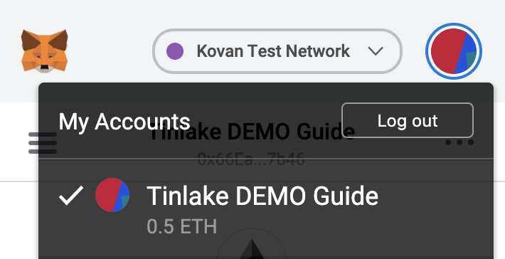
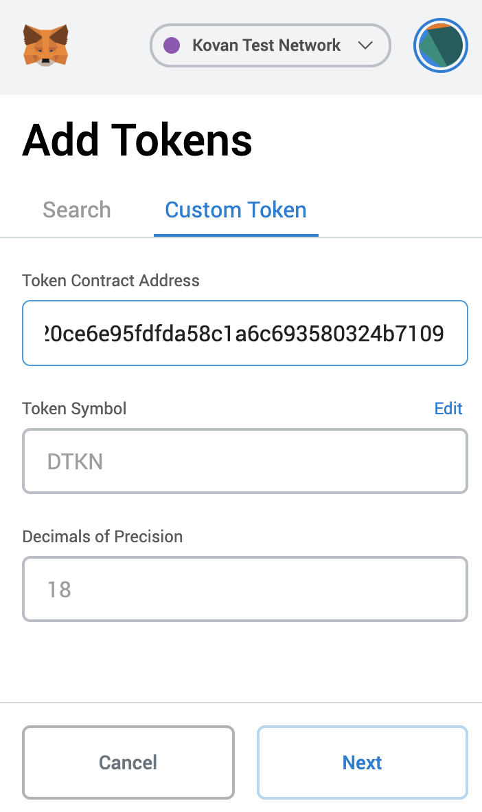
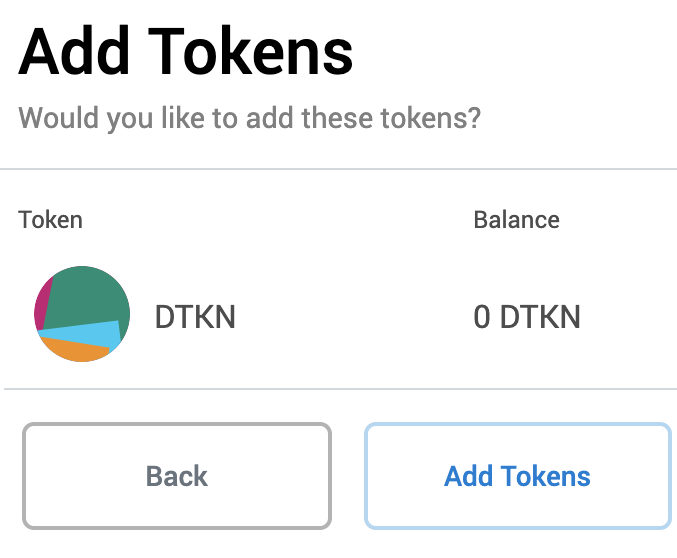
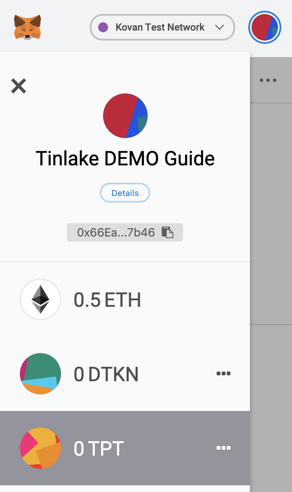

# Getting started 

## Prerequisites
- Chrome Browser (preferrably, the Tinlake Demo UI is not optimized for other Browsers yet)
- [Metamask](https://metamask.io/) 
- Account funded with Kovan faucet (~Test Ether) connected to Metamask (please see information on how to fund your account e.g. [here](https://github.com/kovan-testnet/faucet/blob/master/README.md))
- This link to Tinlake DEMO: https://kovan.demo.tinlake.centrifuge.io
- Please note, that Tinlake DEMO has not been optimized for the use on mobile devices yet

## Set-up Metamask
### Connect to Metamask
To use all features of Tinlake DEMO you need to be logged-in to your Metamask extension. Metamask holds the private keys that are required to confirm your transactions when using Tinlake DEMO. Choose a testnet account you want to use for Tinlake DEMO in Metamask and connect it to Tinlake via the `Connect` button. 

Note, that the further steps described in this section are a one-time set-up for every account you want to use with Tinlake DEMO.

### Fund your account with Kovan Faucet
To use Tinlake DEMO your account should be funded with sufficient Kovan faucet (~Testnet ETH) to pay for the transactions. Please see information on how to fund your account e.g. [here](https://github.com/kovan-testnet/faucet/blob/master/README.md).

### Adding Tinlake DEMO Tokens to your Metamask account
Tinlake uses specific tokens that need to be added to your Metamask extension in order to display the corresponding balances in your Metamask account. These tokens are a dummy currency created for Tinlake DEMO similar to a stablecoin (`DTKN`) and the Tinlake DEMO NFT `TPT`.

To add these tokens to the Metamask account you want to use with Tinlake DEMO, first change to your desired account

#### Adding Dummy Currency `DTKN`
Then click on `Menu` (the three horizontal bars in the left corner), scroll down and click on `Add Token`. Change to the `Custom token` tab and paste the following Token Address `0x2cab5720ce6e95fdfda58c1a6c693580324b7109` into the `Token Contract Address` field: 

`Token Symbol` and `Decimals of Precision` will be filled in automatically. Click on `Next` and then confirm by clicking on `Add Tokens`.

#### Adding the Tinlake DEMO NFT `TPT`
Repeat the same steps as described above for the Tinlake DEMO NFT `TPT`. The NFT token address is `0xac0c1ef395290288028a0a9fdfc8fdebebe54a24`.

You should now see both Tokens in your Metamask account:

