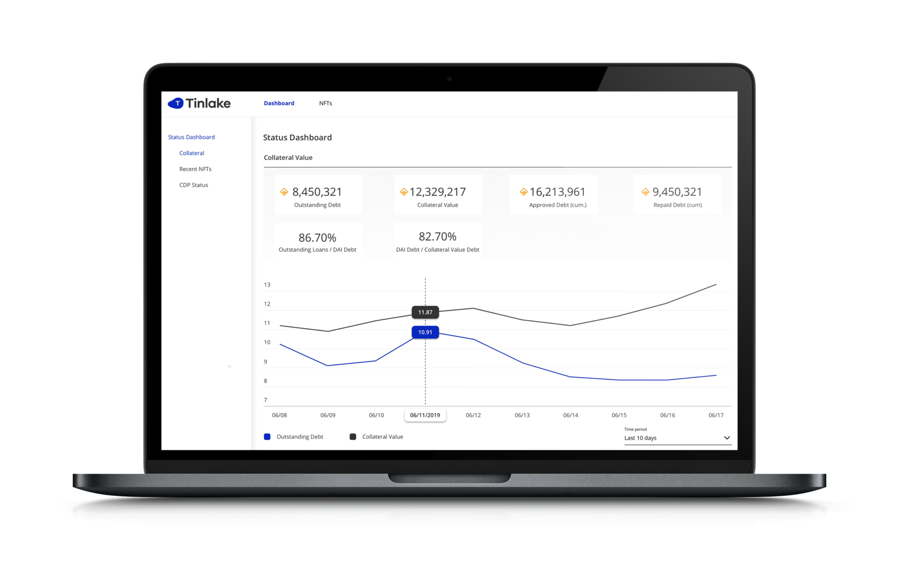

Tinlake UI provides a simple interface for Admins & Borrowers to interact with Tinlake Contracts. The UI supports the following set of features:

**Admins’ perspective**
- Set maximum borrow amounts for loans
- Set thresholds for loans
- Create interest rate groups
- Set interest rates for loans
- Whitelist investors to supply funds into tranches
- Whitelist investors to redeem funds from tranches 

**Borrowers’ perspective**
- Borrow loans
- Repay loans

**Lenders’ perspective**
- Supply funds into tranches
- Redeem funds from tranches 

For contract communication the UI integrates tinlake.js  - the Tinlake JavaScript client implementation.
