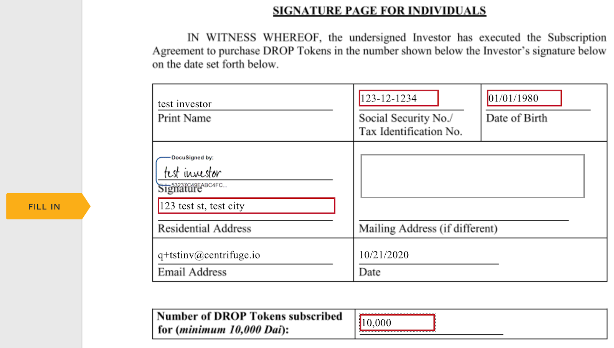
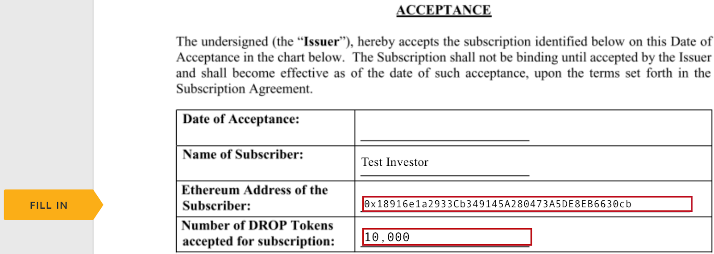

## This Document

This document describes the process to subscribe for an opportunity on Securitize after you have clicked on the button:

of an opportunity.

## Step 1: Review Documents and Investment Amount

### List of Documents

You should see the following document available to download under

#### Executive Summary

Download and read the executive summary. It gives you an overview of the asset originator, the underlying assets, and the opportunity details including specific risk factors. Please reach out to the issuer if you have any questions.

#### DROP Subscription Agreement

Download and read the DROP subscription agreement. It needs to be signed in a later step to subscribe to the opportunity and being able to purchase DROP tokens. The agreement outlines your rights and obligations as an investor, it includes the Executive Summary and all general risk factors. Please reach out to the issuer if you have any questions.

U.S. Person Taxpayer Identification Number and Certification
This is the W-9 tax form each investor that is a U.S. person (e.g., a U.S. citizen or resident, a partnership organized under U.S. law, a corporation organized under U.S. law, a limited liability company organized under U.S. law, or an estate or trust (other than a foreign estate or trust whose income from sources without the U.S. is not includible in the beneficiaries’ gross income)), must provide the issuer with its taxpayer identification number on a signed IRS form W-9. This form is necessary for the issuer to comply with its tax filing obligations and to establish that the investor is not subject to certain withholding tax obligations applicable to non-U.S. persons. The enclosed form contains detailed instructions for furnishing this information.

**The completed form W-9 should be returned to the issuer; do not send it to the IRS.**

You can either upload the filled and signed W-9 tax form in the signature process later on or you fill out the W-9 tax form which is embedded in the subscription agreement during the signature process later on.

The W-9 tax form is also available from https://www.irs.gov/pub/irs-pdf/fw9.pdf.

#### Non-U.S. Person Individual Taxpayer Identification Number and Certification

This is the W-8BEN tax form each Investor that is (i) an individual and (ii) not a U.S. person or disregarded entity for U.S. tax purposes (e.g., a U.S. citizen or resident, a partnership organized under U.S. law, or a limited liability company organized under U.S. law), must provide the Issuer with its taxpayer identification number on a signed IRS form W-8BEN. This form is necessary for the issuer to comply with its tax filing obligations and to establish that the investor is not subject to certain withholding tax obligations applicable to non-U.S. persons. The enclosed form contains detailed instructions for furnishing this information.
The completed form W-8BEN should be returned to the Issuer; do not send it to the IRS.

You can either upload the filled and signed W-8BEN tax form in the signature process later on or you fill out the W-8BEN tax form which is embedded in the subscription agreement during the signature process later on.

The W-8BEN tax form is also available from https://www.irs.gov/pub/irs-pdf/fw8ben.pdf.

#### Non-U.S. Person Non-Individual Taxpayer Identification Number and Certification

This is the W-8BEN-E tax form each Investor that is (i) not an individual and (ii) not a U.S. person (e.g., a corporation organized under U.S. law or an estate or trust (other than a foreign estate or trust whose income from sources without the U.S. is not includible in the beneficiaries’ gross income)), must provide the Issuer with its taxpayer identification number on a signed IRS form W8-BEN-E, as applicable. This form is necessary for the Issuer to comply with its tax filing obligations and to establish that the Investor is not subject to certain withholding tax obligations applicable to non-U.S. persons. The enclosed form contains detailed instructions for furnishing this information.
The completed form W- 8BEN-E should be returned to the Issuer; do not send it to the IRS.
You can either upload the filled and signed W-8BEN-E tax form in the signature process later on or you fill out the W-8BEN-E tax form which is embedded in the subscription agreement during the signature process later on.
The W-8BEN-E tax form is also available from https://www.irs.gov/pub/irs-pdf/fw8bene.pdf

### Set your Investment Amount

Set the amount you would like to invest, at least enter the minimum amount:

Continue by clicking on “Invest”.

## Step 2: Investor Qualification

Confirm that you are a qualified investor.

## Step 3: Sign Subscription Agreement

Here you start the signature process by clicking on:

Please check your investment amount before.

### Select Investor Type

If you are subscribing for a:

- Joint Account or a
- Individual Retirement Account (IRA),

which requires a second signature, please continue here [Signing with a Second Signer](#signing-with-a-second-signer).

If you are an:

- Individual Investor or a
- Trust and Entity,

which is requiring only your signature, please continue with the next section [Signing as Single Signer](#signing-as-single-signer).

### Signing as Single Signer

#### Tax Form Handling

You need to provide an FW-9 (see U.S. Person Taxpayer Identification Number and Certification) or FW-8BEN (see Non-U.S. Person Individual Taxpayer Identification Number and Certification) / F8-BEN-E (see Non-U.S. Person Non-Individual Taxpayer Identification Number and Certification) tax form depending on your taxpayer status. You can either attach an already completed tax form complete the tax form embedded in this document.

#### Sign the Agreement

Please confirm here again your initial investment in Dai stable coins. You will be able to invest more or invest several times even if you are entering the minimum investment amount here.

Please provide on the acceptance page the Ethereum address you will use to invest. The investment will not happen in Securitize but on Tinlake. Therefore the issuer will whitelist your Ethereum address when they have accepted and countersigned your subscription agreement. Tinlake currently supports Ethereum addresses operated through Metamask and Portis.

#### Fill out the Tax Form

Completed the tax form embedded in this document if you have chosen this option before.

#### Finish the Signing

#### Waiting for Issuer’s Acceptance

You need to wait and hold on until the issuer has reviewed your subscription agreement, whitelisted your Ethereum address for the Tinlake pool you have subscribed to, and accepts and countersigns your agreement.

You will receive an email from DocuSign with a subject starting with “Completed: Please DocuSign:” when the issuer has finally accepted your subscription.

The completed documents are attached to this email or you click on the link above to view and download the signed documents directly from DocuSign.
You can continue now by investing in the Tinlake pool: [Step 4: Investing](#step-4-investing).

### Signing with a Second Signer

_This chapter is still work in progress and coming soon._

## Step 4: Investing

Investing **DOES NOT HAPPEN** on Securitize. Securitize is only used for the above steps to onboard you as an investor and to subscribe for the opportunity to invest. That is why Securitize should show you the following payment details:

After you have signed the subscription agreement and the issuer has accepted your subscription.

Click on the provided link to [Tinlake](https://tinlake.centrifuge.io). There you connect your Ethereum wallet with the Ethereum address you have entered in the subscription agreement. Please follow the [Tinlake Investor Guide](/tinlake/investment-guide/investor-guide/) for the next steps.

_**Please ignore all portfolio information on Securitize. Your single source of truth is your holding of TIN or DROP tokens of the respective Tinlake pool and the information, which the immutable and censorship-resistant decentralized asset financing protocol Tinlake is providing on Ethereum. Securitize is not supporting decentralized token issuance on Ethereum.**_
