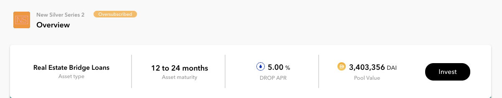
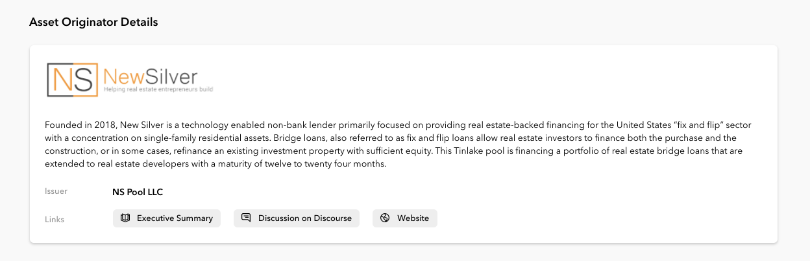
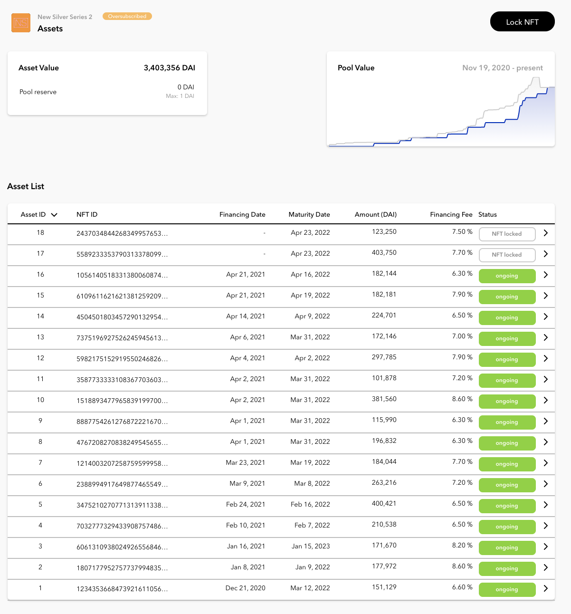
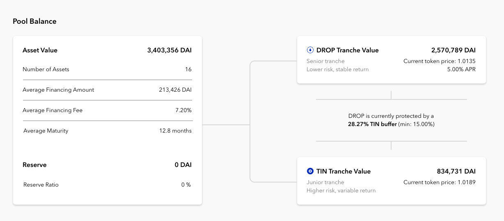

## Introduction

This section walks you through the process as an investor before the first investment: from the home page, to the pool page, and to the resources that will help you decide whether or not you are ready to invest in a pool. After this section, you should be able to do your own research (“DYOR”) and confidently invest in one of the upcoming Tinlake pools.

## The TL;DR Checklist

It’s a lot of information at first, so we put together this step by step list you can use to help you make a decision about which pool you feel best investing in:

- Choosing a pool: Select the pool based on pool value, asset type, and DROP APR that you are most comfortable with.
- Asset Originator: check the Discourse community intro and pool summary, and any other information you find on the web about the company/asset. Check the list of assets financed on Tinlake to see their reputation on Tinlake.
- Asset Type: Do I understand what assets I will finance and the risk of this asset type?
- Risk: Am I comfortable with the TIN buffer protecting my DROP?
- Yield: How does the Cash drag look in relation to the average asset size?

## For starters: Choosing pools

We gotta start in the most obvious place: tinlake.centrifuge.io. The top banner shows you the total value for all pools but for our purposes, we are only looking at the list of pools which currently (mid January 2021) are:

Each one of these is a pool run by an Asset Originator. This dashboard currently shows you a list of seven pools. You might notice that some of them have that little yellow label ”oversubscribed;” in the screenshot above these are amongst others Harbor Trade Credit, ConsolFreight and Paperchain. That yellow label means that they are currently not open for additional investments. When these asset originators drop more assets to be financed the pool will open back up and the label will disappear.

Under the Asset Originator, you’ll find the asset type. For New Silver, it’s real estate bridge loans. That means you, as the investor, will be financing New Silver’s active real estate bridge loans. As an investor you finance the entire portfolio, so you finance all loans in the pool, not one single asset. You can actually see the bridge loans converted to NFTs on the Assets page (will go more into that later).

The Pool Value tells you the current volume of financed assets and how big the pool currently is.

The DROP APR is the fixed nominal interest rate DROP investors receive. This rate is applied to the outstanding financing amount of the pool and tells you how much profit you should expect for your invested DAI. The interest in Tinlake (as most DeFi protocols) is accrued every second, so you earn yield every moment you are invested. That means if you invest 10k DAI into a fully deployed Tinlake pool with a 10% DROP APR you will have 11.05k at the end of the year (equal to a 10.52% APY). The effective DROP yield may be slightly lower than the DROP APR due to the pool’s “cash drag” (see below). Also, when you invest, you also receive CFG Rewards on top 🤑.

## Check out Asset Originator and Asset Type

Based on the asset type, let’s say you are most interested in real estate bridge loans. You understand the asset and feel more comfortable with a 5% DROP APR, given your trust in real estate. The Pool Overview tab will be your first resource that helps you check out the Asset Originator. Let’s start below, where you’ll find a short introduction to the Asset Originator and the asset type.
In the header you'll find the most important metrics for this pool: Asset type, Asset maturity, DROP APR and Pool Value.

The asset maturity tells you how liquid your investment may be. The maturity date of every financing lets you know when the asset originator is obliged to pay back the loan. Upon repayment investors will always be able to redeem before an Asset Originator can use the funds for new financings again. Thus you can see the average maturity as a “soft lockup” period. The reason it is “soft” is because you technically still can withdraw funds from the pool reserve, if the pool reserve has money to draw or other investors want to invest into the pool.

Under Asset Originator Details you find information about the Asset Originator and links to more resources.

## Discourse: Learn More about the Asset Originator

If you want to dig deeper into the Asset Originator you’ll find more information about the company spinning a pool in the Centrifuge Discourse. There is a link at the end of the description, clicking that link will send you to the New Silver’s community intro.

This is a human-friendly page that answers more about the company, organization, asset details, and disclosures. A list of all the community intros can be found here.
At the beginning of the community intro, you’ll find the pool summary (above it’s NS Series 2). This is a detailed description of the actual pool. On both the community intro and pool summary, you are free to ask questions/express concerns directly to the asset originator. Here’s a list of all previous and current pool summaries.
Asset Maturity Date

## Gauging Reputation

If you want to take a look at the past and current financings of the pool, change to the “Asset” tab, which will give you a list of the asset originator’s history with Tinlake as well as the graph of the development of asset value and reserve. For all assets in the list, a status of "NFT locked" (so the NFT is locked as collateral but not financed yet) “Ongoing” or “Completed” (fully repaid) will be listed.

Note: it’s good to also be aware that we have just recently launched Tinlake. Many of these pools are still building up their asset history. ConsolFreight, whose invoice sizes are much smaller, is a good example showing a solid reputation history.

## Maximum Pool Reserve

You may also notice the “Max: 1” under the Pool Reserve. The maximum Reserve can be set by the Asset Originator and signal its financing needs. Subtracting the Max pool reserve by the current pool reserve will let you know how much you can invest in a pool. If the current Reserve is higher than the maximum Reserve set by the Asset Originator the pool is “oversubscribed.” So for New Silver, the pool is currently "oversubscribed", thus no further funding through investments is required.

## Sizing up the Pool by the Numbers: Risk and Yield

Once you are happy with the Asset Originator, let’s look at the state of the pool at the bottom of the Overview page. Lots of numbers happening here. But if it’s your first time, here are the most important things you need to know to better understand how the pool is doing:

## Pool Value, Asset Value, and “Cash drag”

The left side gives you a summary of the pool’s asset portfolio. It shows you how many financings currently are active as well as the current maturity and value of these assets. The card also tells you how much liquidity is in the pool’s “Reserve”. The Pool Reserve and Asset Value add up to the Pool Value. The pool reserve is idle money: that means its money not being used to finance an asset. It’s normally more healthy to see this number relatively low compared to the Average Loan Size because investors don’t earn yield on the reserve — only on outstanding investments. Thus, a persistently high pool reserve may drag down your effective yield (“cash drag”). Temporarily, a Reserve may be relatively high. So for example, New Silver’s assets are quite big. Each real estate loan is around 190k. That means they will need at least 190k in the pool Reserve to finance the next asset.

## TIN and DROP and the Minimum TIN Risk buffer

The two cards to the right show you the current value of each of the two tranches (note, that both values add up to the “Pool Value” of the asset side). The value of these two tranches define the “Current TIN risk buffer”, calculated as TIN value / Pool Value, which you find between the tranche cards. This metric lets DROP investors know how protected they are through TIN. In this pool, the minimum is 15%, meaning DROP holders are protected even if 15% of the loans default. TIN holders (the higher risk) will take that loss instead. The ratio shows currently that it’s at 28%, meaning that percentage has risen. This number can fluctuate but the pool will never allow it to go below 15%. Note: If you need a refresher on how our TIN + DROP system works, head [here](link to two tranches section).

