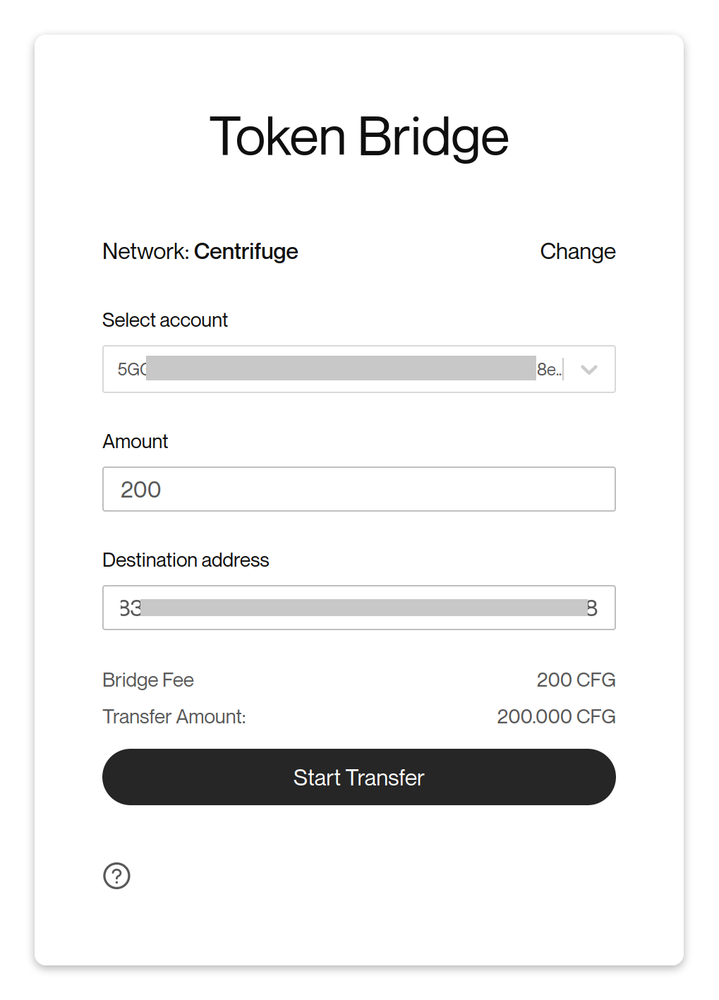
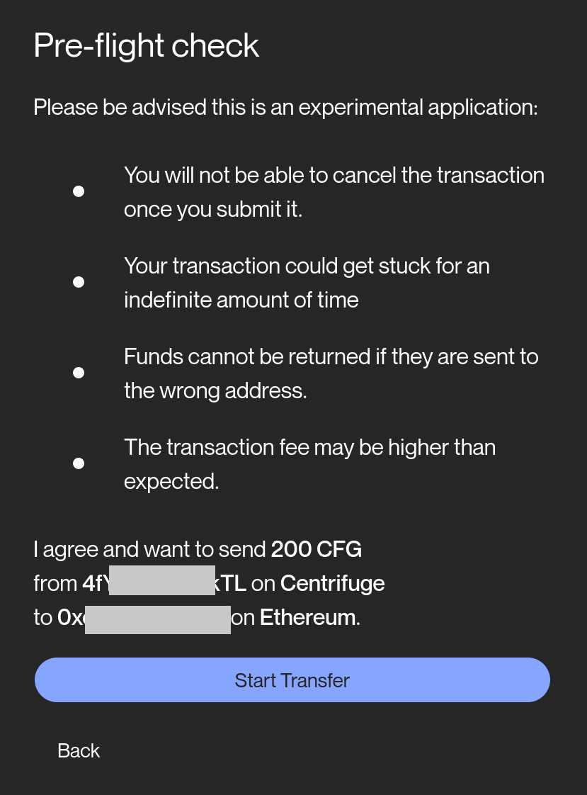
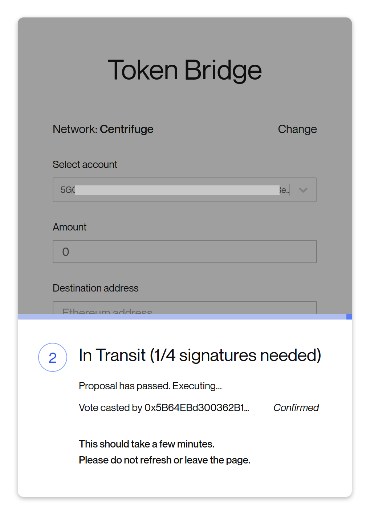

The **CFG** token lives natively on Centrifuge Chain but can be bridged to Ethereum and used as an ERC20 token. The ERC20 Token is called **wCFG** on Ethereum and has the address `0xc221b7E65FfC80DE234bbB6667aBDd46593D34F0` on Ethereum mainnet.

## About the bridge
The bridge used by Centrifuge is a trusted relayer bridge. This means a set of relayers are trusted with relaying messages between Ethereum and Centrifuge chain. When assets are moved between the change these relayers pick up the message on Centrifuge chain and trigger a transaction in Ethereum or vice versa. The bridge is built by [ChainSafe](https://chainsafe.io) in collaboration with Celo, Aragon and ETH Classic. [Read ChainSafe's announcement](https://medium.com/chainsafe-systems/chainsafe-building-chainbridge-49d51ff2e0a2) to learn more about the bridge.

Want to run your own bridge? Head over to: [Running the bridge](/build/bridge/)
### Bridge Fees
The CFG-wCFG is bridge relies on a set of relayers to submit transactions to Ethereum and Cent Chain about the events happening on the other chain. Because these transactions can be very costly at high gas prices the bridge must charge high enough fees that it will be able to pay for its fees even during times of very high gas prices. For this reason the fee to go from Centrifuge Chain to Ethereum is relatively high. In addition because Centrifuge Chain does not have any insight into gas prices on Ethereum there is no way to charge the actual gas spent. The bridge fees are constant and can be changed at any time by the council and are shown to you before you bridge any tokens. There are ways to improve the performance of this in future iterations (batching of transactions, signature aggreation etc.).

### How are CFG & wCFG different?
Each wCFG is backed by one CFG locked up in the bridge account on Centrifuge Chain when moved over to Ethereum and you can move between Ethereum and Centrifuge at any time without any restrictions.

Using **CFG** on Centrifuge Chain allows you to:
* Stake and earn staking rewards
* Participate in governance
* Pay for fees on Centrifuge Chain

Using **wCFG** on Ethereum allows you:
* To interact with DeFi apps that support ERC20 tokens
* Use it within Ethereum and hold it in your Ethereum wallet.

## Using the bridge
A hosted bridge UI is available at https://bridge.centrifuge.io Navigate over there and you will be presented with two options: **Get CFG** to move ERC20 wCFG to Centrifuge Chain and **Get wCFG** to move native CFG to Ethereum. Select which one you would like to do and the UI will ask you to connect your wallet (either via Metamask for Ethereum or the Polkadot.js Browser Extension).

Enter the amount and destination address:

Click on **Start Transfer** and then confirm the transfer:

The bridge relayers now submit your transfer request on chain and after enough confirmations have passed you will receive the tokens on your target chain.

