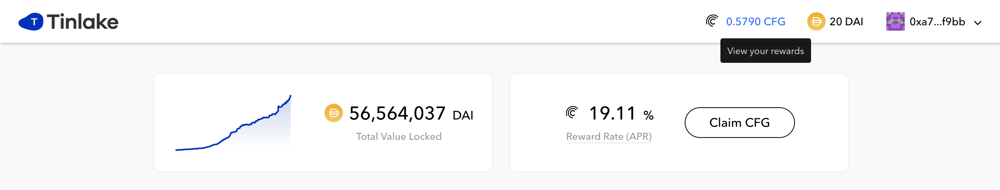
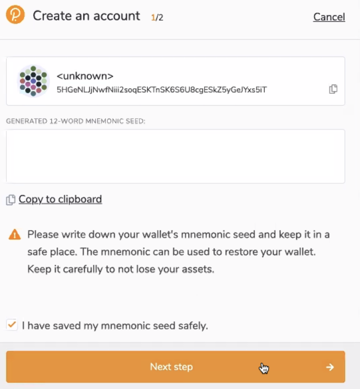
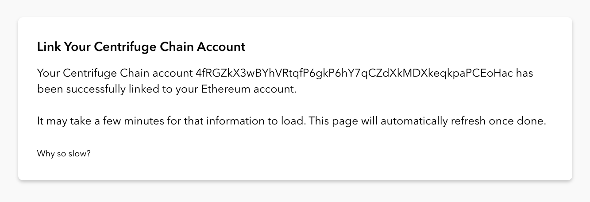
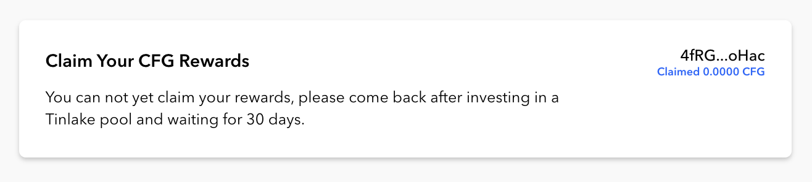
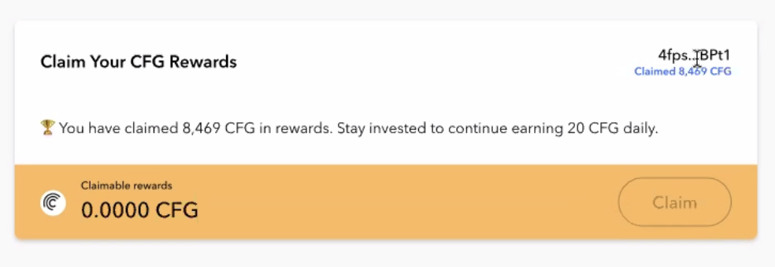

## Introduction
This step-by-step guide to claiming Centrifuge tokens (CFG) as a reward for investments into Centrifuge pools leads investors through creating the required setup and then claiming the first and subsequent rewardd. Note that currently rewards can only be claimed for Ethereum based pools through the [Rewards page](https://tinlake.centrifuge.io/rewards).

CFG rewards are earned on Ethereum based on Tinlake investments and are claimed on the Centrifuge Chain which is based on Polkadot. To claim rewards, the Tinlake investment account needs to be linked to a Centrifuge Chain account holding CFG.

CFG rewards are earned from the first day of investment and cannot be claimed before a minimum holding period of **30 days**. The investor's rewards are found on the [Rewards page](https://tinlake.centrifuge.io/rewards). Note that rewards may follow a declining curve since the reward rate is subject to governance. Previous governance proposals can be found in the [Forum](https://gov.centrifuge.io/c/governance/35).

### About CFG
CFG powers the Centrifuge protocol by staking towards Validators to help secure Centrifuge Chain, paying for transactions participating in on-chain governance for future chain upgrades.

## Claim CFG rewards step by step
Claiming CFG rewards involves the following main steps:
1. Install Polkadot browser extension
2. Create Centrifuge Chain account
3. Link Centrifuge Chain account to Ethereum address
4. Claim CFG rewards to Centrifuge Chain account

### Start
Connect the Ethereum wallet of your Tinlake investments. To go to the Rewards page, click the CFG item in the header, or the button `Claim CFG` in the card on the Tinlake dashboard.

### 1. Install Polkadot Browser Extension
CFG rewards are collected through the [Polkadot.js extension](https://polkadot.js.org/extension/). This extension manages Polkadot accounts (and in this case, the Centrifuge Chain) and allows the signing of transactions.

***Note**: The extension does not perform wallet functions, such as sending funds. Use the [Centrifuge Chain portal](https://polkadot.js.org/apps/?rpc=wss%3A%2F%2Ffullnode.centrifuge.io#/accounts) to send funds.*

Tinlake checks whether the Polkadot browser extension is installed. Click `Install Browser Extension` to download the extension.

Install the extension on Chrome or Firefox.

Return to the Reward page and click `Reload Page` to proceed.

#### Authorize extension
The Polkadot extension asks for permission to be used. Confirm the pop-up to allow Tinlake to access the addresses of your accounts.

If the extension has not yet been authorized, the Reward page presents an error message. Click `Connect Centrifuge Chain Wallet` to open the extension, and confirm. 

### 2. Create Centrifuge Chain account
*If you have an account, it is automatically preselected on the page.*

To create your first Centrifuge Chain account, click on the large plus icon in the extension. If you add a new account, click on the plus icon in the extension and select the `Create new account` action in the menu.

In the first step of the *Create an account* wizard, the address and a mnemonic seed phrase are presented. Click `Next step` to proceed.

In the second step, configure the account's network by choosing the option `Allow use on any chain` and enter a descriptive account name that helps you identify later. Set the account password and click `Add the account with the generated seed` to save the account.

***Important**: Make sure to safely store your seed phrase. For more information on security, refer to Bobby Ong's best practices on this [Twitter thread](https://twitter.com/bobbyong/status/1403881080902471680?s=21).*

### 3. Link Centrifuge Chain Account
Once the Polkadot extension has been installed and an account exists, the Centrifuge Chain account can be linked to your Ethereum address. If there is exactly one account, it is automatically selected, otherwise select the preferred account in the dropdown.

***Note**: Make sure to select the right account — after clicking **Link account**, the account can no longer be changed.*

Click `Link account` to link the account, then confirm the transaction in your Ethereum wallet.

Loading the claimable rewards takes a few minutes. Reload the page if it does not automatically update.

Once the account has been successfully linked, a confirmation message displaying the selected address is presented.

#### Selected account does not match the extension's account
If the address of the selected account in Tinlake is not identical to the one in the extension, the extension uses a different display format. View the tooltip `Unexpected/wrong addresses?` to learn more. 

To display the address in the same format, open the settings menu of the extension to set the address format to `Centrifuge Chain`.

Both account addresses are shown in the Centrifuge Chain format.

***Note**: Find more information about Polkadot address formats in this [forum post](https://gov.centrifuge.io/t/accounts-and-wallet-addresses-in-polkadot-js/3341).*

### 4. Claim CFG
Success! Now that the CentChain account has been linked, you can claim rewards. Before claiming the first time, investments require a minimum holding period of 30 days.

Once the initial holding period has passed, click `Claim` to collect your earned CFG rewards. 

After claiming rewards, the amount is reset, and the button is disabled. 

***Note**: You can view your CFG balance and transactions on the [Subscan blockchain explorer](https://centrifuge.subscan.io/) by searching the account address.*

CFG rewards are earned daily and can be claimed anytime. Until claimed, rewards are accrued over time. 

Happy claiming!

