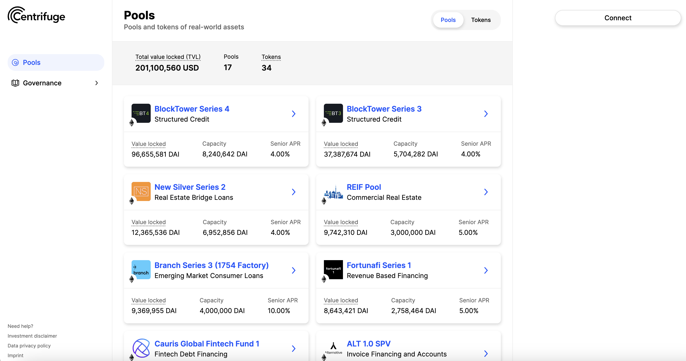

## Investment requirements

### Legal requirements

- Onboarding incl. KYC through [Securitize.io](https://centrifuge.invest.securitize.io/#/login) has been succesfully completed
- Legal documentation (`Subscription Agreement`) for the pool you want to invest in has been signed in Securitize.io

### Technical requirements

- A web browser with a web3 wallet. Tinlake supports Ledger, [Metamask](https://metamask.io) and [Portis](https://www.portis.io/) at the moment. If you have not installed a web3 wallet yet, we recommend to use Metamask. This guide will also focus on using Tinlake with Metamask as a [Browser plugin](https://metamask.io/download.html). Please apply approporiate security measures when setting up your web3 wallet(see also below).
- _**If you use a Ledger, please make sure to activate `Contract data` in the settings of the Ethereum app and to update to the latest firmware.**_
- You need use the Ethereum address you have specified in the Subscription Agreement through your web3 wallet
- The "Ethereum Address of the Subscriber" needs to hold the DAI you want to invest

### Display DAI and TIN/DROP in Metamsk

By default, Metamask only displays your ETH balance under `Assets`. Other tokens need to be added to be displayed. To display the DAI and DROP balances in Metamask, you need to add both tokens to Metamask.
For DROP and TIN this can be done through Tinlake UI. Just click on `Add DROP/TIN to your wallet` in the respective investment component (see below) and confirm in Metamask.
If you haven't added DAI yet, in Metamask:

- Click on `Assets` tab
- Scroll down, click on `Add token`
- Look for `DAI` in the search field
- Mark `Dai Stablecoin (DAI)`
- Scroll down and click on `Next`
- Add `DAI` with a click on the `Add tokens` button

## Fund your Ethereum address

Please make sure that your Ethereum address is funded with the investment amount in DAI and sufficient ETH to pay for the transactions. There are [several centralized and decentralized exchanges](https://cointelegraph.com/ethereum-for-beginners/how-to-buy-ethereum), such as [Coinbase](https://www.coinbase.com/) or [Uniswap](https://uniswap.org/) where you can buy and/or trade ETH and DAI against USD and other tokens.

## The investment interface

The investment will be made through the Tinlake UI available at [tinlake.centrifuge.io](https://tinlake.centrifuge.io/). Select the pool you want to invest in and connect your web3 wallet.
At the top of the page you find the most important pool information, such as the current Pool and Tranche values ([more on Tranches](../../overview/tranches/) and other on Tinlake terminology.)

Below you find the current epoch state to your left and the TIN/DROP invest and redeem components to your right:

Under `Current epoch` you can see how much time and investment capacity is left in the current epoch. You can lock your investment/redemption at any time during an epoch. After the minimum epoch duration has passed, the epoch can be closed and all locked orders will be executed following a best effort approach. The table under `Total locked orders` shows you how many TIN/DROP investment and redemption order are locked for the current epoch.

## Investment flow summary

Tinlake's investments and redemptions are executed in (usually daily) epochs. During an epoch you can lock your investment or redemption order. You can cancel your locked order at any time throughout an epoch. At the end of an epoch all locked orders automatically execute at best effort considering investment/redemption supply and demand and the pool's risk metrics. You can collect your TIN/DROP tokens (in the case of an investment) or DAI (in the case of a redemption) at any time following the start of the next epoch. If your order is only partially executed you can collect that portion of your order. The unfulfilled part of the order remains locked for investment/redemption pending execution. As with your initial order, this lock can be cancelled at any time.

## Step-by-step investment guide

### Connect to Tinlake pool

- Go to the [Tinlake URL](https://tinlake.centrifuge.io/) in your browser
- Click on the pool you want to invest in in the list of pools or visit it directly with the provided pool URL. You will see the pool details.
- Select the Ethereum address used for investing in Metamask. Make sure you also select the `Main Ethereum Network` as network.
- Click on the `Connect` button in the top right corner to connect your Ethereum address for the use with Tinlake. Confirm that you want to connect with your Metamask wallet.
- You should now see your address at the top right
  
- Click on the `Investments` tab.

### Lock your investment

You find the TIN/DROP investment and redemption components on the investment page of the pool.

When you are connected with your whitelisted address after succesfully going through KYC and signing the Subsription Agreement on Securitize, your component will give you the Option to Invest and Redeem

Before you start investing, you may want to `Add TIN/DROP token to your wallet` by simply clicking on the link at the bottom of the component.

To lock your TIN/DROP investment:

- Click on the `Invest` button
- Input the amount in DAI you want to invest (Note, that the Tinlake Minimum Investment amount is 10,000 DAI)
- Click on `Lock DAI`

- This will open Metamask to confirm the transaction
  - If you are using Metamask without a hardware wallet there will one transaction to confirm
  - If you are using a hardware wallet there will be two transactions to confirm at your first transaction (First `Token Approval` then the `Invest Order`). For all your folling investments there will only be one confirmation in Metamask
- Your sucessfully locked order will be displayed in the component

- Your investment amount in DAI will be transferred from your wallet and locked in the Tinlake contracts

**Note that locked DAI are not invested in Tinlake yet and thus do not accrue interest. Your order will be automatically executed at best effort at the close of the epoch.**

### Cancel your locked investment

You can cancel your locked invest order at any time during the epoch. To cancel a locked order:

- Click on the `Cancel Order` button
- Confirm that you want to cancel

- This will open Metamask where you need to confirm the cancel transaction

### Epoch close and order execution

When the epoch is closed all locked orders will be executed by the smart contracts at best effort considering the pools risk metrics. E.g. if the current TIN risk buffer is already close to the Minimum TIN risk buffer no further DROP investments may be accepted until further TIN investments are provided. If the amount of locked orders exceed the epoch's `Maximum Investment Capacity` set by the Asset Originator, locked orders can only be partially executed pro rata.

### Collect your executed investment

After all orders are executed your fullfilled TIN/DROP order will be ready for collection:

To collect your TIN/DROP token simply

- Click on the `Collect button`
  The TIN/DROP token will be transferred to your wallet.

The TIN/DROP token will continue to collect yield reflected in the token price. You can redeem these TIN/DROP at any time (see below).
Note that the token immediatelly start to accrue interest also if you do not collect them immediately. However, you will need to collect these tokens before you can redeem them or make another investment.
