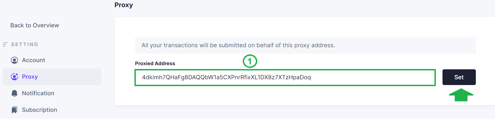
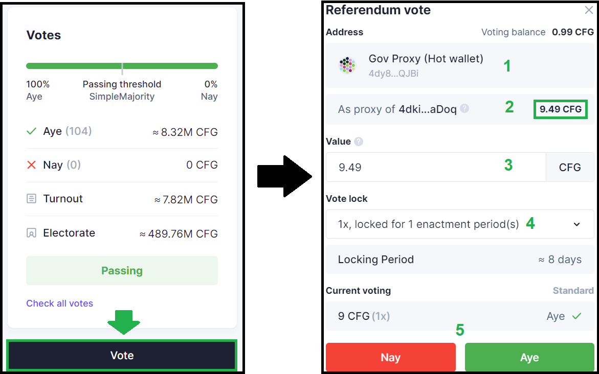

## On-chain Voting

On-chain voting takes place on the blockchain and you need CFG tokens to vote in referenda. All proposals are posted in [this section](https://gov.centrifuge.io/c/cfg-governance/chain-governance/18) of the Forum and in the post you will find all information you need about the proposal (what it is about, where to vote etc).

## How to vote in a referendum

The easiest way to vote is to navigate to [Subsquare](https://centrifuge.subsquare.io/democracy/referenda) and find the referendum you want to vote in.

1. Vote **Nay** or **Aye**
2. Select **voting balance** (up to the amount available)
3. Select **conviction** (lock up period displayed right below)
4. **Confirm** and sign the transaction

### Voting with conviction

Voting with conviction is a unique and powerful feature in the Polkadot ecosystem. It allows everyone to increase their voting power. What it basically means, is that you can vote with up to 6X the amount of your tokens, by locking them up for a longer period of time.

If you don’t choose any conviction, the system will select the 0.1X by default. This means that you only vote with 10% of your tokens, but the tokens you use to vote with will be unlocked as soon as the referendum vote ends.

### Unlocking tokens locked in governance

To unlock your tokens after voting, you have to do it manually after the lock has expired.

You can see how many tokens you have locked in governance, by going to the [Accounts section](https://polkadot.js.org/apps/?rpc=wss%3A%2F%2Ffullnode.parachain.centrifuge.io#/accounts) of the portal and click on the arrow down next to your wallet. To unlock the expired ones, simply click on the three dots, select *Clear expired democracy locks* and sign the transaction.

## How to vote in a referendum with Proxy

If you already have set up a [Proxy wallet](../governance_proxy_and_delegation/index.md), you can also vote in on-chain referenda on SubSquare. Log in with your Proxy (hot) wallet, navigate to [settings](https://centrifuge.subsquare.io/setting/proxy) and specify your proxied (cold) wallet. 

1. Paste the address of the cold wallet (i.e. the wallet that created the Proxy)

To vote in a referendum, navigate to [SubSquare](https://centrifuge.subsquare.io/democracy/referenda), find the referendum you want to vote on and click *Vote*.

1. The **Proxy** (hot) wallet
2. The **Proxied** (cold) wallet and the available balance for voting
3. Select **voting balance** (up to the amount available)
4. Select **conviction** (lock up period displayed right below)
5. Vote **Nay** or **Aye**

Sign the transaction and your vote should be registered.

