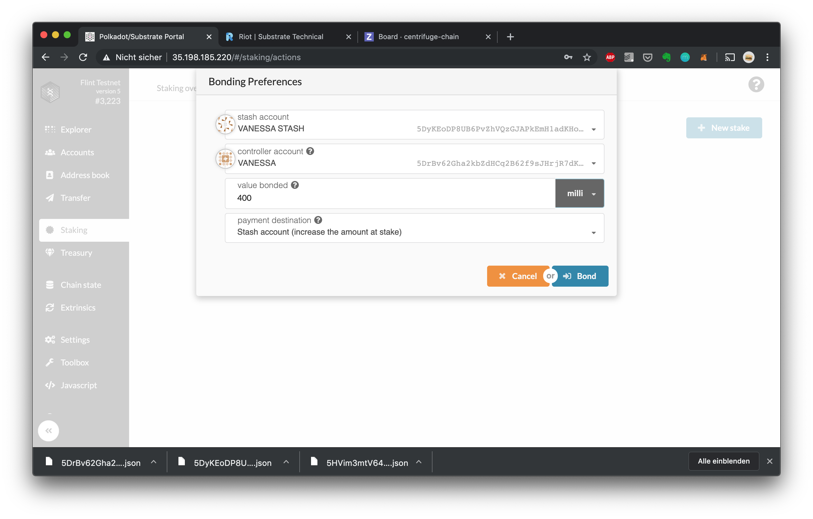
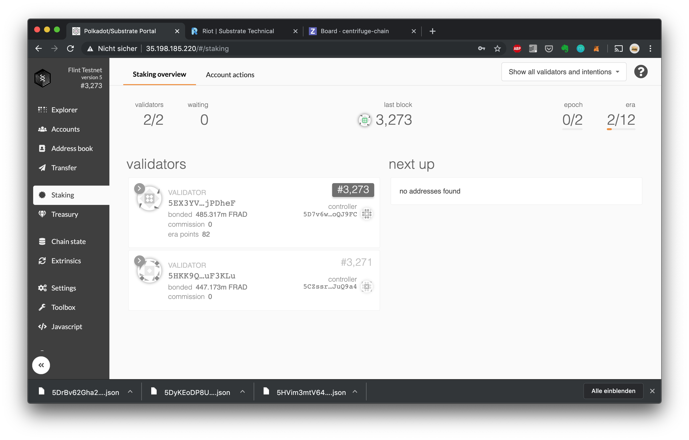

## Staking

Centrifuge Chain uses Nomiated Proof-of-Stake (NPoS) - in this system you can become a validator or nominator. Learn more in the [Polkadot Wiki on staking](https://wiki.polkadot.network/docs/en/learn-staking).

## Running your own Validator

Here's a quick guide to get started validating Centrifuge Chain Amber or Flint testnets.

1. Open the [Centrifuge Chain Portal ](https://portal.chain.centrifuge.io]

2. Create a new key pair for your validator – a stash account (`Vanessa Stash` in this example) that is holding the funds to be staked/bonded and can transfer them, and a separate controller account (`Vanessa` in this example) that will be able to switch between validating/nominating/chilling and can set session keys, which will be used for the validator tasks such as block proposals, finalization etc:  

3. Send tokens to your stash (for staking) and controller accounts (small amount to pay fees for actions) as described above. In order to become a validator, the stash account needs to own enough tokens to replace another validator in the next era. 

4. Head over to the staking screen and create a new stake  

5. Generate new session keys in your node's keystore by running: `curl -H 'Content-Type: application/json' --data '{ "jsonrpc":"2.0", "method":"author_rotateKeys", "id": 1 }' http://127.0.0.1:9933` This command will return the public keys under the "result" field starting with `0x...`.

6. Set the session keys:  

7. You are ready to start validating! Change your status to validating by clicking "Validate":  

8. In the staking overview, you should now see your validator in the "Next Up" column:  If validator slots are empty or if your validator has a higher stake bonded than an active validator, it will enter the validator set at the next era change (at most in 24 hours on Amber/Flint): 

9. All done! If you want to stop validating, head back to "Account actions" and click "Stop Validating"  You should now see that your validator is no longer selected for the next era (at most in 24 hours on Amber/Flint):  After the next era change, your validator should go back to idling and no longer show up in the Staking overview: 

## Run Node

### Requirements

**_System Requirements_**
We recommend consulting the [standard hardware](https://wiki.polkadot.network/docs/en/maintain-guides-how-to-validate-polkadot#standard-hardware) section of the Polkadot Wiki for specs.

Below we describe two ways of running our chain node:

1. **Docker Container**
   This is the recommended way to experiment with your own node. It will get you started within 5 minutes. Since docker is running pre-build containers, this setup minimizes the steps required to get started and isolates any potential issues.

2. **Bare Metal**
   Running a bare metal setup requires you to compile centrifuge chain from source, which can take between a 10 minutes up to 4 hours, depending on your specs. For a production grade setup, we do recommend to run a bare metal validators for 2 reasons: a) It minimizes the tools involved, which increases security, b) The performance is slightly supperior.

### Run your node in a Docker Container

1. Ensure you have [docker](https://docs.docker.com/install/) as well as [subkey](https://substrate.dev/docs/en/knowledgebase/integrate/subkey) installed. Use `subkey` version `v2.0.0`.
2. Generate a new key pair with subkey that will be used as your node-key: `subkey generate`. Make sure you save the output in a safe place. For mainnet keys use network flag: `subkey generate -n centrifuge`
3. Start your node by running the following, where {name} is the name that will show up in Polkadot Telemetry and {node-key} is the private key you just generated (without the `0x` prefix). Note that we do expose RPC and WS ports here for simplicity – these ports should not be exposed in a production grade setup.

a) Flint:

```
docker run -p 30333:30333 -p 9933:9933 -p 9944:9944 --rm -it centrifugeio/centrifuge-chain:20201022093419-da56ac5 \
    centrifuge-chain \
    --validator \
    --name="{name}" \
    --node-key={node-key} \
    --chain=flint \
    --bootnodes=/ip4/35.246.197.135/tcp/30333/p2p/12D3KooWBF1RdctVztxLLzEwUiuMtqEDVicCjVCS8eyxh71nonxz \
    --bootnodes=/ip4/34.89.219.76/tcp/30333/p2p/12D3KooWNHRdve4U1rsZsDnTKbY8C94Y7VJTrifBy9P2LXLDhCnG \
    --unsafe-rpc-external --unsafe-ws-external --rpc-cors="*"
```

b) Amber:

```
docker run -p 30333:30333 -p 9933:9933 -p 9944:9944 --rm -it centrifugeio/centrifuge-chain:20201022093419-da56ac5 \
    centrifuge-chain \
    --validator \
    --name="{name}" \
    --node-key={node-key} \
    --chain=amber \
    --bootnodes=/ip4/34.107.94.59/tcp/30333/p2p/12D3KooWQ3YL8sP2M1S9PVNj8JjmACUjawwRPckzL8fJmXZ7YRPY \
    --bootnodes=/ip4/35.242.247.213/tcp/30333/p2p/12D3KooWECFKJirQiVHeidSkwrEocPr7wkUw3ijbJKNyvCVd3xcu \
    --unsafe-rpc-external --unsafe-ws-external --rpc-cors="*"
```

c) Mainnet:

```
docker run -p 30333:30333 -p 9933:9933 -p 9944:9944 --rm -it centrifugeio/centrifuge-chain:20201022093419-da56ac5 \
    centrifuge-chain \
    --validator \
    --name="{name}" \
    --node-key={node-key} \
    --chain=mainnet \
    --bootnodes=/ip4/34.89.245.58/tcp/30333/p2p/12D3KooWAVAMPNJywZS3J4be8gFGZACfgt1rXS3MyJ2MxEGtLXjr \
    --bootnodes=/ip4/35.246.188.4/tcp/30333/p2p/12D3KooWCUjDbbhJf1o6skuE1EJ5PnKpJMaK6scmvWsHnjAULzDU
```

\*\* Mainnet deployments should follow a more secure setup. Learn more here: https://github.com/w3f/polkadot-secure-validator

4. Generate new session keys in your node's keystore by running: `curl -H 'Content-Type: application/json' --data '{ "jsonrpc":"2.0", "method":"author_rotateKeys", "id": 1 }' http://127.0.0.1:9933` This command will return the public keys under the "result" field starting with `0x...`, which you should copy in order to use them in the next chapter.

### Bare metal instructions

1. Install dependencies:

   a) On Unix systems (Debian, Ubuntu, ...): `sudo apt install -y cmake pkg-config libssl-dev git gcc build-essential clang libclang-dev`

   b) On MacOS: `brew install openssl cmake llvm`

2. Install Rust: `curl https://sh.rustup.rs -sSf | sh`
3. Make sure that you are using the latest Rust stable by default: `rustup default stable`
4. Install nightly for WASM support:
   ```
   RUST_TOOLCHAIN=nightly
   rustup update $RUST_TOOLCHAIN
   ```
5. If above does not work, use:

   ```
   RUST_TOOLCHAIN=nightly-2020-08-16
   rustup update $RUST_TOOLCHAIN

   rustup toolchain install $RUST_TOOLCHAIN
   rustup default $RUST_TOOLCHAIN

   rustup target add wasm32-unknown-unknown --toolchain $RUST_TOOLCHAIN
   ```

6. Add the WASM target: `rustup target add wasm32-unknown-unknown --toolchain $RUST_TOOLCHAIN`
7. Clone centrifuge-chain: `git clone -b v2.0.0-rc6.0 git@github.com:centrifuge/centrifuge-chain.git`
8. Change directory: `cd centrifuge-chain`
9. Optional - run the tests: `cargo test --all`
10. Build Centrifuge Chain: `cargo build --release`
11. Ensure you have [subkey](https://substrate.dev/docs/en/knowledgebase/integrate/subkey) installed (can be on another machine).
12. Generate a new key pair with subkey that will be used as your node-key: `subkey generate`. Make sure you save the output in a safe place.

The node is now built and available in `target/release/centrifuge-chain`.

#### Executing the binary

Below are the commands to start a node as a validator. `{name}` is the name that will show up in [Polkadot Telemetry](https://telemetry.polkadot.io) and `{node-key}` is the private key (`Secret seed` in the output of subkey) you just generated (without the 0x prefix).

To run the node for Flint you can use:

```
./target/release/centrifuge-chain \
    --validator \
    --name="{name}" \
    --node-key={node_key} \
    --chain=flint \
    --bootnodes=/ip4/35.246.197.135/tcp/30333/p2p/12D3KooWBF1RdctVztxLLzEwUiuMtqEDVicCjVCS8eyxh71nonxz \
    --bootnodes=/ip4/34.89.219.76/tcp/30333/p2p/12D3KooWNHRdve4U1rsZsDnTKbY8C94Y7VJTrifBy9P2LXLDhCnG
```

or Amber:

```
./target/release/centrifuge-chain \
    --validator \
    --name="{name}" \
    --node-key={node_key} \
    --chain=amber \
    --bootnodes=/ip4/34.107.94.59/tcp/30333/p2p/12D3KooWQ3YL8sP2M1S9PVNj8JjmACUjawwRPckzL8fJmXZ7YRPY \
    --bootnodes=/ip4/35.242.247.213/tcp/30333/p2p/12D3KooWECFKJirQiVHeidSkwrEocPr7wkUw3ijbJKNyvCVd3xcu
```

Mainnet:

```
./target/release/centrifuge-chain \
    --validator \
    --name="{name}" \
    --node-key={node_key} \
    --chain=mainnet \
    --bootnodes=/ip4/34.89.245.58/tcp/30333/p2p/12D3KooWAVAMPNJywZS3J4be8gFGZACfgt1rXS3MyJ2MxEGtLXjr \
    --bootnodes=/ip4/35.246.188.4/tcp/30333/p2p/12D3KooWCUjDbbhJf1o6skuE1EJ5PnKpJMaK6scmvWsHnjAULzDU
```

#### Creating a service

For your convenience, below are templates for running it as a systemd service:

Create a service, where {pwd} is your current working directory, `{name}` is the name that will show up in [Polkadot Telemetry](https://telemetry.polkadot.io) and `{node-key}` is the private key (`Secret seed` in the output of subkey) you just generated (without the 0x prefix).

Copy below template to `/etc/systemd/system/centrifuge-chain.service` and replace the `{}` placeholders with your local settings.

a) Flint:

```service
[Unit]
Description=Centrifuge Chain Validator
After=network.target
StartLimitIntervalSec=0

[Service]
Type=simple
Restart=always
RestartSec=1
ExecStart={pwd}/target/release/centrifuge-chain \
    --validator \
    --name="{name}" \
    --node-key={node_key} \
    --chain=flint \
    --bootnodes=/ip4/35.246.197.135/tcp/30333/p2p/12D3KooWBF1RdctVztxLLzEwUiuMtqEDVicCjVCS8eyxh71nonxz \
    --bootnodes=/ip4/34.89.219.76/tcp/30333/p2p/12D3KooWNHRdve4U1rsZsDnTKbY8C94Y7VJTrifBy9P2LXLDhCnG

[Install]
WantedBy=multi-user.target
```

b) Amber:

```service
[Unit]
Description=Centrifuge Chain Validator
After=network.target
StartLimitIntervalSec=0

[Service]
Type=simple
Restart=always
RestartSec=1
ExecStart={pwd}/target/release/centrifuge-chain \
    --validator \
    --name="{name}" \
    --node-key={node_key} \
    --chain=amber \
    --bootnodes=/ip4/34.107.94.59/tcp/30333/p2p/12D3KooWQ3YL8sP2M1S9PVNj8JjmACUjawwRPckzL8fJmXZ7YRPY \
    --bootnodes=/ip4/35.242.247.213/tcp/30333/p2p/12D3KooWECFKJirQiVHeidSkwrEocPr7wkUw3ijbJKNyvCVd3xcu

[Install]
WantedBy=multi-user.target
```

c) Mainnet:

```service
[Unit]
Description=Centrifuge Chain Validator
After=network.target
StartLimitIntervalSec=0

[Service]
Type=simple
Restart=always
RestartSec=1
ExecStart={pwd}/target/release/centrifuge-chain \
    --validator \
    --name="{name}" \
    --node-key={node_key} \
    --chain=mainnet \
    --bootnodes=/ip4/34.89.245.58/tcp/30333/p2p/12D3KooWAVAMPNJywZS3J4be8gFGZACfgt1rXS3MyJ2MxEGtLXjr \
    --bootnodes=/ip4/35.246.188.4/tcp/30333/p2p/12D3KooWCUjDbbhJf1o6skuE1EJ5PnKpJMaK6scmvWsHnjAULzDU

[Install]
WantedBy=multi-user.target
```

To run the service:

1. Start your service: `systemctl start centrifuge-chain`
2. Enable automatic restarts of your service after every boot: `systemctl enable centrifuge-chain`
3. To view and follow your logs, run `tail -f /var/log/syslog`
