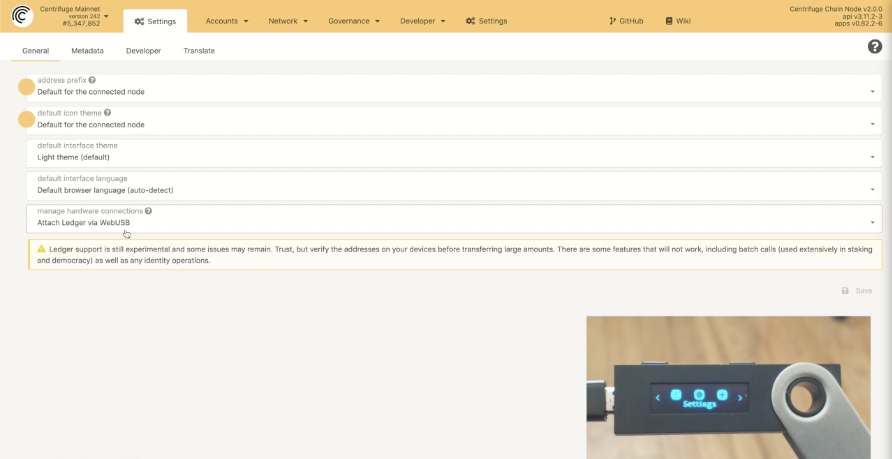
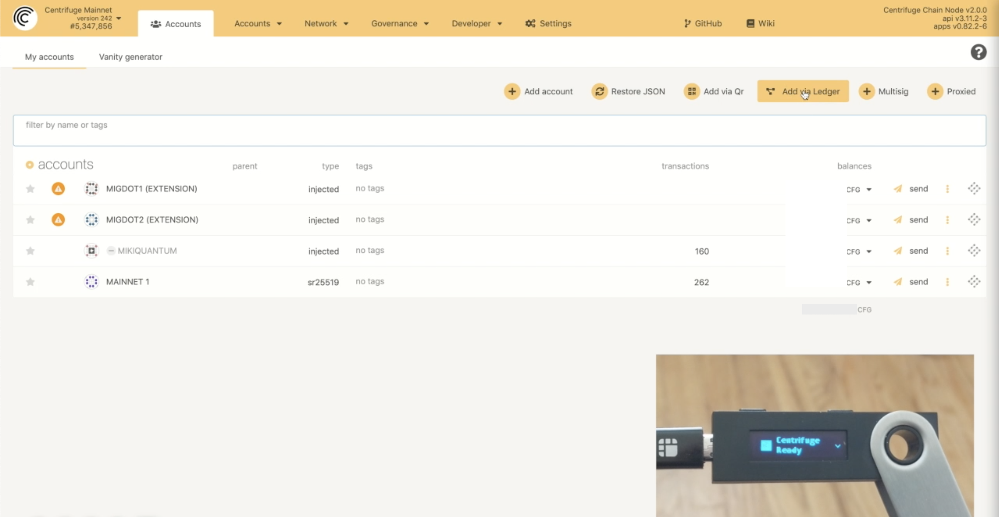
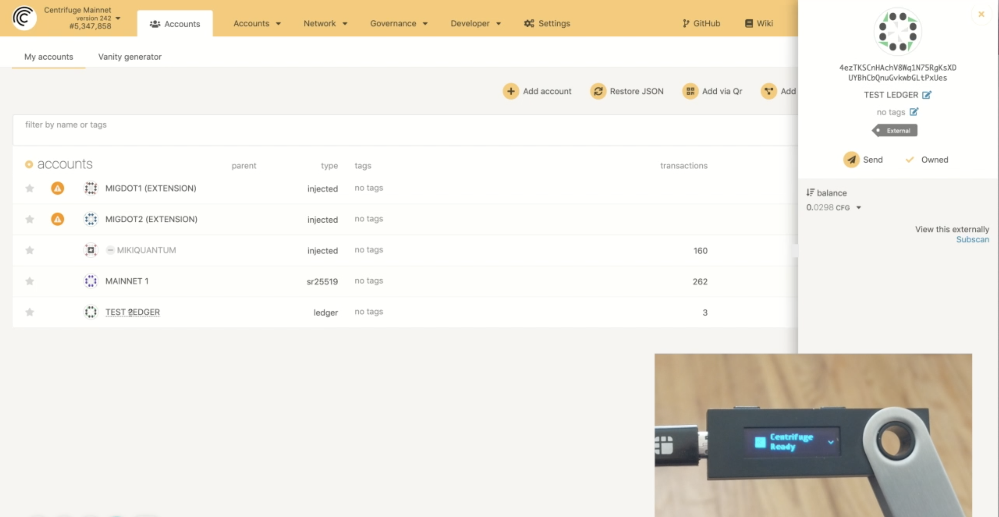
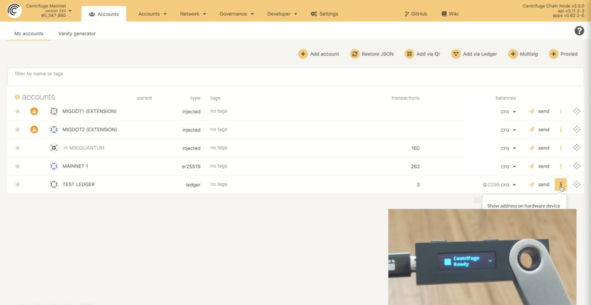
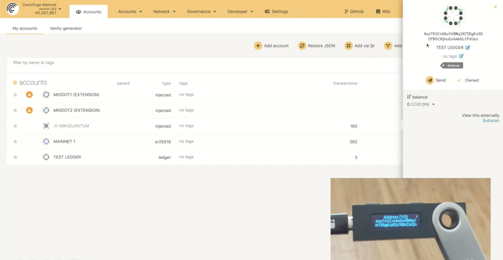
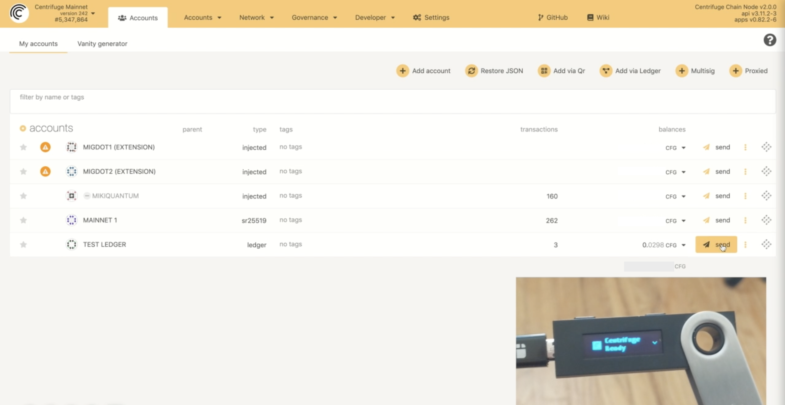
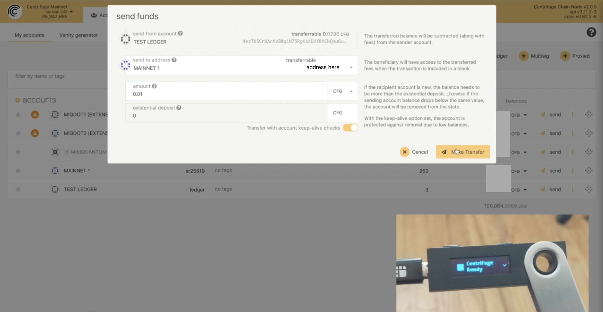
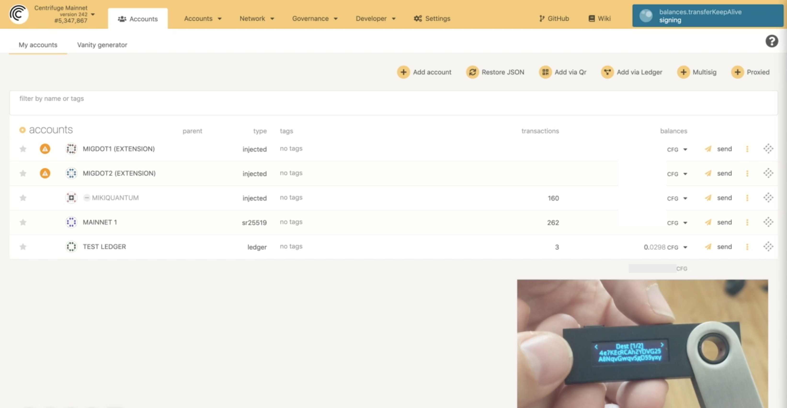
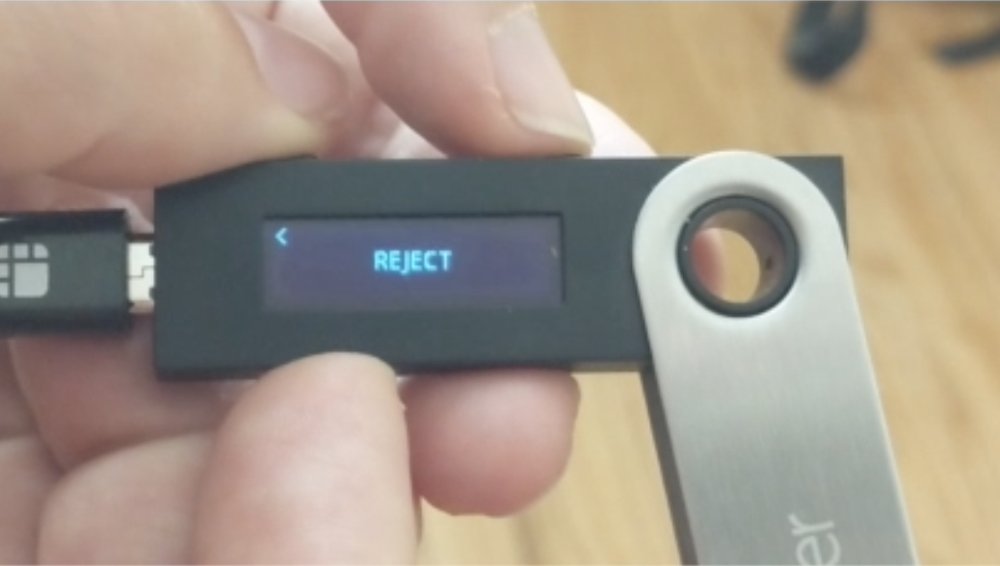
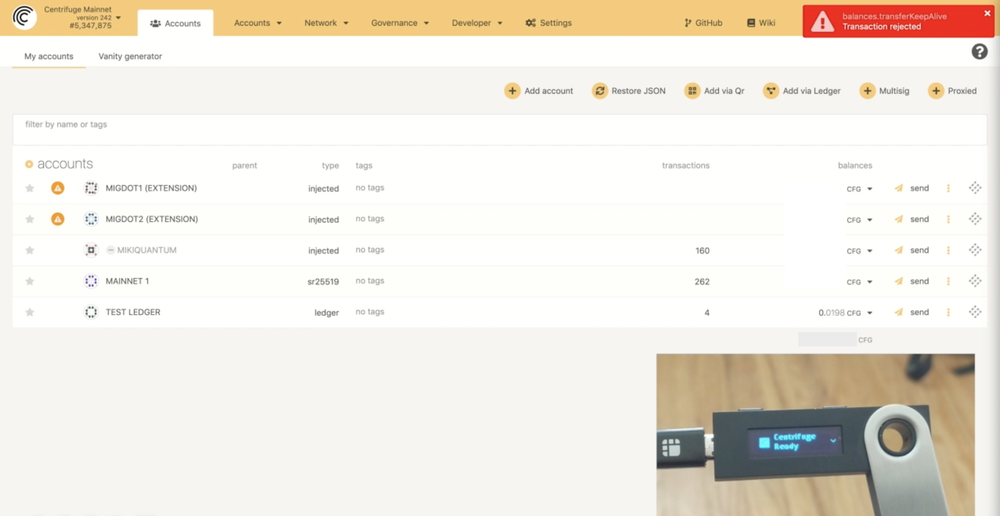

DISCLAIMER: _Use of this guide is at your own risk. To the maximum extent permitted by applicable law, the services are provided without warranties of any kind, whether express, implied, statutory or otherwise, including, but not limited to, implied warranties of merchantability, fitness for a particular purpose, title, quiet enjoyment, accuracy, or non-infringement. Further, to the fullest extent allowed by applicable law, in no event shall the company or its affiliates, be liable to you or any third party for any damages of any kind._

A Centrifuge Chain address can be created through [Polkadot.js website](hhttps://polkadot.js.org/apps/#/explorer), the [Polkadot.js browser extension](https://polkadot.js.org/extension/), or through [Parity Signer](https://www.parity.io/signer/).

## Using the Polkadot.js website
**Of all options, this is the least secure and is not recommended.**

1. Open Polkadot.js[https://polkadot.js.org/apps/#/explorer]
2. Click the dropdown at the top left and select Centrifuge (listed under "Polkadot & Parachains")
3. Create a new account for your user by navigating to "Accounts" and clicking "Add account".

   Fill in the form, e. g. for Peter Parker: 

4. Click "Save" and then "Create and backup account". Make sure you save the downloaded JSON file in a safe place.

5. Done! You can now copy your address and send it to others to receive tokens. The address is the string starting with `4...` (for Centrifuge Mainnet). You can copy it by clicking on the icon to the left of your account name: 

## Using the Polkadot.js extension

1. Download the extension [here](https://polkadot.js.org/extension/)
1. Create a new account by clicking on "+" in the top right of the extension and selecting "Create new account"
1. Save your recovery phrase in a safe place before you continue (**THIS IS VERY IMPORTANT**)
1. Set a name and password for this account
1. Once created, backup the account by selecting the 3 dots to the right of the account name and clicking "Export Account"
1. Make sure you save the downloaded JSON file in a safe place, and remember the password for this account
1. Done! You can now copy your address and send it to others to receive tokens.

## Create an account using the Parity Signer App

This is an unofficial guide on how to use the Parity Signer App to create an account on Centrifuge Chain. Please consult the official Parity Signer documentation [here](https://github.com/paritytech/parity-signer).

### Connect to Centrifuge Chain Mainnet

1. Open the [Polkadot.js website](https://polkadot.js.org/apps/#/explorer) on your computer.
2. In the top left, ensure that the network is set to Centrifuge.

### How to Generate an Address Using Parity Signer

1. Buy an old or new device (ex. iPod touch, Android phone, etc.)
     - **Important:** only charge it with a battery bank or wall charger, **don’t plug it into a computer!!!** Use a charge only cable, not a data cable.
2. Set up a passcode and set it to wipe the device upon entering the code incorrectly too many times.
3. Install the [Parity Signer App](https://www.parity.io/signer/) from below links:
     - [Link for Apple device](https://itunes.apple.com/us/app/parity-signer/id1218174838)
     - [Link for Android device](https://play.google.com/store/apps/details?id=io.parity.signer)
4. Never connect the the device to a computer, even to upgrade it.
5. Turn off WiFi & Bluetooth (**NEVER TURN IT ON AGAIN!**)
6. Create a key for Centrifuge Mainnet using the Parity Signer App
     - Create your identity to get started

       
     - Write down your 24 word Recovery Phrase (**THIS IS VERY IMPORTANT**)

       
     - Set your Identity PIN
       - **You will use this PIN to sign all of your transactions using this device.**
     - Create your first Keypair - select the Centrifuge Mainnet Network
       
7. Get your address by scanning the QR code on the Polkadot.js website.
     - On your computer, navigate to https://polkadot.js.org/apps/#/explorer
     - Make sure the network is set to Centrifuge.
     - Click on Accounts
     - Click on 'Add via QR'
       
     - Scan the QR code on your device for your Centrifuge Mainnet Public Address
       
     - Your address for Centrifuge Mainnet should begin with a '4...'
1. To manually check the above process:
     - Delete the key from the app
     - Recover the key from your backed up phrase
     - Verify the address matches what you obtained above

1) Send some test CFG to another address and use Parity Signer to sign this transaction
     - You will first need to send some CFG to this account
     - Initiate a transfer on the Polkadot.js website by selecting 'Transfer' in the left menu or on 'Send' from the Accounts page
     - Click 'Make Transfer'
     - Click 'Sign via QR'
     - Using the Parity Signer App, scan the QR code in your browser with the App's QR Scanner from this account screen (see above on how to get it).
     - In the app, confirm your signature of the transaction by entering your PIN
     - Click 'Scan Signature QR' in the browser
     - Sign the transaction

1) Backup your Recovery Phrase and keep it somewhere safe. Please do research on secure methods for storage and recovery.

> **A note on app updates:**
> If a new version of the app becomes available, please exercise the following caution.
> Ideally, replace the device or do not update the app.
> If an update is necessary:
>
> 1.  Hard reset the device and wipe everything
> 2.  Re-install the new parity signer app
> 3.  Turn off wifi & bluetooth and **NEVER TURN IT ON AGAIN**
> 4.  Recover your key from seed phrase

- **Remember to write down your secret phrase & STORE IT SAFELY!**
  Follow a secure protocol to save and store your private keys. Please do some research and choose a secure method that will work best for you.

## How to Use your Ledger with Centrifuge
This is a tutorial on how to use your [Ledger device](https://www.ledger.com) to manage your Centrifuge (CFG) tokens on Centrifuge Chain. The Ledger device is a hardware wallet made specifically for managing crypto assets, making it one of the most secure ways to manage your crypto assets. [Parity Signer](https://github.com/paritytech/parity-signer), described above, is an alternate hardware wallet; however, unlike the Ledger, it uses a device that is not specifically designed to manage crypto assets. Read more about other ways to create your account on Centrifuge above.

### What You’ll Need
* Your [initialized](https://support.ledger.com/hc/en-us/articles/360000613793) Ledger device
* The latest firmware version [installed](https://support.ledger.com/hc/en-us/articles/360002731113?docs=true)
* Ledger Live [installed](https://support.ledger.com/hc/en-us/articles/4404389606417-Download-and-install-Ledger-Live)
* A supported browser (Chrome, Safari, or Firefox)

### Install the Centrifuge App
1. Open the Manager in Ledger Live
2. Connect and unlock your Ledger device
3. If asked, allow the manager on your device 
4. Find Centrifuge in the app catalog
5. Click the Install button of the app
6. An installation window appears
7. Your device will display “Processing”
8. The app installation is confirmed

### Use Ledger device using the Polkadot.js website
**Note: The Ledger App is currently out of date and can not be used for signing transactions.**

#### How to use your Ledger Device with https://polkadot.js.org/apps/?rpc=wss://fullnode.centrifuge.io
1. Connect and unlock your Ledger device.

2. Open https://polkadot.js.org/apps/?rpc=wss://fullnode.centrifuge.io. Navigate to Settings, and verify that “Attach Ledger via WebUSB” is selected under manage hardware connections.

#### Add a Ledger account to the Polkadot.js website
3. Open the Centrifuge app on your Ledger device. Take note of the identifier displayed on the screen, then press the left button to open the app. “Centrifuge Ready” displays on the screen.

4. Navigate to Accounts on [Polkadot.js](https://polkadot.js.org/apps/#/explorer), then select “Add via Ledger.” Type in an account name, as well as an account type and index (optional). Then click Save.

#### How to receive CFG
5. Verify that the address is the same across your Ledger and Polkadot.js. This is the address where you can receive CFG. To view your address on Polkadot.js, click on the name of the account you saved. A sidebar will appear on the right of the screen displaying your address.

To view your address on the device, click on the menu to the right of the account on Polkadot.js, and select “show address on hardware device”

Verify that both addresses match.

6. Use this address to receive CFG.

### How to view your account balance
View your account balance directly on the [Polkadot.js](https://polkadot.js.org/apps/#/explorer) or by looking up the account using [Subscan](https://centrifuge.subscan.io). Polkadot.js provides basic information on the account, and for more information on your account, balance, and transfer history, you can use the Centrifuge [block explorer](https://centrifuge.subscan.io) by Subscan.

**Note**
The Centrifuge Ledger app does not support all transactions. 

### Send Centrifuge tokens (CFG) using your Ledger device
1. Navigate to Accounts in [Polkadot.js]](https://polkadot.js.org/apps/#/explorer). Select *send* to the right of the account you wish to send CFG from. 

2. Input the recipient address and amount, then click Make Transfer, then click Sign and Submit.

3. On your Ledger device, press the right button to verify the destination address and amount. Important: verify transaction details on your Ledger device before you approve the transaction.

4. Select APPROVE or REJECT by pressing down both buttons on your Ledger device. 

5. Verify the transaction on Polkadot.js in the upper right corner. View the transaction by navigating to Network > Explorer, under recent events.

### Use Ledger device via Polkadot.js
In case you want to use your Ledger device in the Centrifuge [Polkadot.js website](https://polkadot.js.org/apps/#/explorer) you will have to add the device through the PolkadotJS [Extension](https://polkadot.js.org/extension).

## Third Party Custodians
The following custodians offer custody of CFG or wCFG (ERC20 on Ethereum).
* Bitcoin Suisse Vault (native CFG)
* Coinbase Custody (ERC20 only
* BitGo (ERC20 only)
