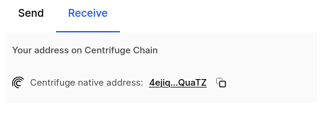
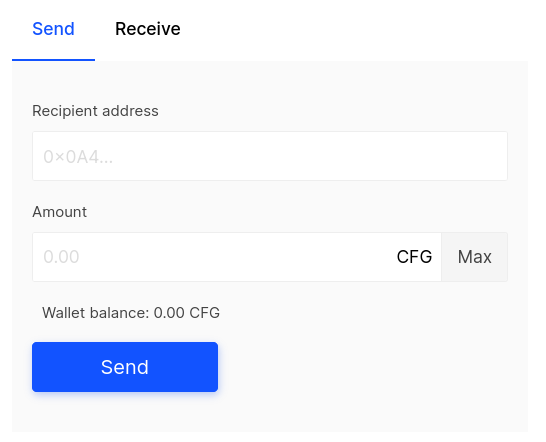
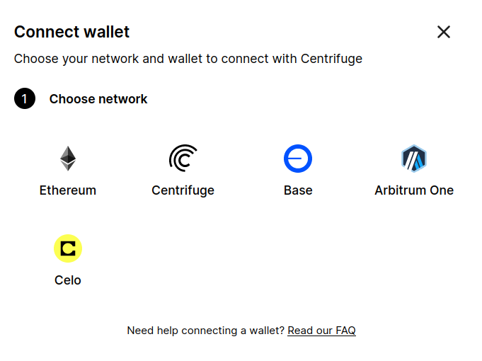

DISCLAIMER: _Use of this guide is at your own risk. To the maximum extent permitted by applicable law, the services are provided without warranties of any kind, whether express, implied, statutory or otherwise, including, but not limited to, implied warranties of merchantability, fitness for a particular purpose, title, quiet enjoyment, accuracy, or non-infringement. Further, to the fullest extent allowed by applicable law, in no event shall the company or its affiliates, be liable to you or any third party for any damages of any kind._

## EVM and Substrate Wallets
Centrifuge supports both EVM and Substrate accounts. If you already have an Ethereum compatible wallet setup, the easiest way is to use your existing Ethereum wallet. For expert users it might be helpful to use a Substrate compatible wallet such as Polkadot Vault. EVM wallets can be used to connect to any of the live networks while Substrate Wallets only work with Centrifuge chain.

A Centrifuge substrate address will begin with `4...`, an EVM address will begin with `0x...`.

### Sending tokens between EVM & Substrate Wallets on Centrifuge Chain
The Centrifuge App can be used to send and receive tokens. It will take care of the address conversion between Substrate and EVM addresses.

#### Receiving CFG on an EVM Account
To receive CFG from someone using a Substrate account, you will need to get your Substrate address. Go to the [App Portfolio](https://app.centrifuge.io/portfolio) and click on [receive](https://app.centrifuge.io/portfolio?receive=CFG) next to your CFG Balance. The Substrate address is then shown to you in the sidebar:

If you are receiving CFG from someone using an EVM account on an EVM account, they can simply use your EVM address and their wallet to send the tokens.

#### Receiving CFG on a Substrate Account
To receive CFG on a Substrate account, simply give the sender your address. The simplest way to send tokens is to go follow the section below (**Sending CFG to any Account**) or they can use their wallet's built in transfer function.

#### Sending CFG to any Account
To send CFG from your wallet to any other account (Substrate or EVM), you can use the app. Go to the [App Portfolio](https://app.centrifuge.io/portfolio) and click on [send](https://app.centrifuge.io/portfolio?send=CFG) next to your CFG Balance.

This will allow you to send to an address of either format.

## Connect your wallet
When using Centrifuge App you can choose between pools deployed on Centrifuge Chain, Ethereum, Base, Celo and Arbitrum. You can connect to both chains via our wallet component that allows you to pick the wallet of your choice. To do so, click on `Connect` in the top right corner. Then, first select the chain you want to connect with. 

In the second step select the wallet of your choice. On Centrifuge Chain the system currently supports [Talisman](https://www.talisman.xyz/), [Subwallet](https://www.subwallet.app/download.html?lang=1), [Polkadot.js](https://polkadot.js.org/extension/), [Fearless Wallet](https://fearlesswallet.io/) and EVM compatible wallets [MetaMask](https://metamask.io/download.html), [Coinbase Wallet](https://www.coinbase.com/wallet) and multiple other wallets through [Wallet Connect](https://walletconnect.com/).

## Setting up an Ethereum wallet
On Ethereum and other EVM compatible networks including Centrifuge chain, the system supports [MetaMask](https://metamask.io/download.html), [Coinbase Wallet](https://www.coinbase.com/wallet) and multiple other wallets through [Wallet Connect](https://walletconnect.com/).

Metamask is a popular browser extension allowing you to access EVM compatible blockchains. If you do not yet have MetaMask set up, head over to [MetaMask](https://metamask.io/download/) to download and install MetaMask.

On the [Centrifuge App](https://app.centrifuge.io) to connect a MetaMask wallet:
- Click on the Connect button in the top right corner.
- Choose the MetaMask wallet in the wallet dialog.

## Using Ledger with Centrifuge
If you do not yet have your Ledger configured, read their [getting started guide](https://support.ledger.com/hc/en-us/articles/360015259693-Choose-your-Ledger-device?docs=true). You will also need to install the [Ethereum App](https://support.ledger.com/hc/en-us/articles/360009576554-Ethereum-ETH-) and [enable blind signing](https://support.ledger.com/hc/en-us/articles/4405481324433-Enable-blind-signing-in-the-Ethereum-ETH-app?docs=true). Make sure to [connect your ledger](https://support.ledger.com/hc/en-us/articles/4404366864657-Connect-your-Ledger-to-MetaMask) to Metamask.

## Set up a Substrate wallet
You can create a Centrifuge account in any wallet that supports Polkadot/Substrate addresses. For detailed information on how to set up Polkadot accounts using the different tools that Web3 Foundation/Parity developed and supports, please also see [the documentation from Polkadot](https://support.polkadot.network/support/solutions/articles/65000098878-how-to-create-a-dot-account). The tutorial below will cover how to set up wallets using:

- [Talisman](https://talisman.xyz) for your browser
- [Nova Wallet](https://novawallet.io/) for iOS and Android
- [Polkadot.js Extension](https://wiki.polkadot.network/docs/polkadotjs#polkadot-js-extension) The Polkadot.js Extension is no longer maintained actively. We recommend using another wallet.
- [Polkadot Vault](https://signer.parity.io/) (formerly called Parity Signer) for a secure offline wallet using an old airgapped mobile device

For a more comprehensive list head to the Polkadot Wiki: [Wallets and Extensions for Substrate](https://wiki.polkadot.network/docs/wallets-and-extensions)

### Using Talisman
Talisman is a wallet that supports Substrate (Polkadot) and Ethereum accounts. The Talisman wallet browser extension is available on Google Chrome, Brave, and Firefox, and a corresponding asset dashboard is accessible at [app.talisman.xyz](https://app.talisman.xyz/portfolio).

To set up Talisman:

- Download the extension [here](https://www.talisman.xyz/wallet) and install it.
- Create a wallet using the instructions from Talisman [here](https://docs.talisman.xyz/talisman/navigating-the-paraverse/account-management/create-a-talisman-wallet).
You can create or import an account in Talisman by clicking on `More options` and `Add account`. This will open a browser tab that allows you to create a new account or add existing accounts via Recovery Phrase, JSON or from your Ledger.

If you want to create a new account, click on `New Account` and `Polkadot`.

Input a name and Talisman will create the account for you. Note, that by default Talisman will display your Polkadot and Kusama balances.

 

To find the CFG address of your account, click on `Copy Address` and search for Centrifuge. Once the balance of your Centrifuge address is larger than zero, it will automatically be displayed in your account list as well.

 

Finally, to see an overview of your CFG accounts, click on "Receive" under your account. To see your native wallet address on Centrifuge Chain select CFG (Centrifuge) from the list.

### Using the Polkadot Vault App (experts only)
The [Polkadot Vault](https://signer.parity.io/ ) (formerly `Parity Signer`) is a cold storage solution that allows you to use a phone in airplane mode as an air-gapped wallet. The Vault app is not technically a wallet, as it does not allow to transfer funds. It is more of a key-chain tool that will enable you the create, manage, and restore accounts or transfer funds together with other wallets or the [Polkadot.js UI](https://wiki.polkadot.network/docs/polkadotjs-ui). Follow the instructions in their [guide](https://paritytech.github.io/parity-signer/tutorials/Start.html) to setup the wallet.

The Centrifuge metadata portal can be found here: [centrifuge.github.io/metadata-portal](https://centrifuge.github.io/metadata-portal/#/centrifuge). First add the Centrifuge network and then load the metadata before creating a key (see Vault Documentation for more details).

 

#### Adding a Vault to the Polkadot.js UI
You can look up your Centrifuge address by scanning the QR code on the Polkadot.js UI.
- On your computer, navigate to https://polkadot.js.org/apps/#/explorer.
- Make sure the network is set to Centrifuge.
- Click on Accounts.
- Click on 'Add via QR'.
- Scan the QR code on your device for your Centrifuge Address.
